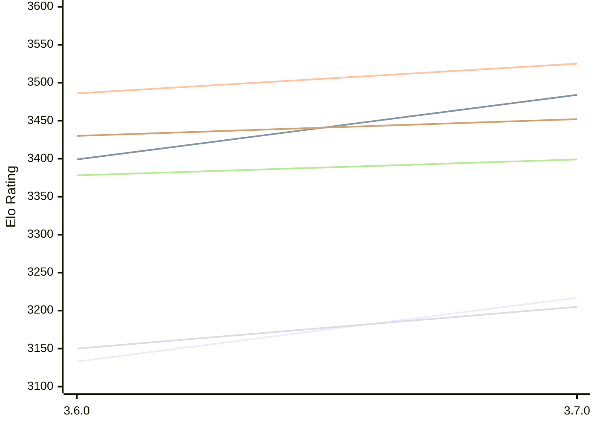

# Engine: Simplechess

Author: Sam Moore

Home: https://github.com/LinkLikesLattes/SimpleChess

## Elo Ratings E1 (Ultra 7 265T (1.50 GHz) - E-Core)

| Version | Published | STC 8.0+0.08s  | LTC 60.0+0.60s | VLTC 2m24s+1.12s | Comment |
| --- | --- | --- | --- | --- | --- |
| 3.7.0 | 2026-11-06 | 3217(+84) | 3484(+85) | 3525(+39) |  |
| 3.6.0 | 2026-10-19 | 3133 | 3399 | 3486 |  |
 | | | cElo (∆ prev) | cElo (∆ prev) | cElo (∆ prev) | 

## Elo Ratings P1 (Ultra 7 265T (1.50 GHz) - P-Core)

| Version | Published | STC 8.0+0.08s  | LTC 60.0+0.60s | VLTC 2m24s+1.12s | Comment |
| --- | --- | --- | --- | --- | --- |
| 3.7.0 | 2026-11-06 | 3205(+55) | 3399(+21) | 3452(+22) |  |
| 3.6.0 | 2026-10-19 | 3150 | 3378 | 3430 |  |
 | | | cElo (∆ prev) | cElo (∆ prev) | cElo (∆ prev) | 

## Elo Ratings T1 (i5-7500T 2.70GHz)

| Version | Published | STC 8.0+0.08s  | LTC 60.0+0.60s | VLTC 2m24s+1.12s | Comment |
| --- | --- | --- | --- | --- | --- |
| 3.6.0 | 2026-10-19 | 3150 | 3378 | 3430 |  |
 | | | cElo (∆ prev) | cElo (∆ prev) | cElo (∆ prev) | 

<a href="https://github.com/computer-chess-index/cci/issues/new?template=submit-version.yml&title=[VERSION]+Simplechess+<version>&body=###%20Engine%20name%0ASimplechess%0A%0A###%20Version%0A3.7.0" target="_blank">Submit new version</a>

 Test Conditions:

GUI/CLI: <a href=https://github.com/cutechess/cutechess target="_blank">Cute-Chess</a> 
Elo Calculation: <a href=https://www.remi-coulom.fr/Bayesian-Elo/ target="_blank">Bayesian-Elo</a> 
CPU for P1: Intel(R) Core(TM) Ultra 7 265T (1.50 GHz) - P-Core 
CPU for E1: Intel(R) Core(TM) Ultra 7 265T (1.50 GHz) - E-Core 
CPU for T1: Intel(R) Core(TM) i5-7500T 2.70GHz 
Opening book: 8_moves_v3 
\* STC: 8.0+0.08s, LTC: 60.0+0.60s, VLTC: 2m24s+1.12s

 Lists:
Ratings: <a href=https://github.com/computer-chess-index/cci/blob/main/lists/CCIRatings.csv target="_blank">Complete list</a>

Generated: 2026-11-17 05:43:05

## Ratings Verlauf E1 / P1

```mermaid
%%{init: {"theme":"base","themeVariables":{"seriesColors:['#a3a3a3','#222221','#faa371']}}}%%
xychart-beta
  x-axis ["3.6.0", "3.7.0"]
  y-axis "Elo Rating" 3100 --> 3600
  line "E1: STC (8.0+0.08s)" [3133, 3217]
  line "E1: LTC (60.0+0.60s)" [3399, 3484]
  line "E1: VLTC (2m24s+1.12s)" [3486, 3525]
  line "P1: STC (8.0+0.08s)" [3150, 3205]
  line "P1: LTC (60.0+0.60s)" [3378, 3399]
  line "P1: VLTC (2m24s+1.12s)" [3430, 3452]
```

## Detailed Evaluation Results

| Version | Time Control | Variant | Elo  | Range +/- | Matches | Score | Average Opponent Elo | Draws |
| --- | --- |--- | --- | --- | --- | --- | --- | --- |
| 3.7.0 | VLTC (2m24s+1.12s) | P1 | 3452 | 44 | 124 | 50% | 3452 | 74% |
|  |  | E1 | 3525 | 34 | 208 | 50% | 3521 | 73% |
|  | LTC (60.0+0.60s) | P1 | 3399 | 38 | 172 | 47% | 3422 | 72% |
|  |  | E1 | 3484 | 31 | 272 | 51% | 3480 | 69% |
|  | STC (8.0+0.08s) | P1 | 3205 | 34 | 218 | 48% | 3222 | 66% |
|  |  | E1 | 3217 | 28 | 360 | 52% | 3206 | 55% |
| --- | --- |--- | --- | --- | --- | --- | --- | --- |
| 3.6.0 | VLTC (2m24s+1.12s) | P1 | 3430 | 39 | 176 | 59% | 3317 | 68% |
|  |  | E1 | 3486 | 31 | 292 | 54% | 3410 | 64% |
|  | LTC (60.0+0.60s) | P1 | 3378 | 37 | 204 | 57% | 3241 | 62% |
|  |  | E1 | 3399 | 29 | 354 | 52% | 3330 | 53% |
|  | STC (8.0+0.08s) | P1 | 3150 | 37 | 248 | 57% | 2946 | 42% |
|  |  | E1 | 3133 | 31 | 340 | 56% | 2951 | 43% |