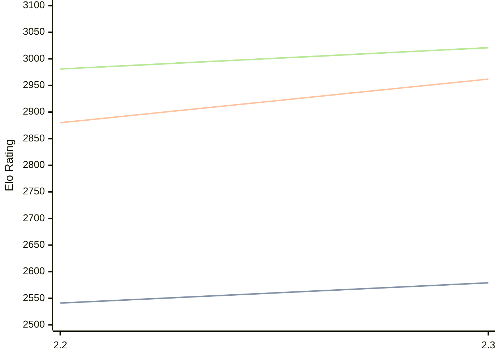

# Engine: Sloth

Author: William Sjolund

Home: https://github.com/Williamguttn/Sloth

## Elo Ratings

| Version | Published | STC 8.0+0.08s  | LTC 60.0+0.60s | VLTC 2m24s+1.12s | Comment |
| --- | --- | --- | --- | --- | --- |
| 2.3 | 2026-09-22 | 2579(+38) | 2962(+82) | 3021(+40) |  |
| 2.2 | 2026-08-28 | 2541 | 2880 | 2981 |  |
 | | | cElo (∆ prev) | cElo (∆ prev) | cElo (∆ prev) | 

<a href="https://github.com/computer-chess-index/cci/issues/new?template=submit-version.yml&title=[VERSION]+Sloth+<version>&body=###%20Engine%20name%0ASloth%0A%0A###%20Version%0A2.3" target="_blank">Submit new version</a>

 Test Conditions:

GUI/CLI: <a href=https://github.com/cutechess/cutechess target="_blank">Cute-Chess</a> 
Elo Calculation: <a href=https://www.remi-coulom.fr/Bayesian-Elo/ target="_blank">Bayesian-Elo</a> 
CPU: Intel(R) Core(TM) i5-7500T 2.70GHz 
Opening book: 8_moves_v3 
\* STC: 8.0+0.08s, LTC: 60.0+0.60s, VLTC: 2m24s+1.12s

 Lists:
Ratings: <a href=https://github.com/computer-chess-index/cci/blob/main/lists/CCIRatings.csv target="_blank">Complete list</a>

Generated: 2026-09-26 04:42:25

## Ratings Verlauf

## Detailed Evaluation Results

| Version | Time Control | Elo  | Range +/- | Matches | Score | Average Opponent Elo | Draws |
| --- | --- | --- | --- | --- | --- | --- | --- |
| 2.3 | VLTC (2m24s+1.12s) | 3021 | 39 | 186 | 52% | 3006 | 53% |
| 2.3 | LTC (60.0+0.60s) | 2962 | 40 | 178 | 51% | 2958 | 48% |
| 2.3 | STC (8.0+0.08s) | 2579 | 45 | 162 | 48% | 2596 | 30% |
| --- | --- | --- | --- | --- | --- | --- | --- |
| 2.2 | VLTC (2m24s+1.12s) | 2981 | 33 | 280 | 51% | 2963 | 43% |
| 2.2 | LTC (60.0+0.60s) | 2880 | 35 | 246 | 53% | 2851 | 46% |
| 2.2 | STC (8.0+0.08s) | 2541 | 33 | 304 | 48% | 2557 | 31% |
| --- | --- | --- | --- | --- | --- | --- | --- |