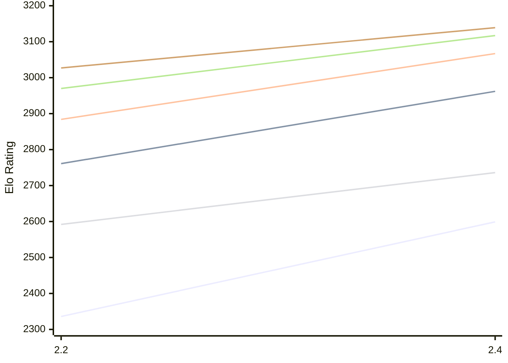
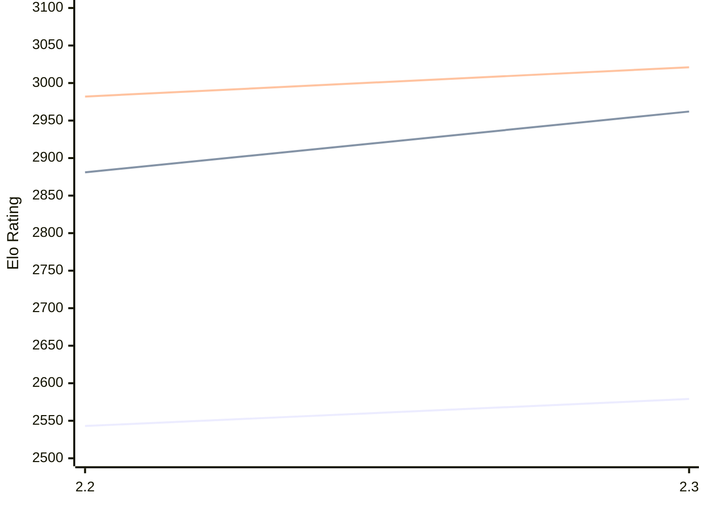

# Engine: Sloth

Author: William Sjolund

Home: https://github.com/Williamguttn/Sloth

## Elo Ratings E1 (Ultra 7 265T (1.50 GHz) - E-Core)

| Version | Published | STC 8.0+0.08s  | LTC 60.0+0.60s | VLTC 2m24s+1.12s | Comment |
| --- | --- | --- | --- | --- | --- |
| 2.4 | 2026-10-09 | 2599(+263) | 2962(+201) | 3067(+183) |  |
| 2.2 | 2026-08-28 | 2336 | 2761 | 2884 |  |
 | | | cElo (∆ prev) | cElo (∆ prev) | cElo (∆ prev) | 

## Elo Ratings P1 (Ultra 7 265T (1.50 GHz) - P-Core)

| Version | Published | STC 8.0+0.08s  | LTC 60.0+0.60s | VLTC 2m24s+1.12s | Comment |
| --- | --- | --- | --- | --- | --- |
| 2.4 | 2026-10-09 | 2736(+144) | 3117(+147) | 3139(+112) |  |
| 2.2 | 2026-08-28 | 2592 | 2970 | 3027 |  |
 | | | cElo (∆ prev) | cElo (∆ prev) | cElo (∆ prev) | 

## Elo Ratings T1 (i5-7500T 2.70GHz)

| Version | Published | STC 8.0+0.08s  | LTC 60.0+0.60s | VLTC 2m24s+1.12s | Comment |
| --- | --- | --- | --- | --- | --- |
| 2.3 | 2026-09-22 | 2579(+36) | 2962(+81) | 3021(+39) |  |
| 2.2 | 2026-08-28 | 2543 | 2881 | 2982 |  |
 | | | cElo (∆ prev) | cElo (∆ prev) | cElo (∆ prev) | 

<a href="https://github.com/computer-chess-index/cci/issues/new?template=submit-version.yml&title=[VERSION]+Sloth+<version>&body=###%20Engine%20name%0ASloth%0A%0A###%20Version%0A2.3" target="_blank">Submit new version</a>

 Test Conditions:

GUI/CLI: <a href=https://github.com/cutechess/cutechess target="_blank">Cute-Chess</a> 
Elo Calculation: <a href=https://www.remi-coulom.fr/Bayesian-Elo/ target="_blank">Bayesian-Elo</a> 
CPU for P1: Intel(R) Core(TM) Ultra 7 265T (1.50 GHz) - P-Core 
CPU for E1: Intel(R) Core(TM) Ultra 7 265T (1.50 GHz) - E-Core 
CPU for T1: Intel(R) Core(TM) i5-7500T 2.70GHz 
Opening book: 8_moves_v3 
\* STC: 8.0+0.08s, LTC: 60.0+0.60s, VLTC: 2m24s+1.12s

 Lists:
Ratings: <a href=https://github.com/computer-chess-index/cci/blob/main/lists/CCIRatings.csv target="_blank">Complete list</a>

Generated: 2026-10-17 04:43:07

## Ratings Verlauf E1 / P1

```mermaid
%%{init: {"theme":"base","themeVariables":{"seriesColors:['#a3a3a3','#222221','#faa371']}}}%%
xychart-beta
  x-axis ["2.2", "2.4"]
  y-axis "Elo Rating" 2300 --> 3200
  line "E1: STC (8.0+0.08s)" [2336, 2599]
  line "E1: LTC (60.0+0.60s)" [2761, 2962]
  line "E1: VLTC (2m24s+1.12s)" [2884, 3067]
  line "P1: STC (8.0+0.08s)" [2592, 2736]
  line "P1: LTC (60.0+0.60s)" [2970, 3117]
  line "P1: VLTC (2m24s+1.12s)" [3027, 3139]
```

## Ratings Verlauf T1

```mermaid
%%{init: {"theme":"base","themeVariables":{"seriesColors:['#a3a3a3','#222221','#faa371']}}}%%
xychart-beta
  x-axis ["2.2", "2.3"]
  y-axis "Elo Rating" 2500 --> 3100
  line "T1: STC (8.0+0.08s)" [2543, 2579]
  line "T1: LTC (60.0+0.60s)" [2881, 2962]
  line "T1: VLTC (2m24s+1.12s)" [2982, 3021]
```

## Detailed Evaluation Results

| Version | Time Control | Variant | Elo  | Range +/- | Matches | Score | Average Opponent Elo | Draws |
| --- | --- |--- | --- | --- | --- | --- | --- | --- |
| 2.4 | VLTC (2m24s+1.12s) | P1 | 3139 | 47 | 124 | 49% | 3147 | 55% |
|  |  | E1 | 3067 | 42 | 170 | 51% | 3060 | 45% |
|  | LTC (60.0+0.60s) | P1 | 3117 | 48 | 124 | 53% | 3094 | 47% |
|  |  | E1 | 2962 | 41 | 178 | 53% | 2938 | 40% |
|  | STC (8.0+0.08s) | P1 | 2736 | 47 | 140 | 53% | 2716 | 39% |
|  |  | E1 | 2599 | 41 | 190 | 54% | 2562 | 37% |
| --- | --- |--- | --- | --- | --- | --- | --- | --- |
| 2.3 | VLTC (2m24s+1.12s) | T1 | 3021 | 36 | 218 | 51% | 3011 | 55% |
|  | LTC (60.0+0.60s) | T1 | 2962 | 37 | 210 | 51% | 2958 | 47% |
|  | STC (8.0+0.08s) | T1 | 2579 | 42 | 190 | 48% | 2596 | 29% |
| --- | --- |--- | --- | --- | --- | --- | --- | --- |
| 2.2 | VLTC (2m24s+1.12s) | T1 | 2982 | 33 | 280 | 51% | 2965 | 43% |
|  |  | P1 | 3027 | 38 | 208 | 47% | 3042 | 47% |
|  |  | E1 | 2884 | 33 | 282 | 47% | 2907 | 43% |
|  | LTC (60.0+0.60s) | T1 | 2881 | 35 | 246 | 53% | 2853 | 46% |
|  |  | P1 | 2970 | 39 | 194 | 49% | 2975 | 46% |
|  |  | E1 | 2761 | 34 | 274 | 46% | 2785 | 39% |
|  | STC (8.0+0.08s) | T1 | 2543 | 33 | 304 | 48% | 2560 | 31% |
|  |  | P1 | 2592 | 44 | 180 | 50% | 2592 | 26% |
|  |  | E1 | 2336 | 35 | 280 | 41% | 2423 | 29% |