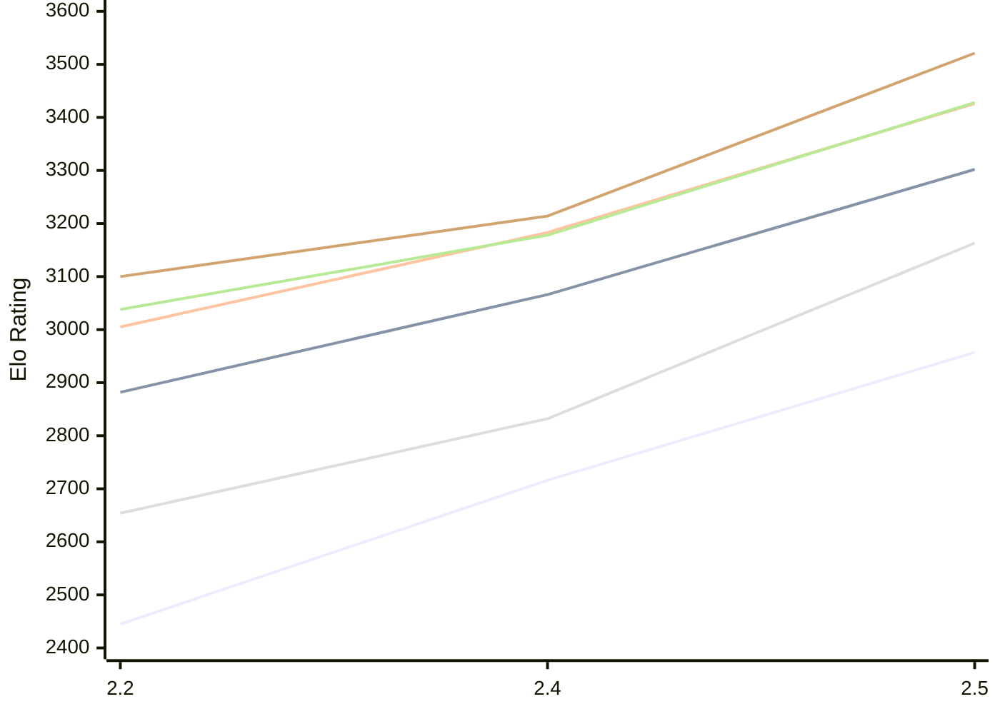
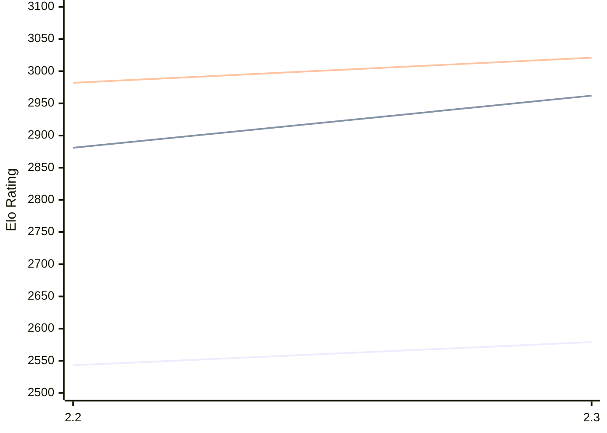

# Engine: Sloth

Author: William Sjolund

Home: https://github.com/Williamguttn/Sloth

## Elo Ratings E1 (Ultra 7 265T (1.50 GHz) - E-Core)

| Version | Published | STC 8.0+0.08s  | LTC 60.0+0.60s | VLTC 2m24s+1.12s | Comment |
| --- | --- | --- | --- | --- | --- |
| 2.5 | 2026-11-03 | 2957(+241) | 3302(+236) | 3426(+243) |  |
| 2.4 | 2026-10-09 | 2716(+271) | 3066(+184) | 3183(+178) |  |
| 2.2 | 2026-08-28 | 2445 | 2882 | 3005 |  |
 | | | cElo (∆ prev) | cElo (∆ prev) | cElo (∆ prev) | 

## Elo Ratings P1 (Ultra 7 265T (1.50 GHz) - P-Core)

| Version | Published | STC 8.0+0.08s  | LTC 60.0+0.60s | VLTC 2m24s+1.12s | Comment |
| --- | --- | --- | --- | --- | --- |
| 2.5 | 2026-11-03 | 3163(+331) | 3428(+250) | 3521(+307) |  |
| 2.4 | 2026-10-09 | 2832(+178) | 3178(+140) | 3214(+114) |  |
| 2.2 | 2026-08-28 | 2654 | 3038 | 3100 |  |
 | | | cElo (∆ prev) | cElo (∆ prev) | cElo (∆ prev) | 

## Elo Ratings T1 (i5-7500T 2.70GHz)

| Version | Published | STC 8.0+0.08s  | LTC 60.0+0.60s | VLTC 2m24s+1.12s | Comment |
| --- | --- | --- | --- | --- | --- |
| 2.3 | 2026-09-22 | 2579(+36) | 2962(+81) | 3021(+39) |  |
| 2.2 | 2026-08-28 | 2543 | 2881 | 2982 |  |
 | | | cElo (∆ prev) | cElo (∆ prev) | cElo (∆ prev) | 

<a href="https://github.com/computer-chess-index/cci/issues/new?template=submit-version.yml&title=[VERSION]+Sloth+<version>&body=###%20Engine%20name%0ASloth%0A%0A###%20Version%0A2.3" target="_blank">Submit new version</a>

 Test Conditions:

GUI/CLI: <a href=https://github.com/cutechess/cutechess target="_blank">Cute-Chess</a> 
Elo Calculation: <a href=https://www.remi-coulom.fr/Bayesian-Elo/ target="_blank">Bayesian-Elo</a> 
CPU for P1: Intel(R) Core(TM) Ultra 7 265T (1.50 GHz) - P-Core 
CPU for E1: Intel(R) Core(TM) Ultra 7 265T (1.50 GHz) - E-Core 
CPU for T1: Intel(R) Core(TM) i5-7500T 2.70GHz 
Opening book: 8_moves_v3 
\* STC: 8.0+0.08s, LTC: 60.0+0.60s, VLTC: 2m24s+1.12s

 Lists:
Ratings: <a href=https://github.com/computer-chess-index/cci/blob/main/lists/CCIRatings.csv target="_blank">Complete list</a>

Generated: 2026-11-06 05:42:35

## Ratings Verlauf E1 / P1

```mermaid
%%{init: {"theme":"base","themeVariables":{"seriesColors:['#a3a3a3','#222221','#faa371']}}}%%
xychart-beta
  x-axis ["2.2", "2.4", "2.5"]
  y-axis "Elo Rating" 2400 --> 3600
  line "E1: STC (8.0+0.08s)" [2445, 2716, 2957]
  line "E1: LTC (60.0+0.60s)" [2882, 3066, 3302]
  line "E1: VLTC (2m24s+1.12s)" [3005, 3183, 3426]
  line "P1: STC (8.0+0.08s)" [2654, 2832, 3163]
  line "P1: LTC (60.0+0.60s)" [3038, 3178, 3428]
  line "P1: VLTC (2m24s+1.12s)" [3100, 3214, 3521]
```

## Ratings Verlauf T1

```mermaid
%%{init: {"theme":"base","themeVariables":{"seriesColors:['#a3a3a3','#222221','#faa371']}}}%%
xychart-beta
  x-axis ["2.2", "2.3"]
  y-axis "Elo Rating" 2500 --> 3100
  line "T1: STC (8.0+0.08s)" [2543, 2579]
  line "T1: LTC (60.0+0.60s)" [2881, 2962]
  line "T1: VLTC (2m24s+1.12s)" [2982, 3021]
```

## Detailed Evaluation Results

| Version | Time Control | Variant | Elo  | Range +/- | Matches | Score | Average Opponent Elo | Draws |
| --- | --- |--- | --- | --- | --- | --- | --- | --- |
| 2.5 | VLTC (2m24s+1.12s) | P1 | 3521 | 49 | 112 | 55% | 3479 | 63% |
|  |  | E1 | 3426 | 34 | 228 | 51% | 3416 | 61% |
|  | LTC (60.0+0.60s) | P1 | 3428 | 41 | 156 | 52% | 3413 | 63% |
|  |  | E1 | 3302 | 32 | 272 | 53% | 3276 | 58% |
|  | STC (8.0+0.08s) | P1 | 3163 | 42 | 166 | 53% | 3133 | 48% |
|  |  | E1 | 2957 | 41 | 196 | 53% | 2923 | 33% |
| --- | --- |--- | --- | --- | --- | --- | --- | --- |
| 2.4 | VLTC (2m24s+1.12s) | P1 | 3214 | 41 | 162 | 49% | 3221 | 56% |
|  |  | E1 | 3183 | 32 | 276 | 51% | 3178 | 50% |
|  | LTC (60.0+0.60s) | P1 | 3178 | 39 | 188 | 51% | 3175 | 45% |
|  |  | E1 | 3066 | 33 | 274 | 51% | 3059 | 42% |
|  | STC (8.0+0.08s) | P1 | 2832 | 37 | 224 | 54% | 2801 | 42% |
|  |  | E1 | 2716 | 34 | 286 | 52% | 2693 | 34% |
| --- | --- |--- | --- | --- | --- | --- | --- | --- |
| 2.3 | VLTC (2m24s+1.12s) | T1 | 3021 | 36 | 218 | 51% | 3011 | 55% |
|  | LTC (60.0+0.60s) | T1 | 2962 | 37 | 210 | 51% | 2958 | 47% |
|  | STC (8.0+0.08s) | T1 | 2579 | 42 | 190 | 48% | 2596 | 29% |
| --- | --- |--- | --- | --- | --- | --- | --- | --- |
| 2.2 | VLTC (2m24s+1.12s) | T1 | 2982 | 33 | 280 | 51% | 2965 | 43% |
|  |  | P1 | 3100 | 38 | 208 | 47% | 3114 | 47% |
|  |  | E1 | 3005 | 33 | 282 | 47% | 3029 | 43% |
|  | LTC (60.0+0.60s) | T1 | 2881 | 35 | 246 | 53% | 2853 | 46% |
|  |  | P1 | 3038 | 39 | 194 | 49% | 3043 | 46% |
|  |  | E1 | 2882 | 34 | 274 | 46% | 2907 | 39% |
|  | STC (8.0+0.08s) | T1 | 2543 | 33 | 304 | 48% | 2560 | 31% |
|  |  | P1 | 2654 | 44 | 180 | 50% | 2651 | 26% |
|  |  | E1 | 2445 | 35 | 280 | 41% | 2533 | 29% |