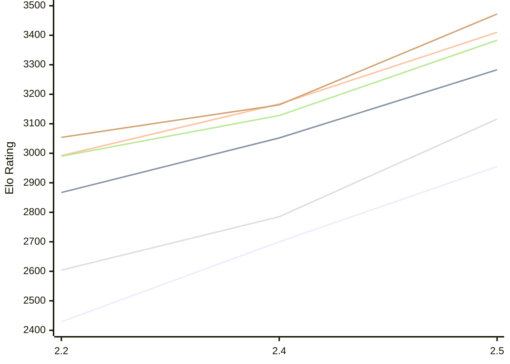
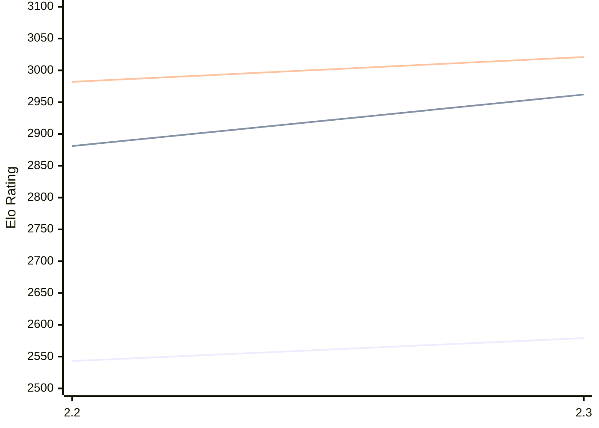

# Engine: Sloth

Author: William Sjolund

Home: https://github.com/Williamguttn/Sloth

## Elo Ratings E1 (Ultra 7 265T (1.50 GHz) - E-Core)

| Version | Published | STC 8.0+0.08s  | LTC 60.0+0.60s | VLTC 2m24s+1.12s | Comment |
| --- | --- | --- | --- | --- | --- |
| 2.5 | 2026-11-03 | 2955(+255) | 3283(+231) | 3410(+243) |  |
| 2.4 | 2026-10-09 | 2700(+271) | 3052(+185) | 3167(+175) |  |
| 2.2 | 2026-08-28 | 2429 | 2867 | 2992 |  |
 | | | cElo (∆ prev) | cElo (∆ prev) | cElo (∆ prev) | 

## Elo Ratings P1 (Ultra 7 265T (1.50 GHz) - P-Core)

| Version | Published | STC 8.0+0.08s  | LTC 60.0+0.60s | VLTC 2m24s+1.12s | Comment |
| --- | --- | --- | --- | --- | --- |
| 2.5 | 2026-11-03 | 3116(+331) | 3383(+255) | 3472(+308) |  |
| 2.4 | 2026-10-09 | 2785(+181) | 3128(+138) | 3164(+110) |  |
| 2.2 | 2026-08-28 | 2604 | 2990 | 3054 |  |
 | | | cElo (∆ prev) | cElo (∆ prev) | cElo (∆ prev) | 

## Elo Ratings T1 (i5-7500T 2.70GHz)

| Version | Published | STC 8.0+0.08s  | LTC 60.0+0.60s | VLTC 2m24s+1.12s | Comment |
| --- | --- | --- | --- | --- | --- |
| 2.3 | 2026-09-22 | 2579(+36) | 2962(+81) | 3021(+39) |  |
| 2.2 | 2026-08-28 | 2543 | 2881 | 2982 |  |
 | | | cElo (∆ prev) | cElo (∆ prev) | cElo (∆ prev) | 

<a href="https://github.com/computer-chess-index/cci/issues/new?template=submit-version.yml&title=[VERSION]+Sloth+<version>&body=###%20Engine%20name%0ASloth%0A%0A###%20Version%0A2.3" target="_blank">Submit new version</a>

 Test Conditions:

GUI/CLI: <a href=https://github.com/cutechess/cutechess target="_blank">Cute-Chess</a> 
Elo Calculation: <a href=https://www.remi-coulom.fr/Bayesian-Elo/ target="_blank">Bayesian-Elo</a> 
CPU for P1: Intel(R) Core(TM) Ultra 7 265T (1.50 GHz) - P-Core 
CPU for E1: Intel(R) Core(TM) Ultra 7 265T (1.50 GHz) - E-Core 
CPU for T1: Intel(R) Core(TM) i5-7500T 2.70GHz 
Opening book: 8_moves_v3 
\* STC: 8.0+0.08s, LTC: 60.0+0.60s, VLTC: 2m24s+1.12s

 Lists:
Ratings: <a href=https://github.com/computer-chess-index/cci/blob/main/lists/CCIRatings.csv target="_blank">Complete list</a>

Generated: 2026-11-09 05:42:54

## Ratings Verlauf E1 / P1

```mermaid
%%{init: {"theme":"base","themeVariables":{"seriesColors:['#a3a3a3','#222221','#faa371']}}}%%
xychart-beta
  x-axis ["2.2", "2.4", "2.5"]
  y-axis "Elo Rating" 2400 --> 3500
  line "E1: STC (8.0+0.08s)" [2429, 2700, 2955]
  line "E1: LTC (60.0+0.60s)" [2867, 3052, 3283]
  line "E1: VLTC (2m24s+1.12s)" [2992, 3167, 3410]
  line "P1: STC (8.0+0.08s)" [2604, 2785, 3116]
  line "P1: LTC (60.0+0.60s)" [2990, 3128, 3383]
  line "P1: VLTC (2m24s+1.12s)" [3054, 3164, 3472]
```

## Ratings Verlauf T1

```mermaid
%%{init: {"theme":"base","themeVariables":{"seriesColors:['#a3a3a3','#222221','#faa371']}}}%%
xychart-beta
  x-axis ["2.2", "2.3"]
  y-axis "Elo Rating" 2500 --> 3100
  line "T1: STC (8.0+0.08s)" [2543, 2579]
  line "T1: LTC (60.0+0.60s)" [2881, 2962]
  line "T1: VLTC (2m24s+1.12s)" [2982, 3021]
```

## Detailed Evaluation Results

| Version | Time Control | Variant | Elo  | Range +/- | Matches | Score | Average Opponent Elo | Draws |
| --- | --- |--- | --- | --- | --- | --- | --- | --- |
| 2.5 | VLTC (2m24s+1.12s) | P1 | 3472 | 46 | 122 | 54% | 3437 | 64% |
|  |  | E1 | 3410 | 32 | 256 | 51% | 3399 | 61% |
|  | LTC (60.0+0.60s) | P1 | 3383 | 40 | 168 | 52% | 3366 | 63% |
|  |  | E1 | 3283 | 30 | 300 | 52% | 3263 | 57% |
|  | STC (8.0+0.08s) | P1 | 3116 | 40 | 182 | 53% | 3089 | 49% |
|  |  | E1 | 2955 | 39 | 216 | 54% | 2913 | 34% |
| --- | --- |--- | --- | --- | --- | --- | --- | --- |
| 2.4 | VLTC (2m24s+1.12s) | E1 | 3167 | 32 | 276 | 51% | 3163 | 50% |
|  |  | P1 | 3164 | 41 | 162 | 49% | 3173 | 56% |
|  | LTC (60.0+0.60s) | E1 | 3052 | 33 | 274 | 51% | 3046 | 42% |
|  |  | P1 | 3128 | 39 | 188 | 51% | 3125 | 45% |
|  | STC (8.0+0.08s) | E1 | 2700 | 34 | 286 | 52% | 2677 | 34% |
|  |  | P1 | 2785 | 37 | 224 | 54% | 2754 | 42% |
| --- | --- |--- | --- | --- | --- | --- | --- | --- |
| 2.3 | VLTC (2m24s+1.12s) | T1 | 3021 | 36 | 218 | 51% | 3011 | 55% |
|  | LTC (60.0+0.60s) | T1 | 2962 | 37 | 210 | 51% | 2958 | 47% |
|  | STC (8.0+0.08s) | T1 | 2579 | 42 | 190 | 48% | 2596 | 29% |
| --- | --- |--- | --- | --- | --- | --- | --- | --- |
| 2.2 | VLTC (2m24s+1.12s) | T1 | 2982 | 33 | 280 | 51% | 2965 | 43% |
|  |  | P1 | 3054 | 38 | 208 | 47% | 3069 | 47% |
|  |  | E1 | 2992 | 33 | 282 | 47% | 3015 | 43% |
|  | LTC (60.0+0.60s) | P1 | 2990 | 39 | 194 | 49% | 2996 | 46% |
|  |  | E1 | 2867 | 34 | 274 | 46% | 2890 | 39% |
|  |  | T1 | 2881 | 35 | 246 | 53% | 2853 | 46% |
|  | STC (8.0+0.08s) | P1 | 2604 | 44 | 180 | 50% | 2601 | 26% |
|  |  | E1 | 2429 | 35 | 280 | 41% | 2516 | 29% |
|  |  | T1 | 2543 | 33 | 304 | 48% | 2560 | 31% |