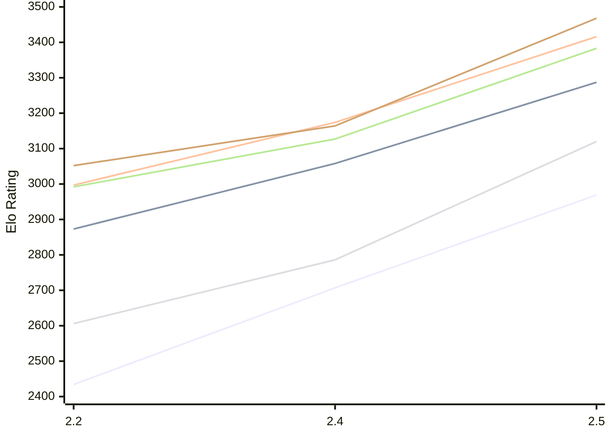
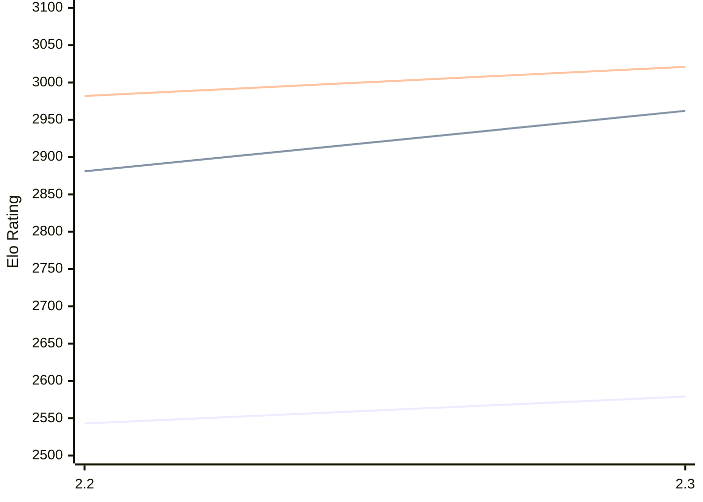

# Engine: Sloth

Author: William Sjolund

Home: https://github.com/Williamguttn/Sloth

## Elo Ratings E1 (Ultra 7 265T (1.50 GHz) - E-Core)

| Version | Published | STC 8.0+0.08s  | LTC 60.0+0.60s | VLTC 2m24s+1.12s | Comment |
| --- | --- | --- | --- | --- | --- |
| 2.5 | 2026-11-03 | 2969(+262) | 3287(+229) | 3416(+242) |  |
| 2.4 | 2026-10-09 | 2707(+273) | 3058(+185) | 3174(+177) |  |
| 2.2 | 2026-08-28 | 2434 | 2873 | 2997 |  |
 | | | cElo (∆ prev) | cElo (∆ prev) | cElo (∆ prev) | 

## Elo Ratings P1 (Ultra 7 265T (1.50 GHz) - P-Core)

| Version | Published | STC 8.0+0.08s  | LTC 60.0+0.60s | VLTC 2m24s+1.12s | Comment |
| --- | --- | --- | --- | --- | --- |
| 2.5 | 2026-11-03 | 3120(+334) | 3383(+256) | 3468(+304) |  |
| 2.4 | 2026-10-09 | 2786(+180) | 3127(+135) | 3164(+112) |  |
| 2.2 | 2026-08-28 | 2606 | 2992 | 3052 |  |
 | | | cElo (∆ prev) | cElo (∆ prev) | cElo (∆ prev) | 

## Elo Ratings T1 (i5-7500T 2.70GHz)

| Version | Published | STC 8.0+0.08s  | LTC 60.0+0.60s | VLTC 2m24s+1.12s | Comment |
| --- | --- | --- | --- | --- | --- |
| 2.3 | 2026-09-22 | 2579(+36) | 2962(+81) | 3021(+39) |  |
| 2.2 | 2026-08-28 | 2543 | 2881 | 2982 |  |
 | | | cElo (∆ prev) | cElo (∆ prev) | cElo (∆ prev) | 

<a href="https://github.com/computer-chess-index/cci/issues/new?template=submit-version.yml&title=[VERSION]+Sloth+<version>&body=###%20Engine%20name%0ASloth%0A%0A###%20Version%0A2.3" target="_blank">Submit new version</a>

 Test Conditions:

GUI/CLI: <a href=https://github.com/cutechess/cutechess target="_blank">Cute-Chess</a> 
Elo Calculation: <a href=https://www.remi-coulom.fr/Bayesian-Elo/ target="_blank">Bayesian-Elo</a> 
CPU for P1: Intel(R) Core(TM) Ultra 7 265T (1.50 GHz) - P-Core 
CPU for E1: Intel(R) Core(TM) Ultra 7 265T (1.50 GHz) - E-Core 
CPU for T1: Intel(R) Core(TM) i5-7500T 2.70GHz 
Opening book: 8_moves_v3 
\* STC: 8.0+0.08s, LTC: 60.0+0.60s, VLTC: 2m24s+1.12s

 Lists:
Ratings: <a href=https://github.com/computer-chess-index/cci/blob/main/lists/CCIRatings.csv target="_blank">Complete list</a>

Generated: 2026-11-10 05:42:41

## Ratings Verlauf E1 / P1

```mermaid
%%{init: {"theme":"base","themeVariables":{"seriesColors:['#a3a3a3','#222221','#faa371']}}}%%
xychart-beta
  x-axis ["2.2", "2.4", "2.5"]
  y-axis "Elo Rating" 2400 --> 3500
  line "E1: STC (8.0+0.08s)" [2434, 2707, 2969]
  line "E1: LTC (60.0+0.60s)" [2873, 3058, 3287]
  line "E1: VLTC (2m24s+1.12s)" [2997, 3174, 3416]
  line "P1: STC (8.0+0.08s)" [2606, 2786, 3120]
  line "P1: LTC (60.0+0.60s)" [2992, 3127, 3383]
  line "P1: VLTC (2m24s+1.12s)" [3052, 3164, 3468]
```

## Ratings Verlauf T1

```mermaid
%%{init: {"theme":"base","themeVariables":{"seriesColors:['#a3a3a3','#222221','#faa371']}}}%%
xychart-beta
  x-axis ["2.2", "2.3"]
  y-axis "Elo Rating" 2500 --> 3100
  line "T1: STC (8.0+0.08s)" [2543, 2579]
  line "T1: LTC (60.0+0.60s)" [2881, 2962]
  line "T1: VLTC (2m24s+1.12s)" [2982, 3021]
```

## Detailed Evaluation Results

| Version | Time Control | Variant | Elo  | Range +/- | Matches | Score | Average Opponent Elo | Draws |
| --- | --- |--- | --- | --- | --- | --- | --- | --- |
| 2.5 | VLTC (2m24s+1.12s) | P1 | 3468 | 45 | 130 | 53% | 3440 | 65% |
|  |  | E1 | 3416 | 32 | 260 | 51% | 3406 | 61% |
|  | LTC (60.0+0.60s) | P1 | 3383 | 40 | 168 | 52% | 3366 | 63% |
|  |  | E1 | 3287 | 30 | 308 | 52% | 3270 | 58% |
|  | STC (8.0+0.08s) | P1 | 3120 | 39 | 186 | 53% | 3087 | 49% |
|  |  | E1 | 2969 | 37 | 236 | 54% | 2925 | 35% |
| --- | --- |--- | --- | --- | --- | --- | --- | --- |
| 2.4 | VLTC (2m24s+1.12s) | P1 | 3164 | 41 | 162 | 49% | 3173 | 56% |
|  |  | E1 | 3174 | 32 | 276 | 51% | 3168 | 50% |
|  | LTC (60.0+0.60s) | E1 | 3058 | 33 | 274 | 51% | 3051 | 42% |
|  |  | P1 | 3127 | 39 | 188 | 51% | 3124 | 45% |
|  | STC (8.0+0.08s) | E1 | 2707 | 34 | 286 | 52% | 2684 | 34% |
|  |  | P1 | 2786 | 37 | 224 | 54% | 2754 | 42% |
| --- | --- |--- | --- | --- | --- | --- | --- | --- |
| 2.3 | VLTC (2m24s+1.12s) | T1 | 3021 | 36 | 218 | 51% | 3011 | 55% |
|  | LTC (60.0+0.60s) | T1 | 2962 | 37 | 210 | 51% | 2958 | 47% |
|  | STC (8.0+0.08s) | T1 | 2579 | 42 | 190 | 48% | 2596 | 29% |
| --- | --- |--- | --- | --- | --- | --- | --- | --- |
| 2.2 | VLTC (2m24s+1.12s) | T1 | 2982 | 33 | 280 | 51% | 2965 | 43% |
|  |  | P1 | 3052 | 38 | 208 | 47% | 3067 | 47% |
|  |  | E1 | 2997 | 33 | 282 | 47% | 3020 | 43% |
|  | LTC (60.0+0.60s) | T1 | 2881 | 35 | 246 | 53% | 2853 | 46% |
|  |  | P1 | 2992 | 39 | 194 | 49% | 2997 | 46% |
|  |  | E1 | 2873 | 34 | 274 | 46% | 2897 | 39% |
|  | STC (8.0+0.08s) | P1 | 2606 | 44 | 180 | 50% | 2601 | 26% |
|  |  | E1 | 2434 | 35 | 280 | 41% | 2522 | 29% |
|  |  | T1 | 2543 | 33 | 304 | 48% | 2560 | 31% |