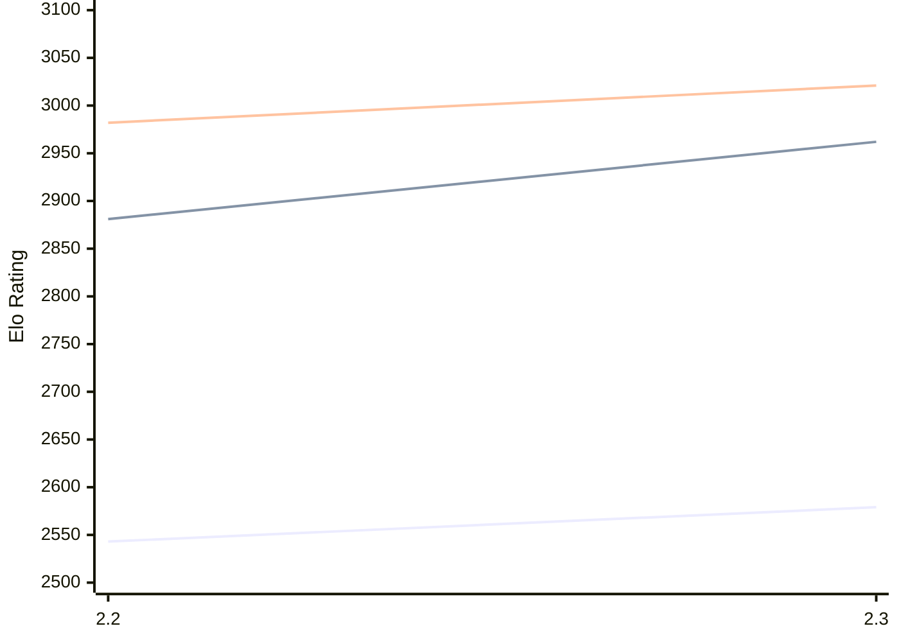

# Engine: Sloth

Author: William Sjolund

Home: https://github.com/Williamguttn/Sloth

## Elo Ratings E1 (Ultra 7 265T (1.50 GHz) - E-Core)

| Version | Published | STC 8.0+0.08s  | LTC 60.0+0.60s | VLTC 2m24s+1.12s | Comment |
| --- | --- | --- | --- | --- | --- |
| 2.5 | 2026-11-03 | 2920(+271) | 3214(+230) | 3344(+244) |  |
| 2.4 | 2026-10-09 | 2649(+195) | 2984(+64) | 3100(+103) |  |
| 2.3 | 2026-09-22 | 2454(+69) | 2920(+111) | 2997(+65) |  |
| 2.2 | 2026-08-28 | 2385 | 2809 | 2932 |  |
 | | | cElo (∆ prev) | cElo (∆ prev) | cElo (∆ prev) | 

## Elo Ratings P1 (Ultra 7 265T (1.50 GHz) - P-Core)

| Version | Published | STC 8.0+0.08s  | LTC 60.0+0.60s | VLTC 2m24s+1.12s | Comment |
| --- | --- | --- | --- | --- | --- |
| 2.5 | 2026-11-03 | 2989(+324) | 3221(+229) | 3287(+260) |  |
| 2.4 | 2026-10-09 | 2665(+80) | 2992(+27) | 3027(+2) |  |
| 2.3 | 2026-09-22 | 2585(+89) | 2965(+102) | 3025(+108) |  |
| 2.2 | 2026-08-28 | 2496 | 2863 | 2917 |  |
 | | | cElo (∆ prev) | cElo (∆ prev) | cElo (∆ prev) | 

## Elo Ratings T1 (i5-7500T 2.70GHz)

| Version | Published | STC 8.0+0.08s  | LTC 60.0+0.60s | VLTC 2m24s+1.12s | Comment |
| --- | --- | --- | --- | --- | --- |
| 2.3 | 2026-09-22 | 2579(+36) | 2962(+81) | 3021(+39) |  |
| 2.2 | 2026-08-28 | 2543 | 2881 | 2982 |  |
 | | | cElo (∆ prev) | cElo (∆ prev) | cElo (∆ prev) | 

<a href="https://github.com/computer-chess-index/cci/issues/new?template=submit-version.yml&title=[VERSION]+Sloth+<version>&body=###%20Engine%20name%0ASloth%0A%0A###%20Version%0A2.3" target="_blank">Submit new version</a>

 Test Conditions:

GUI/CLI: <a href=https://github.com/cutechess/cutechess target="_blank">Cute-Chess</a> 
Elo Calculation: <a href=https://www.remi-coulom.fr/Bayesian-Elo/ target="_blank">Bayesian-Elo</a> 
CPU for P1: Intel(R) Core(TM) Ultra 7 265T (1.50 GHz) - P-Core 
CPU for E1: Intel(R) Core(TM) Ultra 7 265T (1.50 GHz) - E-Core 
CPU for T1: Intel(R) Core(TM) i5-7500T 2.70GHz 
Opening book: 8_moves_v3 
\* STC: 8.0+0.08s, LTC: 60.0+0.60s, VLTC: 2m24s+1.12s

 Lists:
Ratings: <a href=https://github.com/computer-chess-index/cci/blob/main/lists/CCIRatings.csv target="_blank">Complete list</a>

Generated: 2026-11-27 05:43:29

## Ratings Verlauf E1 / P1

```mermaid
%%{init: {"theme":"base","themeVariables":{"seriesColors:['#a3a3a3','#222221','#faa371']}}}%%
xychart-beta
  x-axis ["2.2", "2.3", "2.4", "2.5"]
  y-axis "Elo Rating" 2300 --> 3400
  line "E1: STC (8.0+0.08s)" [2385, 2454, 2649, 2920]
  line "E1: LTC (60.0+0.60s)" [2809, 2920, 2984, 3214]
  line "E1: VLTC (2m24s+1.12s)" [2932, 2997, 3100, 3344]
  line "P1: STC (8.0+0.08s)" [2496, 2585, 2665, 2989]
  line "P1: LTC (60.0+0.60s)" [2863, 2965, 2992, 3221]
  line "P1: VLTC (2m24s+1.12s)" [2917, 3025, 3027, 3287]
```

## Ratings Verlauf T1

```mermaid
%%{init: {"theme":"base","themeVariables":{"seriesColors:['#a3a3a3','#222221','#faa371']}}}%%
xychart-beta
  x-axis ["2.2", "2.3"]
  y-axis "Elo Rating" 2500 --> 3100
  line "T1: STC (8.0+0.08s)" [2543, 2579]
  line "T1: LTC (60.0+0.60s)" [2881, 2962]
  line "T1: VLTC (2m24s+1.12s)" [2982, 3021]
```

## Detailed Evaluation Results

| Version | Time Control | Variant | Elo  | Range +/- | Matches | Score | Average Opponent Elo | Draws |
| --- | --- |--- | --- | --- | --- | --- | --- | --- |
| 2.5 | VLTC (2m24s+1.12s) | P1 | 3287 | 37 | 192 | 52% | 3274 | 66% |
|  |  | E1 | 3344 | 30 | 300 | 51% | 3336 | 63% |
|  | LTC (60.0+0.60s) | P1 | 3221 | 34 | 236 | 51% | 3213 | 58% |
|  |  | E1 | 3214 | 28 | 348 | 51% | 3204 | 58% |
|  | STC (8.0+0.08s) | P1 | 2989 | 36 | 226 | 54% | 2958 | 50% |
|  |  | E1 | 2920 | 31 | 318 | 54% | 2885 | 38% |
| --- | --- |--- | --- | --- | --- | --- | --- | --- |
| 2.4 | VLTC (2m24s+1.12s) | P1 | 3027 | 37 | 206 | 48% | 3047 | 53% |
|  |  | E1 | 3100 | 31 | 296 | 50% | 3101 | 49% |
|  | LTC (60.0+0.60s) | P1 | 2992 | 37 | 212 | 51% | 2989 | 49% |
|  |  | E1 | 2984 | 32 | 306 | 50% | 2977 | 41% |
|  | STC (8.0+0.08s) | P1 | 2665 | 35 | 248 | 51% | 2660 | 40% |
|  |  | E1 | 2649 | 32 | 308 | 51% | 2633 | 34% |
| --- | --- |--- | --- | --- | --- | --- | --- | --- |
| 2.3 | VLTC (2m24s+1.12s) | P1 | 3025 | 40 | 176 | 48% | 3043 | 51% |
|  |  | E1 | 2997 | 32 | 278 | 50% | 3001 | 47% |
|  |  | T1 | 3021 | 36 | 218 | 51% | 3011 | 55% |
|  | LTC (60.0+0.60s) | P1 | 2965 | 46 | 142 | 46% | 2993 | 46% |
|  |  | E1 | 2920 | 36 | 230 | 51% | 2913 | 45% |
|  |  | T1 | 2962 | 37 | 210 | 51% | 2958 | 47% |
|  | STC (8.0+0.08s) | E1 | 2454 | 41 | 196 | 47% | 2481 | 29% |
|  |  | T1 | 2579 | 42 | 190 | 48% | 2596 | 29% |
|  |  | P1 | 2585 | 50 | 134 | 48% | 2606 | 29% |
| --- | --- |--- | --- | --- | --- | --- | --- | --- |
| 2.2 | VLTC (2m24s+1.12s) | E1 | 2932 | 33 | 282 | 47% | 2955 | 43% |
|  |  | T1 | 2982 | 33 | 280 | 51% | 2965 | 43% |
|  |  | P1 | 2917 | 38 | 208 | 47% | 2932 | 47% |
|  | LTC (60.0+0.60s) | E1 | 2809 | 34 | 274 | 46% | 2834 | 39% |
|  |  | T1 | 2881 | 35 | 246 | 53% | 2853 | 46% |
|  |  | P1 | 2863 | 39 | 194 | 49% | 2869 | 46% |
|  | STC (8.0+0.08s) | T1 | 2543 | 33 | 304 | 48% | 2560 | 31% |
|  |  | P1 | 2496 | 44 | 180 | 50% | 2495 | 26% |
|  |  | E1 | 2385 | 35 | 280 | 41% | 2473 | 29% |