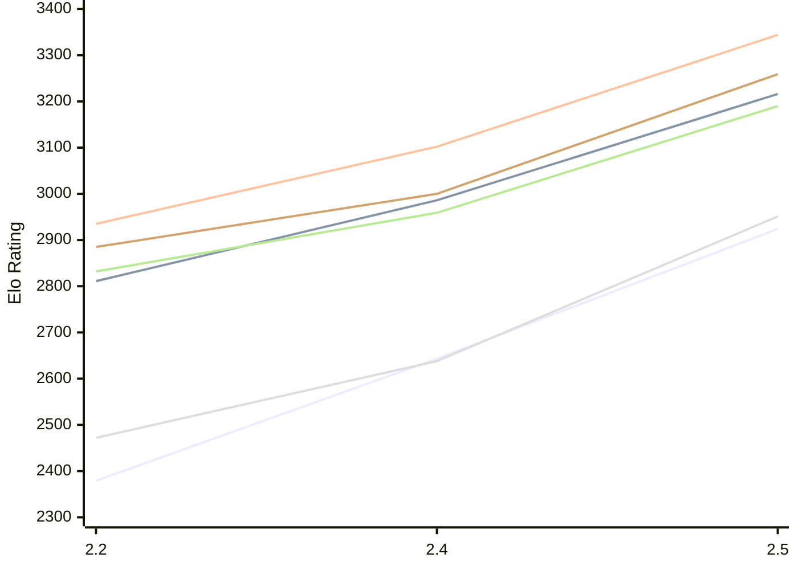
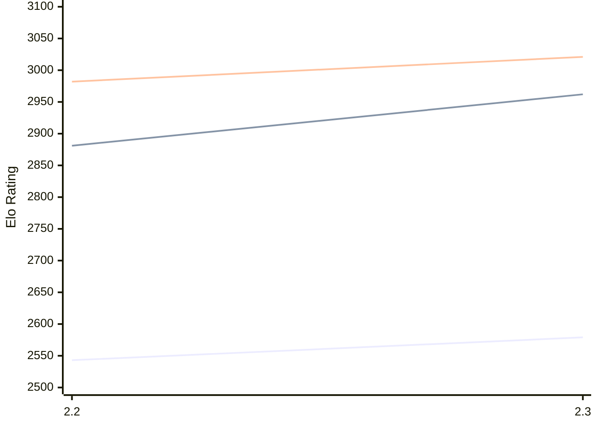

# Engine: Sloth

Author: William Sjolund

Home: https://github.com/Williamguttn/Sloth

## Elo Ratings E1 (Ultra 7 265T (1.50 GHz) - E-Core)

| Version | Published | STC 8.0+0.08s  | LTC 60.0+0.60s | VLTC 2m24s+1.12s | Comment |
| --- | --- | --- | --- | --- | --- |
| 2.5 | 2026-11-03 | 2924(+281) | 3216(+230) | 3344(+242) |  |
| 2.4 | 2026-10-09 | 2643(+264) | 2986(+175) | 3102(+167) |  |
| 2.2 | 2026-08-28 | 2379 | 2811 | 2935 |  |
 | | | cElo (∆ prev) | cElo (∆ prev) | cElo (∆ prev) | 

## Elo Ratings P1 (Ultra 7 265T (1.50 GHz) - P-Core)

| Version | Published | STC 8.0+0.08s  | LTC 60.0+0.60s | VLTC 2m24s+1.12s | Comment |
| --- | --- | --- | --- | --- | --- |
| 2.5 | 2026-11-03 | 2951(+313) | 3190(+231) | 3259(+259) |  |
| 2.4 | 2026-10-09 | 2638(+166) | 2959(+127) | 3000(+115) |  |
| 2.2 | 2026-08-28 | 2472 | 2832 | 2885 |  |
 | | | cElo (∆ prev) | cElo (∆ prev) | cElo (∆ prev) | 

## Elo Ratings T1 (i5-7500T 2.70GHz)

| Version | Published | STC 8.0+0.08s  | LTC 60.0+0.60s | VLTC 2m24s+1.12s | Comment |
| --- | --- | --- | --- | --- | --- |
| 2.3 | 2026-09-22 | 2579(+36) | 2962(+81) | 3021(+39) |  |
| 2.2 | 2026-08-28 | 2543 | 2881 | 2982 |  |
 | | | cElo (∆ prev) | cElo (∆ prev) | cElo (∆ prev) | 

<a href="https://github.com/computer-chess-index/cci/issues/new?template=submit-version.yml&title=[VERSION]+Sloth+<version>&body=###%20Engine%20name%0ASloth%0A%0A###%20Version%0A2.3" target="_blank">Submit new version</a>

 Test Conditions:

GUI/CLI: <a href=https://github.com/cutechess/cutechess target="_blank">Cute-Chess</a> 
Elo Calculation: <a href=https://www.remi-coulom.fr/Bayesian-Elo/ target="_blank">Bayesian-Elo</a> 
CPU for P1: Intel(R) Core(TM) Ultra 7 265T (1.50 GHz) - P-Core 
CPU for E1: Intel(R) Core(TM) Ultra 7 265T (1.50 GHz) - E-Core 
CPU for T1: Intel(R) Core(TM) i5-7500T 2.70GHz 
Opening book: 8_moves_v3 
\* STC: 8.0+0.08s, LTC: 60.0+0.60s, VLTC: 2m24s+1.12s

 Lists:
Ratings: <a href=https://github.com/computer-chess-index/cci/blob/main/lists/CCIRatings.csv target="_blank">Complete list</a>

Generated: 2026-11-18 05:43:29

## Ratings Verlauf E1 / P1

```mermaid
%%{init: {"theme":"base","themeVariables":{"seriesColors:['#a3a3a3','#222221','#faa371']}}}%%
xychart-beta
  x-axis ["2.2", "2.4", "2.5"]
  y-axis "Elo Rating" 2300 --> 3400
  line "E1: STC (8.0+0.08s)" [2379, 2643, 2924]
  line "E1: LTC (60.0+0.60s)" [2811, 2986, 3216]
  line "E1: VLTC (2m24s+1.12s)" [2935, 3102, 3344]
  line "P1: STC (8.0+0.08s)" [2472, 2638, 2951]
  line "P1: LTC (60.0+0.60s)" [2832, 2959, 3190]
  line "P1: VLTC (2m24s+1.12s)" [2885, 3000, 3259]
```

## Ratings Verlauf T1

```mermaid
%%{init: {"theme":"base","themeVariables":{"seriesColors:['#a3a3a3','#222221','#faa371']}}}%%
xychart-beta
  x-axis ["2.2", "2.3"]
  y-axis "Elo Rating" 2500 --> 3100
  line "T1: STC (8.0+0.08s)" [2543, 2579]
  line "T1: LTC (60.0+0.60s)" [2881, 2962]
  line "T1: VLTC (2m24s+1.12s)" [2982, 3021]
```

## Detailed Evaluation Results

| Version | Time Control | Variant | Elo  | Range +/- | Matches | Score | Average Opponent Elo | Draws |
| --- | --- |--- | --- | --- | --- | --- | --- | --- |
| 2.5 | VLTC (2m24s+1.12s) | E1 | 3344 | 30 | 292 | 50% | 3339 | 62% |
|  |  | P1 | 3259 | 38 | 176 | 51% | 3248 | 65% |
|  | LTC (60.0+0.60s) | P1 | 3190 | 35 | 218 | 51% | 3185 | 59% |
|  |  | E1 | 3216 | 29 | 324 | 52% | 3204 | 57% |
|  | STC (8.0+0.08s) | P1 | 2951 | 37 | 206 | 53% | 2921 | 50% |
|  |  | E1 | 2924 | 33 | 290 | 55% | 2877 | 37% |
| --- | --- |--- | --- | --- | --- | --- | --- | --- |
| 2.4 | VLTC (2m24s+1.12s) | P1 | 3000 | 37 | 202 | 48% | 3017 | 53% |
|  |  | E1 | 3102 | 31 | 296 | 50% | 3104 | 49% |
|  | LTC (60.0+0.60s) | P1 | 2959 | 38 | 204 | 51% | 2954 | 48% |
|  |  | E1 | 2986 | 32 | 306 | 50% | 2978 | 41% |
|  | STC (8.0+0.08s) | P1 | 2638 | 36 | 240 | 51% | 2631 | 40% |
|  |  | E1 | 2643 | 32 | 308 | 51% | 2628 | 34% |
| --- | --- |--- | --- | --- | --- | --- | --- | --- |
| 2.3 | VLTC (2m24s+1.12s) | T1 | 3021 | 36 | 218 | 51% | 3011 | 55% |
|  | LTC (60.0+0.60s) | T1 | 2962 | 37 | 210 | 51% | 2958 | 47% |
|  | STC (8.0+0.08s) | T1 | 2579 | 42 | 190 | 48% | 2596 | 29% |
| --- | --- |--- | --- | --- | --- | --- | --- | --- |
| 2.2 | VLTC (2m24s+1.12s) | T1 | 2982 | 33 | 280 | 51% | 2965 | 43% |
|  |  | P1 | 2885 | 38 | 208 | 47% | 2901 | 47% |
|  |  | E1 | 2935 | 33 | 282 | 47% | 2958 | 43% |
|  | LTC (60.0+0.60s) | T1 | 2881 | 35 | 246 | 53% | 2853 | 46% |
|  |  | P1 | 2832 | 39 | 194 | 49% | 2838 | 46% |
|  |  | E1 | 2811 | 34 | 274 | 46% | 2835 | 39% |
|  | STC (8.0+0.08s) | T1 | 2543 | 33 | 304 | 48% | 2560 | 31% |
|  |  | P1 | 2472 | 44 | 180 | 50% | 2472 | 26% |
|  |  | E1 | 2379 | 35 | 280 | 41% | 2466 | 29% |