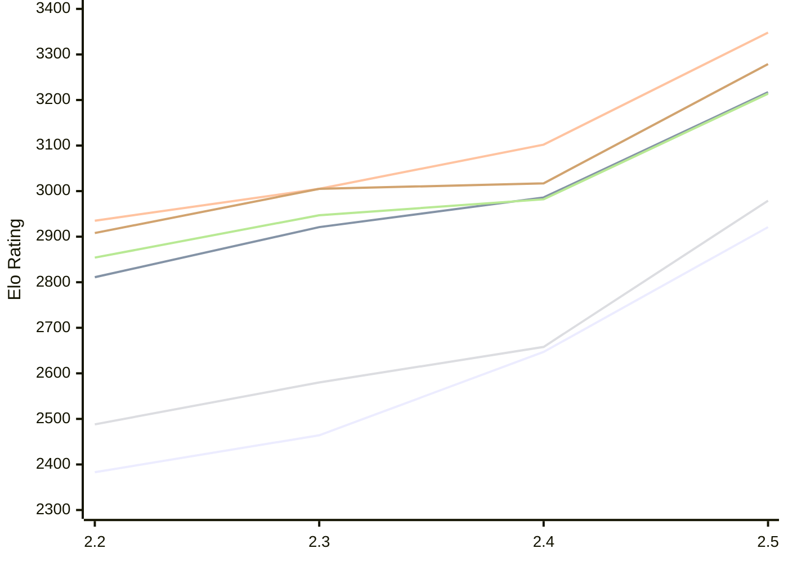
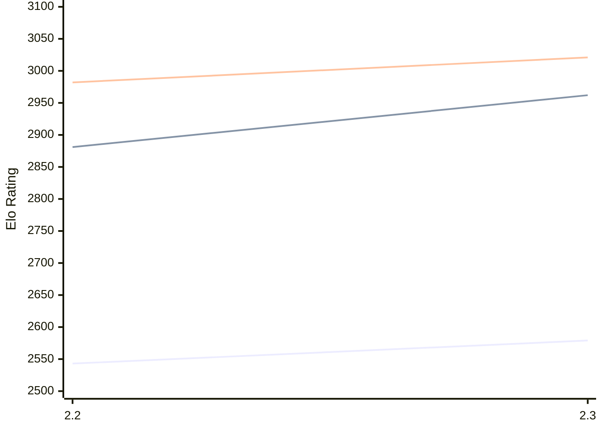

# Engine: Sloth

Author: William Sjolund

Home: https://github.com/Williamguttn/Sloth

## Elo Ratings E1 (Ultra 7 265T (1.50 GHz) - E-Core)

| Version | Published | STC 8.0+0.08s  | LTC 60.0+0.60s | VLTC 2m24s+1.12s | Comment |
| --- | --- | --- | --- | --- | --- |
| 2.5 | 2026-11-03 | 2921(+274) | 3217(+231) | 3348(+246) |  |
| 2.4 | 2026-10-09 | 2647(+183) | 2986(+65) | 3102(+97) |  |
| 2.3 | 2026-09-22 | 2464(+81) | 2921(+110) | 3005(+70) |  |
| 2.2 | 2026-08-28 | 2383 | 2811 | 2935 |  |
 | | | cElo (∆ prev) | cElo (∆ prev) | cElo (∆ prev) | 

## Elo Ratings P1 (Ultra 7 265T (1.50 GHz) - P-Core)

| Version | Published | STC 8.0+0.08s  | LTC 60.0+0.60s | VLTC 2m24s+1.12s | Comment |
| --- | --- | --- | --- | --- | --- |
| 2.5 | 2026-11-03 | 2979(+321) | 3214(+232) | 3279(+262) |  |
| 2.4 | 2026-10-09 | 2658(+78) | 2982(+35) | 3017(+12) |  |
| 2.3 | 2026-09-22 | 2580(+92) | 2947(+93) | 3005(+97) |  |
| 2.2 | 2026-08-28 | 2488 | 2854 | 2908 |  |
 | | | cElo (∆ prev) | cElo (∆ prev) | cElo (∆ prev) | 

## Elo Ratings T1 (i5-7500T 2.70GHz)

| Version | Published | STC 8.0+0.08s  | LTC 60.0+0.60s | VLTC 2m24s+1.12s | Comment |
| --- | --- | --- | --- | --- | --- |
| 2.3 | 2026-09-22 | 2579(+36) | 2962(+81) | 3021(+39) |  |
| 2.2 | 2026-08-28 | 2543 | 2881 | 2982 |  |
 | | | cElo (∆ prev) | cElo (∆ prev) | cElo (∆ prev) | 

<a href="https://github.com/computer-chess-index/cci/issues/new?template=submit-version.yml&title=[VERSION]+Sloth+<version>&body=###%20Engine%20name%0ASloth%0A%0A###%20Version%0A2.3" target="_blank">Submit new version</a>

 Test Conditions:

GUI/CLI: <a href=https://github.com/cutechess/cutechess target="_blank">Cute-Chess</a> 
Elo Calculation: <a href=https://www.remi-coulom.fr/Bayesian-Elo/ target="_blank">Bayesian-Elo</a> 
CPU for P1: Intel(R) Core(TM) Ultra 7 265T (1.50 GHz) - P-Core 
CPU for E1: Intel(R) Core(TM) Ultra 7 265T (1.50 GHz) - E-Core 
CPU for T1: Intel(R) Core(TM) i5-7500T 2.70GHz 
Opening book: 8_moves_v3 
\* STC: 8.0+0.08s, LTC: 60.0+0.60s, VLTC: 2m24s+1.12s

 Lists:
Ratings: <a href=https://github.com/computer-chess-index/cci/blob/main/lists/CCIRatings.csv target="_blank">Complete list</a>

Generated: 2026-11-24 05:43:11

## Ratings Verlauf E1 / P1

```mermaid
%%{init: {"theme":"base","themeVariables":{"seriesColors:['#a3a3a3','#222221','#faa371']}}}%%
xychart-beta
  x-axis ["2.2", "2.3", "2.4", "2.5"]
  y-axis "Elo Rating" 2300 --> 3400
  line "E1: STC (8.0+0.08s)" [2383, 2464, 2647, 2921]
  line "E1: LTC (60.0+0.60s)" [2811, 2921, 2986, 3217]
  line "E1: VLTC (2m24s+1.12s)" [2935, 3005, 3102, 3348]
  line "P1: STC (8.0+0.08s)" [2488, 2580, 2658, 2979]
  line "P1: LTC (60.0+0.60s)" [2854, 2947, 2982, 3214]
  line "P1: VLTC (2m24s+1.12s)" [2908, 3005, 3017, 3279]
```

## Ratings Verlauf T1

```mermaid
%%{init: {"theme":"base","themeVariables":{"seriesColors:['#a3a3a3','#222221','#faa371']}}}%%
xychart-beta
  x-axis ["2.2", "2.3"]
  y-axis "Elo Rating" 2500 --> 3100
  line "T1: STC (8.0+0.08s)" [2543, 2579]
  line "T1: LTC (60.0+0.60s)" [2881, 2962]
  line "T1: VLTC (2m24s+1.12s)" [2982, 3021]
```

## Detailed Evaluation Results

| Version | Time Control | Variant | Elo  | Range +/- | Matches | Score | Average Opponent Elo | Draws |
| --- | --- |--- | --- | --- | --- | --- | --- | --- |
| 2.5 | VLTC (2m24s+1.12s) | P1 | 3279 | 37 | 192 | 52% | 3264 | 66% |
|  |  | E1 | 3348 | 30 | 300 | 51% | 3340 | 63% |
|  | LTC (60.0+0.60s) | P1 | 3214 | 34 | 232 | 52% | 3204 | 58% |
|  |  | E1 | 3217 | 29 | 328 | 52% | 3205 | 57% |
|  | STC (8.0+0.08s) | E1 | 2921 | 32 | 310 | 54% | 2886 | 37% |
|  |  | P1 | 2979 | 36 | 222 | 54% | 2947 | 50% |
| --- | --- |--- | --- | --- | --- | --- | --- | --- |
| 2.4 | VLTC (2m24s+1.12s) | P1 | 3017 | 37 | 206 | 48% | 3038 | 53% |
|  |  | E1 | 3102 | 31 | 296 | 50% | 3104 | 49% |
|  | LTC (60.0+0.60s) | P1 | 2982 | 37 | 212 | 51% | 2978 | 49% |
|  |  | E1 | 2986 | 32 | 306 | 50% | 2978 | 41% |
|  | STC (8.0+0.08s) | P1 | 2658 | 35 | 248 | 51% | 2653 | 40% |
|  |  | E1 | 2647 | 32 | 308 | 51% | 2633 | 34% |
| --- | --- |--- | --- | --- | --- | --- | --- | --- |
| 2.3 | VLTC (2m24s+1.12s) | T1 | 3021 | 36 | 218 | 51% | 3011 | 55% |
|  |  | P1 | 3005 | 46 | 136 | 48% | 3021 | 51% |
|  |  | E1 | 3005 | 34 | 254 | 51% | 3004 | 48% |
|  | LTC (60.0+0.60s) | T1 | 2962 | 37 | 210 | 51% | 2958 | 47% |
|  |  | P1 | 2947 | 48 | 126 | 45% | 2989 | 47% |
|  |  | E1 | 2921 | 37 | 220 | 51% | 2915 | 45% |
|  | STC (8.0+0.08s) | T1 | 2579 | 42 | 190 | 48% | 2596 | 29% |
|  |  | P1 | 2580 | 53 | 118 | 48% | 2599 | 29% |
|  |  | E1 | 2464 | 45 | 168 | 49% | 2479 | 29% |
| --- | --- |--- | --- | --- | --- | --- | --- | --- |
| 2.2 | VLTC (2m24s+1.12s) | T1 | 2982 | 33 | 280 | 51% | 2965 | 43% |
|  |  | P1 | 2908 | 38 | 208 | 47% | 2923 | 47% |
|  |  | E1 | 2935 | 33 | 282 | 47% | 2958 | 43% |
|  | LTC (60.0+0.60s) | T1 | 2881 | 35 | 246 | 53% | 2853 | 46% |
|  |  | P1 | 2854 | 39 | 194 | 49% | 2859 | 46% |
|  |  | E1 | 2811 | 34 | 274 | 46% | 2835 | 39% |
|  | STC (8.0+0.08s) | T1 | 2543 | 33 | 304 | 48% | 2560 | 31% |
|  |  | P1 | 2488 | 44 | 180 | 50% | 2487 | 26% |
|  |  | E1 | 2383 | 35 | 280 | 41% | 2471 | 29% |