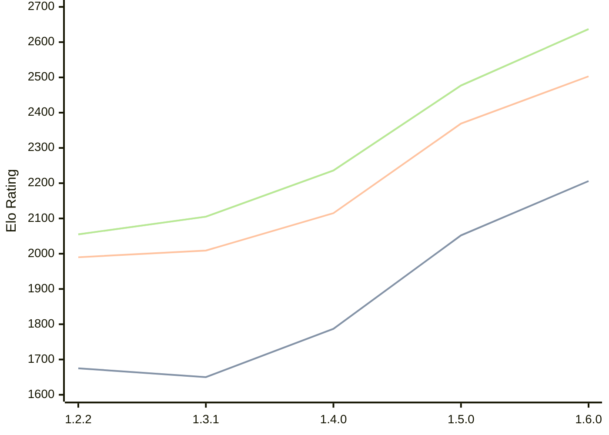

# Engine: SoloEngine

Author: Yunus Emre Yıldız

Home: https://github.com/yunusemreyldz07/SoloEngine

## Ratings nach Version

| Version | Published | STC 8.0+0.08s  | LTC 60.0+0.60s | VLTC 2m24s+1.12s | Comment |
| --- | --- | --- | --- | --- | --- |
| 1.6.0 | 2026-03-14 | 2206(+154) | 2503(+134) | 2637(+160) |  |
| 1.5.0 | 2026-03-04 | 2052(+265) | 2369(+254) | 2477(+241) |  |
| 1.4.0 | 2026-02-07 | 1787(+137) | 2115(+106) | 2236(+131) |  |
| 1.3.1 | 2026-02-01 | 1650(-25) | 2009(+19) | 2105(+50) |  |
| 1.2.2 | 2026-01-23 | 1675 | 1990 | 2055 |  |
 | | | cElo (∆ prev) | cElo (∆ prev) | cElo (∆ prev) | 

<a href="https://github.com/computer-chess-index/cci/issues/new?template=submit-version.yml&title=[VERSION]+SoloEngine+<version>&body=###%20Engine%20name%0ASoloEngine%0A%0A###%20Version%0A1.6.0" target="_blank">Submit new version</a>

 Test Conditions:

GUI/CLI: <a href=https://github.com/cutechess/cutechess target="_blank">Cute-Chess</a> 
Elo Calculation: <a href=https://www.remi-coulom.fr/Bayesian-Elo/ target="_blank">Bayesian-Elo</a> 
CPU: Intel(R) Core(TM) i5-7500T 2.70GHz 
Opening book: 8_moves_v3 
\* STC: 8.0+0.08s, LTC: 60.0+0.60s, VLTC: 2m24s+1.12s

 Lists:
Ratings: <a href=https://github.com/computer-chess-index/cci/blob/main/lists/CCIRatings.csv target="_blank">Complete list</a>

Generated: 2026-03-22 06:25:56

## Ratings Verlauf

⬛ STC (8.0+0.08s) &nbsp;&nbsp; 🟧 LTC (60.0+0.60s) &nbsp;&nbsp; 🟩 VLTC (2m24s+1.12s)

dark mode: 🟩STC (8.0+0.08s) 🟧LTC (60.0+0.60s) ⬜VLTC (2m24s+1.12s)

