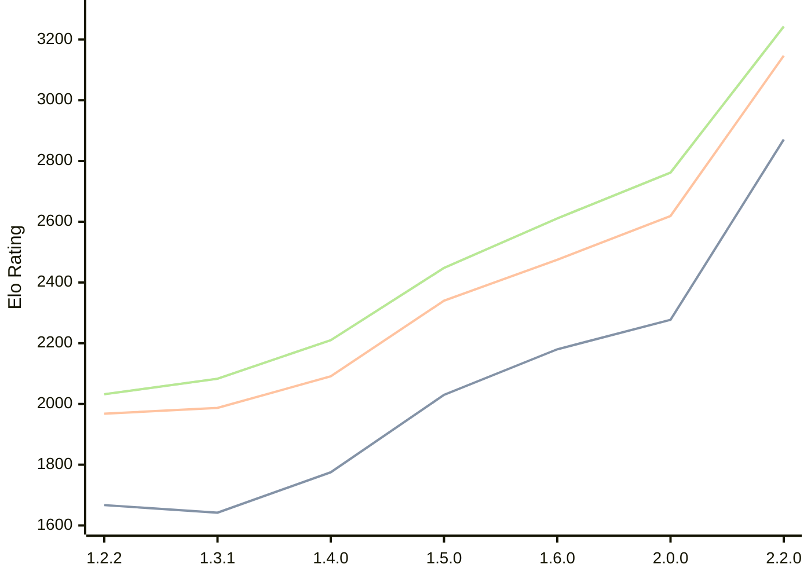

# Engine: SoloEngine

Author: Yunus Emre Yıldız

Home: https://github.com/yunusemreyldz07/SoloEngine

## Elo Ratings

| Version | Published | STC 8.0+0.08s  | LTC 60.0+0.60s | VLTC 2m24s+1.12s | Comment |
| --- | --- | --- | --- | --- | --- |
| 2.2.0 | 2026-06-06 | 2871(+new) | 3147(+new) | 3243(+new) |  |
| 2.1.0 | 2026-04-14 |  |  |  |  |
| 2.0.0 | 2026-03-23 | 2277(+97) | 2619(+144) | 2762(+151) |  |
| 1.6.0 | 2026-03-14 | 2180(+150) | 2475(+135) | 2611(+163) |  |
| 1.5.0 | 2026-03-04 | 2030(+255) | 2340(+249) | 2448(+238) |  |
| 1.4.0 | 2026-02-07 | 1775(+133) | 2091(+104) | 2210(+127) |  |
| 1.3.1 | 2026-02-01 | 1642(-25) | 1987(+19) | 2083(+51) |  |
| 1.2.2 | 2026-01-23 | 1667 | 1968 | 2032 |  |
 | | | cElo (∆ prev) | cElo (∆ prev) | cElo (∆ prev) | 

<a href="https://github.com/computer-chess-index/cci/issues/new?template=submit-version.yml&title=[VERSION]+SoloEngine+<version>&body=###%20Engine%20name%0ASoloEngine%0A%0A###%20Version%0A2.2.0" target="_blank">Submit new version</a>

 Test Conditions:

GUI/CLI: <a href=https://github.com/cutechess/cutechess target="_blank">Cute-Chess</a> 
Elo Calculation: <a href=https://www.remi-coulom.fr/Bayesian-Elo/ target="_blank">Bayesian-Elo</a> 
CPU: Intel(R) Core(TM) i5-7500T 2.70GHz 
Opening book: 8_moves_v3 
\* STC: 8.0+0.08s, LTC: 60.0+0.60s, VLTC: 2m24s+1.12s

 Lists:
Ratings: <a href=https://github.com/computer-chess-index/cci/blob/main/lists/CCIRatings.csv target="_blank">Complete list</a>

Generated: 2026-09-26 04:42:29

## Ratings Verlauf

## Detailed Evaluation Results

| Version | Time Control | Elo  | Range +/- | Matches | Score | Average Opponent Elo | Draws |
| --- | --- | --- | --- | --- | --- | --- | --- |
| 2.2.0 | VLTC (2m24s+1.12s) | 3243 | 26 | 380 | 50% | 3241 | 63% |
| 2.2.0 | LTC (60.0+0.60s) | 3147 | 28 | 366 | 53% | 3114 | 55% |
| 2.2.0 | STC (8.0+0.08s) | 2871 | 25 | 480 | 52% | 2854 | 43% |
| --- | --- | --- | --- | --- | --- | --- | --- |
| 2.0.0 | VLTC (2m24s+1.12s) | 2762 | 27 | 436 | 52% | 2745 | 32% |
| 2.0.0 | LTC (60.0+0.60s) | 2619 | 31 | 328 | 49% | 2624 | 34% |
| 2.0.0 | STC (8.0+0.08s) | 2277 | 31 | 348 | 52% | 2260 | 26% |
| --- | --- | --- | --- | --- | --- | --- | --- |
| 1.6.0 | VLTC (2m24s+1.12s) | 2611 | 34 | 280 | 50% | 2607 | 36% |
| 1.6.0 | LTC (60.0+0.60s) | 2475 | 32 | 332 | 51% | 2462 | 30% |
| 1.6.0 | STC (8.0+0.08s) | 2180 | 35 | 288 | 49% | 2198 | 26% |
| --- | --- | --- | --- | --- | --- | --- | --- |
| 1.5.0 | VLTC (2m24s+1.12s) | 2448 | 30 | 380 | 48% | 2468 | 28% |
| 1.5.0 | LTC (60.0+0.60s) | 2340 | 37 | 252 | 52% | 2323 | 25% |
| 1.5.0 | STC (8.0+0.08s) | 2030 | 35 | 288 | 54% | 1990 | 22% |
| --- | --- | --- | --- | --- | --- | --- | --- |
| 1.4.0 | VLTC (2m24s+1.12s) | 2210 | 36 | 264 | 49% | 2219 | 28% |
| 1.4.0 | LTC (60.0+0.60s) | 2091 | 40 | 206 | 53% | 2070 | 33% |
| 1.4.0 | STC (8.0+0.08s) | 1775 | 43 | 180 | 51% | 1766 | 28% |
| --- | --- | --- | --- | --- | --- | --- | --- |
| 1.3.1 | VLTC (2m24s+1.12s) | 2083 | 40 | 204 | 52% | 2068 | 31% |
| 1.3.1 | LTC (60.0+0.60s) | 1987 | 46 | 164 | 51% | 1982 | 23% |
| 1.3.1 | STC (8.0+0.08s) | 1642 | 42 | 208 | 47% | 1667 | 18% |
| --- | --- | --- | --- | --- | --- | --- | --- |
| 1.2.2 | VLTC (2m24s+1.12s) | 2032 | 38 | 260 | 46% | 2102 | 24% |
| 1.2.2 | LTC (60.0+0.60s) | 1968 | 43 | 204 | 46% | 2032 | 20% |
| 1.2.2 | STC (8.0+0.08s) | 1667 | 41 | 232 | 47% | 1723 | 18% |
| --- | --- | --- | --- | --- | --- | --- | --- |