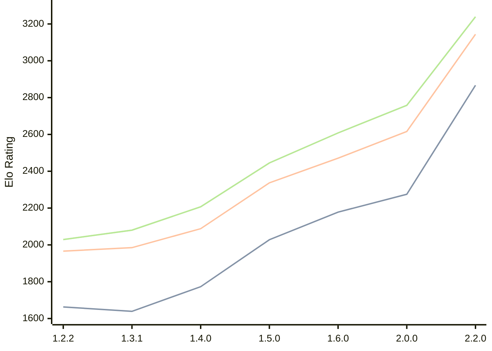

# Engine: SoloEngine

Author: Yunus Emre Yıldız

Home: https://github.com/yunusemreyldz07/SoloEngine

## Elo Ratings

| Version | Published | STC 8.0+0.08s  | LTC 60.0+0.60s | VLTC 2m24s+1.12s | Comment |
| --- | --- | --- | --- | --- | --- |
| 2.2.0 | 2026-06-06 | 2867(+new) | 3144(+new) | 3239(+new) |  |
| 2.1.0 | 2026-04-14 |  |  |  |  |
| 2.0.0 | 2026-03-23 | 2275(+97) | 2616(+145) | 2758(+150) |  |
| 1.6.0 | 2026-03-14 | 2178(+150) | 2471(+134) | 2608(+163) |  |
| 1.5.0 | 2026-03-04 | 2028(+255) | 2337(+249) | 2445(+238) |  |
| 1.4.0 | 2026-02-07 | 1773(+134) | 2088(+103) | 2207(+127) |  |
| 1.3.1 | 2026-02-01 | 1639(-24) | 1985(+19) | 2080(+51) |  |
| 1.2.2 | 2026-01-23 | 1663 | 1966 | 2029 |  |
 | | | cElo (∆ prev) | cElo (∆ prev) | cElo (∆ prev) | 

<a href="https://github.com/computer-chess-index/cci/issues/new?template=submit-version.yml&title=[VERSION]+SoloEngine+<version>&body=###%20Engine%20name%0ASoloEngine%0A%0A###%20Version%0A2.2.0" target="_blank">Submit new version</a>

 Test Conditions:

GUI/CLI: <a href=https://github.com/cutechess/cutechess target="_blank">Cute-Chess</a> 
Elo Calculation: <a href=https://www.remi-coulom.fr/Bayesian-Elo/ target="_blank">Bayesian-Elo</a> 
CPU: Intel(R) Core(TM) i5-7500T 2.70GHz 
Opening book: 8_moves_v3 
\* STC: 8.0+0.08s, LTC: 60.0+0.60s, VLTC: 2m24s+1.12s

 Lists:
Ratings: <a href=https://github.com/computer-chess-index/cci/blob/main/lists/CCIRatings.csv target="_blank">Complete list</a>

Generated: 2026-09-14 04:42:18

## Ratings Verlauf

## Detailed Evaluation Results

| Version | Time Control | Elo  | Range +/- | Matches | Score | Average Opponent Elo | Draws |
| --- | --- | --- | --- | --- | --- | --- | --- |
| 2.2.0 | VLTC (2m24s+1.12s) | 3239 | 26 | 380 | 50% | 3237 | 63% |
| 2.2.0 | LTC (60.0+0.60s) | 3144 | 28 | 366 | 53% | 3110 | 55% |
| 2.2.0 | STC (8.0+0.08s) | 2867 | 26 | 462 | 51% | 2851 | 44% |
| --- | --- | --- | --- | --- | --- | --- | --- |
| 2.0.0 | VLTC (2m24s+1.12s) | 2758 | 27 | 436 | 52% | 2742 | 32% |
| 2.0.0 | LTC (60.0+0.60s) | 2616 | 31 | 328 | 49% | 2622 | 34% |
| 2.0.0 | STC (8.0+0.08s) | 2275 | 31 | 348 | 52% | 2257 | 26% |
| --- | --- | --- | --- | --- | --- | --- | --- |
| 1.6.0 | VLTC (2m24s+1.12s) | 2608 | 34 | 280 | 50% | 2604 | 36% |
| 1.6.0 | LTC (60.0+0.60s) | 2471 | 32 | 332 | 51% | 2460 | 30% |
| 1.6.0 | STC (8.0+0.08s) | 2178 | 35 | 288 | 49% | 2195 | 26% |
| --- | --- | --- | --- | --- | --- | --- | --- |
| 1.5.0 | VLTC (2m24s+1.12s) | 2445 | 30 | 380 | 48% | 2464 | 28% |
| 1.5.0 | LTC (60.0+0.60s) | 2337 | 37 | 252 | 52% | 2321 | 25% |
| 1.5.0 | STC (8.0+0.08s) | 2028 | 35 | 288 | 54% | 1986 | 22% |
| --- | --- | --- | --- | --- | --- | --- | --- |
| 1.4.0 | VLTC (2m24s+1.12s) | 2207 | 36 | 264 | 49% | 2217 | 28% |
| 1.4.0 | LTC (60.0+0.60s) | 2088 | 40 | 206 | 53% | 2067 | 33% |
| 1.4.0 | STC (8.0+0.08s) | 1773 | 43 | 180 | 51% | 1763 | 28% |
| --- | --- | --- | --- | --- | --- | --- | --- |
| 1.3.1 | VLTC (2m24s+1.12s) | 2080 | 40 | 204 | 52% | 2066 | 31% |
| 1.3.1 | LTC (60.0+0.60s) | 1985 | 46 | 164 | 51% | 1978 | 23% |
| 1.3.1 | STC (8.0+0.08s) | 1639 | 42 | 208 | 47% | 1665 | 18% |
| --- | --- | --- | --- | --- | --- | --- | --- |
| 1.2.2 | VLTC (2m24s+1.12s) | 2029 | 38 | 260 | 46% | 2098 | 24% |
| 1.2.2 | LTC (60.0+0.60s) | 1966 | 43 | 204 | 46% | 2029 | 20% |
| 1.2.2 | STC (8.0+0.08s) | 1663 | 41 | 232 | 47% | 1719 | 18% |
| --- | --- | --- | --- | --- | --- | --- | --- |