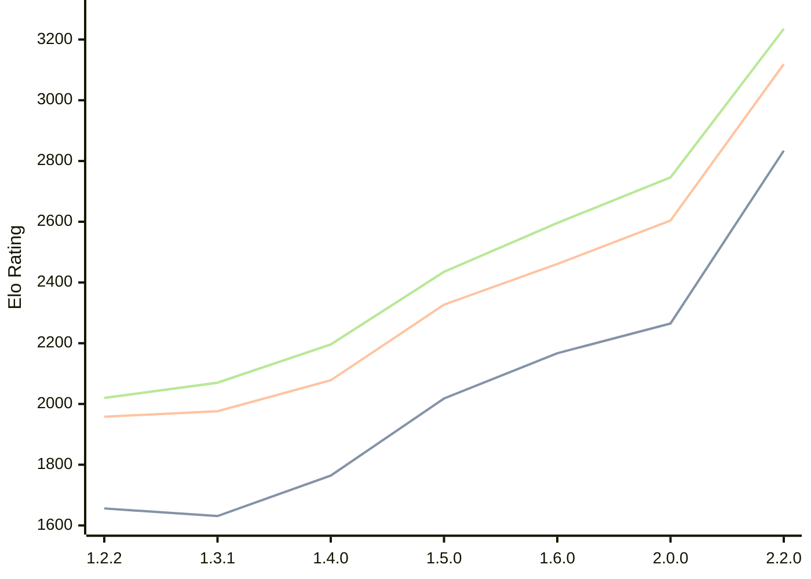

# Engine: SoloEngine

Author: Yunus Emre Yıldız

Home: https://github.com/yunusemreyldz07/SoloEngine

## Elo Ratings

| Version | Published | STC 8.0+0.08s  | LTC 60.0+0.60s | VLTC 2m24s+1.12s | Comment |
| --- | --- | --- | --- | --- | --- |
| 2.2.0 | 2026-06-06 | 2834(+new) | 3119(+new) | 3235(+new) |  |
| 2.1.0 | 2026-04-14 |  |  |  |  |
| 2.0.0 | 2026-03-23 | 2265(+98) | 2604(+143) | 2746(+150) |  |
| 1.6.0 | 2026-03-14 | 2167(+149) | 2461(+134) | 2596(+161) |  |
| 1.5.0 | 2026-03-04 | 2018(+254) | 2327(+249) | 2435(+239) |  |
| 1.4.0 | 2026-02-07 | 1764(+133) | 2078(+102) | 2196(+126) |  |
| 1.3.1 | 2026-02-01 | 1631(-25) | 1976(+18) | 2070(+50) |  |
| 1.2.2 | 2026-01-23 | 1656 | 1958 | 2020 |  |
 | | | cElo (∆ prev) | cElo (∆ prev) | cElo (∆ prev) | 

<a href="https://github.com/computer-chess-index/cci/issues/new?template=submit-version.yml&title=[VERSION]+SoloEngine+<version>&body=###%20Engine%20name%0ASoloEngine%0A%0A###%20Version%0A2.2.0" target="_blank">Submit new version</a>

 Test Conditions:

GUI/CLI: <a href=https://github.com/cutechess/cutechess target="_blank">Cute-Chess</a> 
Elo Calculation: <a href=https://www.remi-coulom.fr/Bayesian-Elo/ target="_blank">Bayesian-Elo</a> 
CPU: Intel(R) Core(TM) i5-7500T 2.70GHz 
Opening book: 8_moves_v3 
\* STC: 8.0+0.08s, LTC: 60.0+0.60s, VLTC: 2m24s+1.12s

 Lists:
Ratings: <a href=https://github.com/computer-chess-index/cci/blob/main/lists/CCIRatings.csv target="_blank">Complete list</a>

Generated: 2026-06-24 06:28:39

## Ratings Verlauf

## Ratings Verlauf

⬛ STC (8.0+0.08s) &nbsp;&nbsp; 🟧 LTC (60.0+0.60s) &nbsp;&nbsp; 🟩 VLTC (2m24s+1.12s)

dark mode: 🟩STC (8.0+0.08s) 🟧LTC (60.0+0.60s) ⬜VLTC (2m24s+1.12s)

## Detailed Evaluation Results

| Version | Time Control | Elo  | Range +/- | Matches | Score | Average Opponent Elo | Draws |
| --- | --- | --- | --- | --- | --- | --- | --- |
| 2.2.0 | VLTC (2m24s+1.12s) | 3235 | 33 | 248 | 52% | 3214 | 62% |
| 2.2.0 | LTC (60.0+0.60s) | 3119 | 33 | 262 | 53% | 3082 | 53% |
| 2.2.0 | STC (8.0+0.08s) | 2834 | 32 | 294 | 50% | 2828 | 44% |
| --- | --- | --- | --- | --- | --- | --- | --- |
| 2.0.0 | VLTC (2m24s+1.12s) | 2746 | 27 | 436 | 52% | 2728 | 32% |
| 2.0.0 | LTC (60.0+0.60s) | 2604 | 31 | 328 | 49% | 2610 | 34% |
| 2.0.0 | STC (8.0+0.08s) | 2265 | 31 | 348 | 52% | 2248 | 26% |
| --- | --- | --- | --- | --- | --- | --- | --- |
| 1.6.0 | VLTC (2m24s+1.12s) | 2596 | 34 | 280 | 50% | 2592 | 36% |
| 1.6.0 | LTC (60.0+0.60s) | 2461 | 32 | 332 | 51% | 2449 | 30% |
| 1.6.0 | STC (8.0+0.08s) | 2167 | 35 | 288 | 49% | 2184 | 26% |
| --- | --- | --- | --- | --- | --- | --- | --- |
| 1.5.0 | VLTC (2m24s+1.12s) | 2435 | 30 | 380 | 48% | 2454 | 28% |
| 1.5.0 | LTC (60.0+0.60s) | 2327 | 37 | 252 | 52% | 2311 | 25% |
| 1.5.0 | STC (8.0+0.08s) | 2018 | 35 | 288 | 54% | 1978 | 22% |
| --- | --- | --- | --- | --- | --- | --- | --- |
| 1.4.0 | VLTC (2m24s+1.12s) | 2196 | 36 | 264 | 49% | 2206 | 28% |
| 1.4.0 | LTC (60.0+0.60s) | 2078 | 40 | 206 | 53% | 2056 | 33% |
| 1.4.0 | STC (8.0+0.08s) | 1764 | 43 | 180 | 51% | 1755 | 28% |
| --- | --- | --- | --- | --- | --- | --- | --- |
| 1.3.1 | VLTC (2m24s+1.12s) | 2070 | 40 | 204 | 52% | 2055 | 31% |
| 1.3.1 | LTC (60.0+0.60s) | 1976 | 46 | 164 | 51% | 1970 | 23% |
| 1.3.1 | STC (8.0+0.08s) | 1631 | 42 | 208 | 47% | 1658 | 18% |
| --- | --- | --- | --- | --- | --- | --- | --- |
| 1.2.2 | VLTC (2m24s+1.12s) | 2020 | 38 | 260 | 46% | 2088 | 24% |
| 1.2.2 | LTC (60.0+0.60s) | 1958 | 43 | 204 | 46% | 2021 | 20% |
| 1.2.2 | STC (8.0+0.08s) | 1656 | 41 | 232 | 47% | 1710 | 18% |
| --- | --- | --- | --- | --- | --- | --- | --- |