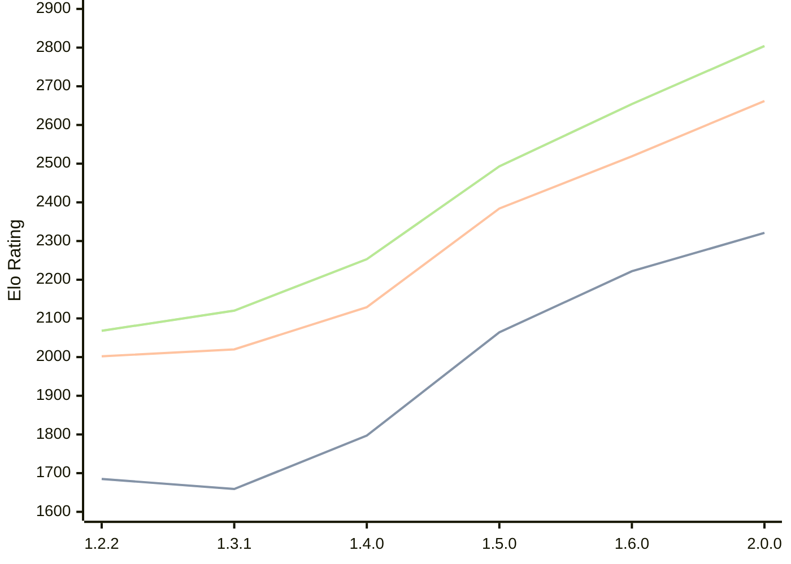

# Engine: SoloEngine

Author: Yunus Emre Yıldız

Home: https://github.com/yunusemreyldz07/SoloEngine

## Elo Ratings

| Version | Published | STC 8.0+0.08s  | LTC 60.0+0.60s | VLTC 2m24s+1.12s | Comment |
| --- | --- | --- | --- | --- | --- |
| 2.1.0 | 2026-04-14 |  |  |  |  |
| 2.0.0 | 2026-03-23 | 2321(+99) | 2662(+143) | 2804(+150) |  |
| 1.6.0 | 2026-03-14 | 2222(+158) | 2519(+135) | 2654(+161) |  |
| 1.5.0 | 2026-03-04 | 2064(+267) | 2384(+255) | 2493(+240) |  |
| 1.4.0 | 2026-02-07 | 1797(+138) | 2129(+109) | 2253(+133) |  |
| 1.3.1 | 2026-02-01 | 1659(-26) | 2020(+18) | 2120(+52) |  |
| 1.2.2 | 2026-01-23 | 1685 | 2002 | 2068 |  |
 | | | cElo (∆ prev) | cElo (∆ prev) | cElo (∆ prev) | 

<a href="https://github.com/computer-chess-index/cci/issues/new?template=submit-version.yml&title=[VERSION]+SoloEngine+<version>&body=###%20Engine%20name%0ASoloEngine%0A%0A###%20Version%0A2.1.0" target="_blank">Submit new version</a>

 Test Conditions:

GUI/CLI: <a href=https://github.com/cutechess/cutechess target="_blank">Cute-Chess</a> 
Elo Calculation: <a href=https://www.remi-coulom.fr/Bayesian-Elo/ target="_blank">Bayesian-Elo</a> 
CPU: Intel(R) Core(TM) i5-7500T 2.70GHz 
Opening book: 8_moves_v3 
\* STC: 8.0+0.08s, LTC: 60.0+0.60s, VLTC: 2m24s+1.12s

 Lists:
Ratings: <a href=https://github.com/computer-chess-index/cci/blob/main/lists/CCIRatings.csv target="_blank">Complete list</a>

Generated: 2026-05-04 06:28:09

## Ratings Verlauf

⬛ STC (8.0+0.08s) &nbsp;&nbsp; 🟧 LTC (60.0+0.60s) &nbsp;&nbsp; 🟩 VLTC (2m24s+1.12s)

dark mode: 🟩STC (8.0+0.08s) 🟧LTC (60.0+0.60s) ⬜VLTC (2m24s+1.12s)

## Detailed Evaluation Results

| Version | Time Control | Elo  | Range +/- | Matches | Score | Average Opponent Elo | Draws |
| --- | --- | --- | --- | --- | --- | --- | --- |
| 2.0.0 | VLTC (2m24s+1.12s) | 2804 | 27 | 436 | 52% | 2786 | 32% |
| 2.0.0 | LTC (60.0+0.60s) | 2662 | 31 | 328 | 49% | 2668 | 34% |
| 2.0.0 | STC (8.0+0.08s) | 2321 | 31 | 348 | 52% | 2304 | 26% |
| --- | --- | --- | --- | --- | --- | --- | --- |
| 1.6.0 | VLTC (2m24s+1.12s) | 2654 | 34 | 280 | 50% | 2650 | 36% |
| 1.6.0 | LTC (60.0+0.60s) | 2519 | 32 | 332 | 51% | 2507 | 30% |
| 1.6.0 | STC (8.0+0.08s) | 2222 | 35 | 288 | 49% | 2240 | 26% |
| --- | --- | --- | --- | --- | --- | --- | --- |
| 1.5.0 | VLTC (2m24s+1.12s) | 2493 | 30 | 380 | 48% | 2512 | 28% |
| 1.5.0 | LTC (60.0+0.60s) | 2384 | 37 | 252 | 52% | 2368 | 25% |
| 1.5.0 | STC (8.0+0.08s) | 2064 | 35 | 288 | 54% | 2024 | 22% |
| --- | --- | --- | --- | --- | --- | --- | --- |
| 1.4.0 | VLTC (2m24s+1.12s) | 2253 | 36 | 264 | 49% | 2263 | 28% |
| 1.4.0 | LTC (60.0+0.60s) | 2129 | 40 | 206 | 53% | 2107 | 33% |
| 1.4.0 | STC (8.0+0.08s) | 1797 | 43 | 180 | 51% | 1789 | 28% |
| --- | --- | --- | --- | --- | --- | --- | --- |
| 1.3.1 | VLTC (2m24s+1.12s) | 2120 | 40 | 204 | 52% | 2105 | 31% |
| 1.3.1 | LTC (60.0+0.60s) | 2020 | 46 | 164 | 51% | 2014 | 23% |
| 1.3.1 | STC (8.0+0.08s) | 1659 | 42 | 208 | 47% | 1685 | 18% |
| --- | --- | --- | --- | --- | --- | --- | --- |
| 1.2.2 | VLTC (2m24s+1.12s) | 2068 | 38 | 260 | 46% | 2138 | 24% |
| 1.2.2 | LTC (60.0+0.60s) | 2002 | 43 | 204 | 46% | 2067 | 20% |
| 1.2.2 | STC (8.0+0.08s) | 1685 | 41 | 232 | 47% | 1740 | 18% |
| --- | --- | --- | --- | --- | --- | --- | --- |