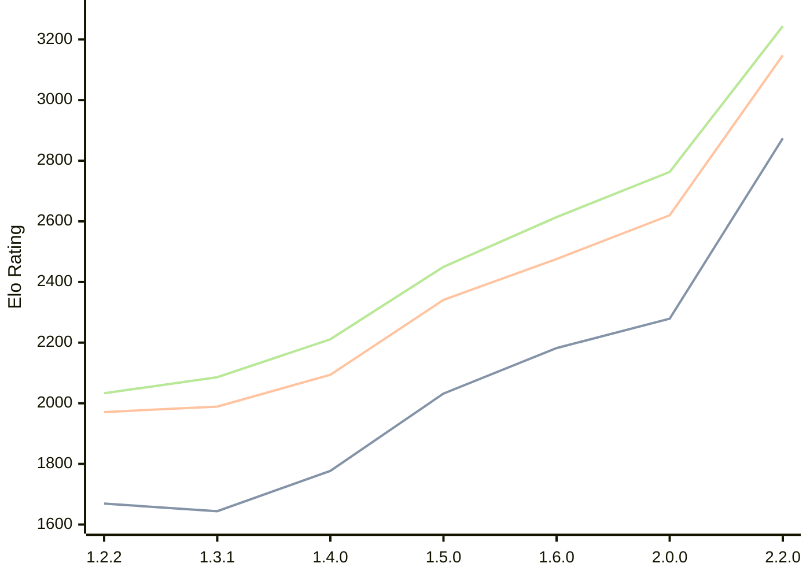

# Engine: SoloEngine

Author: Yunus Emre Yıldız

Home: https://github.com/yunusemreyldz07/SoloEngine

## Elo Ratings E1

| Version | Published | STC 8.0+0.08s  | LTC 60.0+0.60s | VLTC 2m24s+1.12s | Comment |
| --- | --- | --- | --- | --- | --- |
| 2.2.0 | 2026-06-06 | 2792 | 3075 | 3137 |  |
 | | | cElo (∆ prev) | cElo (∆ prev) | cElo (∆ prev) | 

## Elo Ratings P1

| Version | Published | STC 8.0+0.08s  | LTC 60.0+0.60s | VLTC 2m24s+1.12s | Comment |
| --- | --- | --- | --- | --- | --- |
| 2.2.0 | 2026-06-06 | 3005 | 3337 | 3407 |  |
 | | | cElo (∆ prev) | cElo (∆ prev) | cElo (∆ prev) | 

## Elo Ratings T1

| Version | Published | STC 8.0+0.08s  | LTC 60.0+0.60s | VLTC 2m24s+1.12s | Comment |
| --- | --- | --- | --- | --- | --- |
| 2.2.0 | 2026-06-06 | 2874(+595) | 3148(+528) | 3244(+481) |  |
| 2.0.0 | 2026-03-23 | 2279(+97) | 2620(+144) | 2763(+149) |  |
| 1.6.0 | 2026-03-14 | 2182(+150) | 2476(+135) | 2614(+164) |  |
| 1.5.0 | 2026-03-04 | 2032(+255) | 2341(+247) | 2450(+239) |  |
| 1.4.0 | 2026-02-07 | 1777(+133) | 2094(+105) | 2211(+125) |  |
| 1.3.1 | 2026-02-01 | 1644(-25) | 1989(+18) | 2086(+53) |  |
| 1.2.2 | 2026-01-23 | 1669 | 1971 | 2033 |  |
 | | | cElo (∆ prev) | cElo (∆ prev) | cElo (∆ prev) | 

<a href="https://github.com/computer-chess-index/cci/issues/new?template=submit-version.yml&title=[VERSION]+SoloEngine+<version>&body=###%20Engine%20name%0ASoloEngine%0A%0A###%20Version%0A2.2.0" target="_blank">Submit new version</a>

 Test Conditions:

GUI/CLI: <a href=https://github.com/cutechess/cutechess target="_blank">Cute-Chess</a> 
Elo Calculation: <a href=https://www.remi-coulom.fr/Bayesian-Elo/ target="_blank">Bayesian-Elo</a> 
CPU for P1: Intel(R) Core(TM) Ultra 7 265T (1.50 GHz) - P-Core 
CPU for E1: Intel(R) Core(TM) Ultra 7 265T (1.50 GHz) - E-Core 
CPU for T1: Intel(R) Core(TM) i5-7500T 2.70GHz 
Opening book: 8_moves_v3 
\* STC: 8.0+0.08s, LTC: 60.0+0.60s, VLTC: 2m24s+1.12s

 Lists:
Ratings: <a href=https://github.com/computer-chess-index/cci/blob/main/lists/CCIRatings.csv target="_blank">Complete list</a>

Generated: 2026-10-10 04:42:45

## Ratings Verlauf

```mermaid
%%{init: {"theme":"base","themeVariables":{"seriesColors:['#a3a3a3','#222221','#faa371']}}}%%
xychart-beta
  x-axis ["1.2.2", "1.3.1", "1.4.0", "1.5.0", "1.6.0", "2.0.0", "2.2.0"]
  y-axis "Elo Rating" 1600 --> 3300
  line "" [1669, 1644, 1777, 2032, 2182, 2279, 2874]
  line "STC (8.0+0.08s)" [1669, 1644, 1777, 2032, 2182, 2279, 2874]
  line "LTC (60.0+0.60s)" [1971, 1989, 2094, 2341, 2476, 2620, 3148]
  line "" [2033, 2086, 2211, 2450, 2614, 2763, 3244]
  line "VLTC (2m24s+1.12s)" [2033, 2086, 2211, 2450, 2614, 2763, 3244]
```

## Detailed Evaluation Results

| Version | Time Control | Elo  | Range +/- | Matches | Score | Average Opponent Elo | Draws |
| --- | --- | --- | --- | --- | --- | --- | --- |
| 2.2.0 | VLTC (2m24s+1.12s) | 3137 | 39 | 202 | 56% | 3062 | 48% |
| 2.2.0 | VLTC (2m24s+1.12s) | 3244 | 26 | 380 | 50% | 3243 | 63% |
| 2.2.0 | VLTC (2m24s+1.12s) | 3407 | 42 | 178 | 60% | 3218 | 46% |
| 2.2.0 | LTC (60.0+0.60s) | 3075 | 36 | 242 | 59% | 2920 | 46% |
| 2.2.0 | LTC (60.0+0.60s) | 3148 | 28 | 368 | 53% | 3116 | 55% |
| 2.2.0 | LTC (60.0+0.60s) | 3337 | 40 | 174 | 55% | 3283 | 55% |
| 2.2.0 | STC (8.0+0.08s) | 2792 | 35 | 252 | 49% | 2803 | 42% |
| --- | --- | --- | --- | --- | --- | --- | --- |
| 2.2.0 | STC (8.0+0.08s) | 2874 | 25 | 484 | 52% | 2855 | 43% |
| --- | --- | --- | --- | --- | --- | --- | --- |
| 2.2.0 | STC (8.0+0.08s) | 3005 | 41 | 180 | 49% | 3017 | 41% |
| --- | --- | --- | --- | --- | --- | --- | --- |
| 2.0.0 | VLTC (2m24s+1.12s) | 2763 | 27 | 436 | 52% | 2746 | 32% |
| 2.0.0 | LTC (60.0+0.60s) | 2620 | 31 | 328 | 49% | 2626 | 34% |
| 2.0.0 | STC (8.0+0.08s) | 2279 | 31 | 348 | 52% | 2263 | 26% |
| --- | --- | --- | --- | --- | --- | --- | --- |
| 1.6.0 | VLTC (2m24s+1.12s) | 2614 | 34 | 280 | 50% | 2608 | 36% |
| 1.6.0 | LTC (60.0+0.60s) | 2476 | 32 | 332 | 51% | 2464 | 30% |
| 1.6.0 | STC (8.0+0.08s) | 2182 | 35 | 288 | 49% | 2199 | 26% |
| --- | --- | --- | --- | --- | --- | --- | --- |
| 1.5.0 | VLTC (2m24s+1.12s) | 2450 | 30 | 380 | 48% | 2469 | 28% |
| 1.5.0 | LTC (60.0+0.60s) | 2341 | 37 | 252 | 52% | 2325 | 25% |
| 1.5.0 | STC (8.0+0.08s) | 2032 | 35 | 288 | 54% | 1991 | 22% |
| --- | --- | --- | --- | --- | --- | --- | --- |
| 1.4.0 | VLTC (2m24s+1.12s) | 2211 | 36 | 264 | 49% | 2221 | 28% |
| 1.4.0 | LTC (60.0+0.60s) | 2094 | 40 | 206 | 53% | 2072 | 33% |
| 1.4.0 | STC (8.0+0.08s) | 1777 | 43 | 180 | 51% | 1769 | 28% |
| --- | --- | --- | --- | --- | --- | --- | --- |
| 1.3.1 | VLTC (2m24s+1.12s) | 2086 | 40 | 204 | 52% | 2071 | 31% |
| 1.3.1 | LTC (60.0+0.60s) | 1989 | 46 | 164 | 51% | 1983 | 23% |
| 1.3.1 | STC (8.0+0.08s) | 1644 | 42 | 208 | 47% | 1670 | 18% |
| --- | --- | --- | --- | --- | --- | --- | --- |
| 1.2.2 | VLTC (2m24s+1.12s) | 2033 | 38 | 260 | 46% | 2103 | 24% |
| 1.2.2 | LTC (60.0+0.60s) | 1971 | 43 | 204 | 46% | 2034 | 20% |
| 1.2.2 | STC (8.0+0.08s) | 1669 | 41 | 232 | 47% | 1724 | 18% |
| --- | --- | --- | --- | --- | --- | --- | --- |