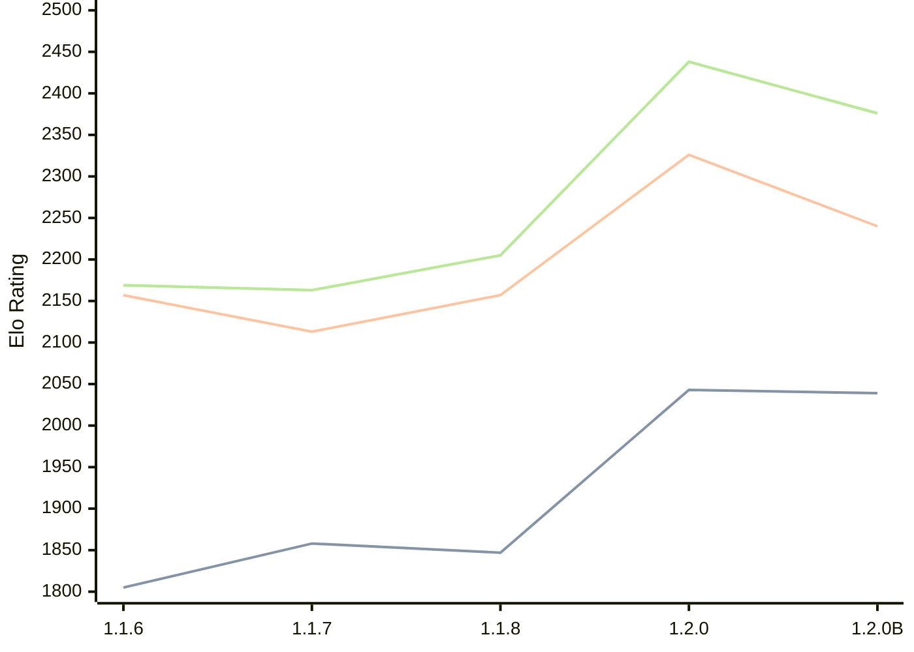

# Engine: Soomi

Author: Otto Laukkanen

Home: https://github.com/Koma1867/Soomi-V1-Chess-engine-in-golang

## Elo Ratings

| Version | Published | STC 8.0+0.08s  | LTC 60.0+0.60s | VLTC 2m24s+1.12s | Comment |
| --- | --- | --- | --- | --- | --- |
| 1.2.0B | 2026-04-24 | 2039(-4) | 2240(-86) | 2376(-62) |  |
| 1.2.0 | 2025-12-31 | 2043(+196) | 2326(+169) | 2438(+233) |  |
| 1.1.8 | 2025-12-16 | 1847(-11) | 2157(+44) | 2205(+42) |  |
| 1.1.7 | 2025-12-07 | 1858(+53) | 2113(-44) | 2163(-6) |  |
| 1.1.6 | 2025-11-30 | 1805 | 2157 | 2169 |  |
 | | | cElo (∆ prev) | cElo (∆ prev) | cElo (∆ prev) | 

<a href="https://github.com/computer-chess-index/cci/issues/new?template=submit-version.yml&title=[VERSION]+Soomi+<version>&body=###%20Engine%20name%0ASoomi%0A%0A###%20Version%0A1.2.0B" target="_blank">Submit new version</a>

 Test Conditions:

GUI/CLI: <a href=https://github.com/cutechess/cutechess target="_blank">Cute-Chess</a> 
Elo Calculation: <a href=https://www.remi-coulom.fr/Bayesian-Elo/ target="_blank">Bayesian-Elo</a> 
CPU: Intel(R) Core(TM) i5-7500T 2.70GHz 
Opening book: 8_moves_v3 
\* STC: 8.0+0.08s, LTC: 60.0+0.60s, VLTC: 2m24s+1.12s

 Lists:
Ratings: <a href=https://github.com/computer-chess-index/cci/blob/main/lists/CCIRatings.csv target="_blank">Complete list</a>

Generated: 2026-05-19 06:29:14

## Ratings Verlauf

⬛ STC (8.0+0.08s) &nbsp;&nbsp; 🟧 LTC (60.0+0.60s) &nbsp;&nbsp; 🟩 VLTC (2m24s+1.12s)

dark mode: 🟩STC (8.0+0.08s) 🟧LTC (60.0+0.60s) ⬜VLTC (2m24s+1.12s)

## Detailed Evaluation Results

| Version | Time Control | Elo  | Range +/- | Matches | Score | Average Opponent Elo | Draws |
| --- | --- | --- | --- | --- | --- | --- | --- |
| 1.2.0B | VLTC (2m24s+1.12s) | 2376 | 34 | 296 | 49% | 2377 | 28% |
| 1.2.0B | LTC (60.0+0.60s) | 2240 | 32 | 344 | 49% | 2241 | 21% |
| 1.2.0B | STC (8.0+0.08s) | 2039 | 32 | 356 | 49% | 2040 | 23% |
| --- | --- | --- | --- | --- | --- | --- | --- |
| 1.2.0 | VLTC (2m24s+1.12s) | 2438 | 26 | 516 | 54% | 2403 | 23% |
| 1.2.0 | LTC (60.0+0.60s) | 2326 | 27 | 460 | 50% | 2329 | 26% |
| 1.2.0 | STC (8.0+0.08s) | 2043 | 26 | 502 | 50% | 2043 | 23% |
| --- | --- | --- | --- | --- | --- | --- | --- |
| 1.1.8 | VLTC (2m24s+1.12s) | 2205 | 45 | 180 | 47% | 2233 | 19% |
| 1.1.8 | LTC (60.0+0.60s) | 2157 | 42 | 192 | 50% | 2157 | 28% |
| 1.1.8 | STC (8.0+0.08s) | 1847 | 47 | 164 | 48% | 1867 | 20% |
| --- | --- | --- | --- | --- | --- | --- | --- |
| 1.1.7 | VLTC (2m24s+1.12s) | 2163 | 46 | 160 | 52% | 2152 | 28% |
| 1.1.7 | LTC (60.0+0.60s) | 2113 | 46 | 160 | 53% | 2083 | 26% |
| 1.1.7 | STC (8.0+0.08s) | 1858 | 50 | 140 | 55% | 1804 | 22% |
| --- | --- | --- | --- | --- | --- | --- | --- |
| 1.1.6 | VLTC (2m24s+1.12s) | 2169 | 50 | 152 | 43% | 2256 | 18% |
| 1.1.6 | LTC (60.0+0.60s) | 2157 | 46 | 168 | 46% | 2199 | 24% |
| 1.1.6 | STC (8.0+0.08s) | 1805 | 60 | 104 | 48% | 1837 | 18% |
| --- | --- | --- | --- | --- | --- | --- | --- |