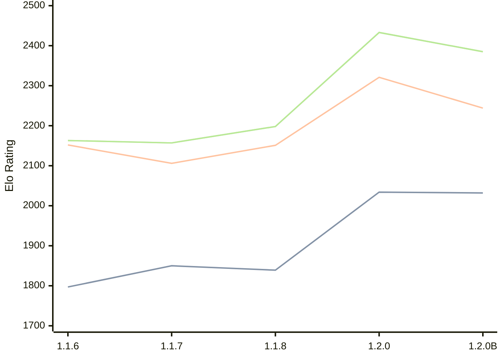

# Engine: Soomi

Author: Otto Laukkanen

Home: https://github.com/Koma1867/Soomi-V1-Chess-engine-in-golang

## Elo Ratings

| Version | Published | STC 8.0+0.08s  | LTC 60.0+0.60s | VLTC 2m24s+1.12s | Comment |
| --- | --- | --- | --- | --- | --- |
| 1.2.0B | 2026-04-24 | 2032(-2) | 2244(-77) | 2385(-48) |  |
| 1.2.0 | 2025-12-31 | 2034(+195) | 2321(+170) | 2433(+235) |  |
| 1.1.8 | 2025-12-16 | 1839(-11) | 2151(+45) | 2198(+41) |  |
| 1.1.7 | 2025-12-07 | 1850(+53) | 2106(-46) | 2157(-6) |  |
| 1.1.6 | 2025-11-30 | 1797 | 2152 | 2163 |  |
 | | | cElo (∆ prev) | cElo (∆ prev) | cElo (∆ prev) | 

<a href="https://github.com/computer-chess-index/cci/issues/new?template=submit-version.yml&title=[VERSION]+Soomi+<version>&body=###%20Engine%20name%0ASoomi%0A%0A###%20Version%0A1.2.0B" target="_blank">Submit new version</a>

 Test Conditions:

GUI/CLI: <a href=https://github.com/cutechess/cutechess target="_blank">Cute-Chess</a> 
Elo Calculation: <a href=https://www.remi-coulom.fr/Bayesian-Elo/ target="_blank">Bayesian-Elo</a> 
CPU: Intel(R) Core(TM) i5-7500T 2.70GHz 
Opening book: 8_moves_v3 
\* STC: 8.0+0.08s, LTC: 60.0+0.60s, VLTC: 2m24s+1.12s

 Lists:
Ratings: <a href=https://github.com/computer-chess-index/cci/blob/main/lists/CCIRatings.csv target="_blank">Complete list</a>

Generated: 2026-09-25 04:42:47

## Ratings Verlauf

## Detailed Evaluation Results

| Version | Time Control | Elo  | Range +/- | Matches | Score | Average Opponent Elo | Draws |
| --- | --- | --- | --- | --- | --- | --- | --- |
| 1.2.0B | VLTC (2m24s+1.12s) | 2385 | 28 | 444 | 51% | 2377 | 26% |
| 1.2.0B | LTC (60.0+0.60s) | 2244 | 28 | 468 | 49% | 2248 | 22% |
| 1.2.0B | STC (8.0+0.08s) | 2032 | 26 | 524 | 50% | 2020 | 24% |
| --- | --- | --- | --- | --- | --- | --- | --- |
| 1.2.0 | VLTC (2m24s+1.12s) | 2433 | 26 | 516 | 54% | 2399 | 23% |
| 1.2.0 | LTC (60.0+0.60s) | 2321 | 27 | 460 | 50% | 2322 | 26% |
| 1.2.0 | STC (8.0+0.08s) | 2034 | 26 | 502 | 50% | 2036 | 23% |
| --- | --- | --- | --- | --- | --- | --- | --- |
| 1.1.8 | VLTC (2m24s+1.12s) | 2198 | 45 | 180 | 47% | 2226 | 19% |
| 1.1.8 | LTC (60.0+0.60s) | 2151 | 42 | 192 | 50% | 2151 | 28% |
| 1.1.8 | STC (8.0+0.08s) | 1839 | 47 | 164 | 48% | 1858 | 20% |
| --- | --- | --- | --- | --- | --- | --- | --- |
| 1.1.7 | VLTC (2m24s+1.12s) | 2157 | 46 | 160 | 52% | 2145 | 28% |
| 1.1.7 | LTC (60.0+0.60s) | 2106 | 46 | 160 | 53% | 2078 | 26% |
| 1.1.7 | STC (8.0+0.08s) | 1850 | 50 | 140 | 55% | 1794 | 22% |
| --- | --- | --- | --- | --- | --- | --- | --- |
| 1.1.6 | VLTC (2m24s+1.12s) | 2163 | 50 | 152 | 43% | 2250 | 18% |
| 1.1.6 | LTC (60.0+0.60s) | 2152 | 46 | 168 | 46% | 2194 | 24% |
| 1.1.6 | STC (8.0+0.08s) | 1797 | 60 | 104 | 48% | 1831 | 18% |
| --- | --- | --- | --- | --- | --- | --- | --- |