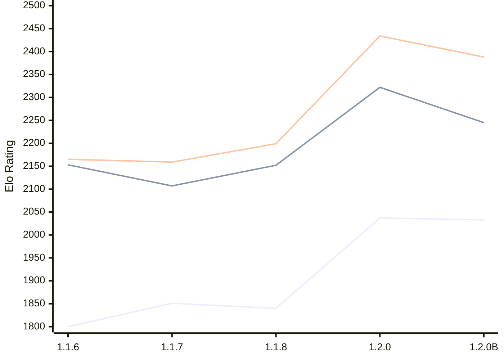

# Engine: Soomi

Author: Otto Laukkanen

Home: https://github.com/Koma1867/Soomi-V1-Chess-engine-in-golang

## Elo Ratings E1 (Ultra 7 265T (1.50 GHz) - E-Core)

| Version | Published | STC 8.0+0.08s  | LTC 60.0+0.60s | VLTC 2m24s+1.12s | Comment |
| --- | --- | --- | --- | --- | --- |
| 1.2.0B | 2026-04-24 | 1877 | 2152 | 2249 |  |
 | | | cElo (∆ prev) | cElo (∆ prev) | cElo (∆ prev) | 

## Elo Ratings P1 (Ultra 7 265T (1.50 GHz) - P-Core)

| Version | Published | STC 8.0+0.08s  | LTC 60.0+0.60s | VLTC 2m24s+1.12s | Comment |
| --- | --- | --- | --- | --- | --- |
| 1.2.0B | 2026-04-24 | 1995 | 2338 | 2294 |  |
 | | | cElo (∆ prev) | cElo (∆ prev) | cElo (∆ prev) | 

## Elo Ratings T1 (i5-7500T 2.70GHz)

| Version | Published | STC 8.0+0.08s  | LTC 60.0+0.60s | VLTC 2m24s+1.12s | Comment |
| --- | --- | --- | --- | --- | --- |
| 1.2.0B | 2026-04-24 | 2033(-4) | 2245(-77) | 2388(-46) |  |
| 1.2.0 | 2025-12-31 | 2037(+197) | 2322(+170) | 2434(+235) |  |
| 1.1.8 | 2025-12-16 | 1840(-11) | 2152(+45) | 2199(+40) |  |
| 1.1.7 | 2025-12-07 | 1851(+51) | 2107(-46) | 2159(-6) |  |
| 1.1.6 | 2025-11-30 | 1800 | 2153 | 2165 |  |
 | | | cElo (∆ prev) | cElo (∆ prev) | cElo (∆ prev) | 

<a href="https://github.com/computer-chess-index/cci/issues/new?template=submit-version.yml&title=[VERSION]+Soomi+<version>&body=###%20Engine%20name%0ASoomi%0A%0A###%20Version%0A1.2.0B" target="_blank">Submit new version</a>

 Test Conditions:

GUI/CLI: <a href=https://github.com/cutechess/cutechess target="_blank">Cute-Chess</a> 
Elo Calculation: <a href=https://www.remi-coulom.fr/Bayesian-Elo/ target="_blank">Bayesian-Elo</a> 
CPU for P1: Intel(R) Core(TM) Ultra 7 265T (1.50 GHz) - P-Core 
CPU for E1: Intel(R) Core(TM) Ultra 7 265T (1.50 GHz) - E-Core 
CPU for T1: Intel(R) Core(TM) i5-7500T 2.70GHz 
Opening book: 8_moves_v3 
\* STC: 8.0+0.08s, LTC: 60.0+0.60s, VLTC: 2m24s+1.12s

 Lists:
Ratings: <a href=https://github.com/computer-chess-index/cci/blob/main/lists/CCIRatings.csv target="_blank">Complete list</a>

Generated: 2026-10-16 04:43:50

## Ratings Verlauf T1

```mermaid
%%{init: {"theme":"base","themeVariables":{"seriesColors:['#a3a3a3','#222221','#faa371']}}}%%
xychart-beta
  x-axis ["1.1.6", "1.1.7", "1.1.8", "1.2.0", "1.2.0B"]
  y-axis "Elo Rating" 1800 --> 2500
  line "T1: STC (8.0+0.08s)" [1800, 1851, 1840, 2037, 2033]
  line "T1: LTC (60.0+0.60s)" [2153, 2107, 2152, 2322, 2245]
  line "T1: VLTC (2m24s+1.12s)" [2165, 2159, 2199, 2434, 2388]
```

## Detailed Evaluation Results

| Version | Time Control | Variant | Elo  | Range +/- | Matches | Score | Average Opponent Elo | Draws |
| --- | --- |--- | --- | --- | --- | --- | --- | --- |
| 1.2.0B | VLTC (2m24s+1.12s) | P1 | 2294 | 51 | 148 | 55% | 2195 | 22% |
|  |  | E1 | 2249 | 43 | 204 | 53% | 2214 | 20% |
|  |  | T1 | 2388 | 28 | 448 | 51% | 2379 | 26% |
|  | LTC (60.0+0.60s) | E1 | 2152 | 42 | 220 | 51% | 2153 | 20% |
|  |  | T1 | 2245 | 28 | 468 | 49% | 2249 | 22% |
|  |  | P1 | 2338 | 48 | 144 | 50% | 2342 | 28% |
|  | STC (8.0+0.08s) | E1 | 1877 | 37 | 250 | 46% | 1916 | 27% |
|  |  | T1 | 2033 | 26 | 524 | 50% | 2021 | 24% |
|  |  | P1 | 1995 | 46 | 168 | 47% | 2022 | 23% |
| --- | --- |--- | --- | --- | --- | --- | --- | --- |
| 1.2.0 | VLTC (2m24s+1.12s) | T1 | 2434 | 26 | 516 | 54% | 2400 | 23% |
|  | LTC (60.0+0.60s) | T1 | 2322 | 27 | 460 | 50% | 2325 | 26% |
|  | STC (8.0+0.08s) | T1 | 2037 | 26 | 502 | 50% | 2037 | 23% |
| --- | --- |--- | --- | --- | --- | --- | --- | --- |
| 1.1.8 | VLTC (2m24s+1.12s) | T1 | 2199 | 45 | 180 | 47% | 2229 | 19% |
|  | LTC (60.0+0.60s) | T1 | 2152 | 42 | 192 | 50% | 2152 | 28% |
|  | STC (8.0+0.08s) | T1 | 1840 | 47 | 164 | 48% | 1860 | 20% |
| --- | --- |--- | --- | --- | --- | --- | --- | --- |
| 1.1.7 | VLTC (2m24s+1.12s) | T1 | 2159 | 46 | 160 | 52% | 2147 | 28% |
|  | LTC (60.0+0.60s) | T1 | 2107 | 46 | 160 | 53% | 2079 | 26% |
|  | STC (8.0+0.08s) | T1 | 1851 | 50 | 140 | 55% | 1797 | 22% |
| --- | --- |--- | --- | --- | --- | --- | --- | --- |
| 1.1.6 | VLTC (2m24s+1.12s) | T1 | 2165 | 50 | 152 | 43% | 2252 | 18% |
|  | LTC (60.0+0.60s) | T1 | 2153 | 46 | 168 | 46% | 2195 | 24% |
|  | STC (8.0+0.08s) | T1 | 1800 | 60 | 104 | 48% | 1832 | 18% |