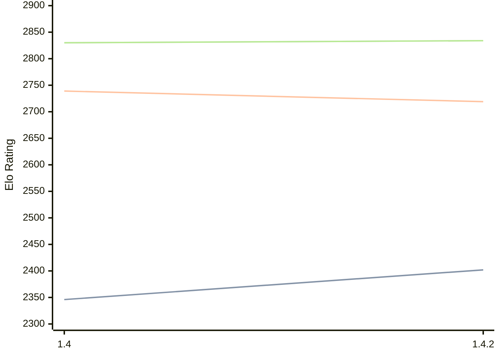

# Engine: Spike

Author: Volker Böhm, Ralf Schäfer

Home: https://github.com/Mangar2/Spike

## Elo Ratings

| Version | Published | STC 8.0+0.08s  | LTC 60.0+0.60s | VLTC 2m24s+1.12s | Comment |
| --- | --- | --- | --- | --- | --- |
| 1.4.2 | 2026-08-28 | 2402(+56) | 2719(-20) | 2834(+4) |  |
| 1.4 | 2011-02-01 | 2346 | 2739 | 2830 |  |
 | | | cElo (∆ prev) | cElo (∆ prev) | cElo (∆ prev) | 

<a href="https://github.com/computer-chess-index/cci/issues/new?template=submit-version.yml&title=[VERSION]+Spike+<version>&body=###%20Engine%20name%0ASpike%0A%0A###%20Version%0A1.4.2" target="_blank">Submit new version</a>

 Test Conditions:

GUI/CLI: <a href=https://github.com/cutechess/cutechess target="_blank">Cute-Chess</a> 
Elo Calculation: <a href=https://www.remi-coulom.fr/Bayesian-Elo/ target="_blank">Bayesian-Elo</a> 
CPU: Intel(R) Core(TM) i5-7500T 2.70GHz 
Opening book: 8_moves_v3 
\* STC: 8.0+0.08s, LTC: 60.0+0.60s, VLTC: 2m24s+1.12s

 Lists:
Ratings: <a href=https://github.com/computer-chess-index/cci/blob/main/lists/CCIRatings.csv target="_blank">Complete list</a>

Generated: 2026-09-26 04:42:38

## Ratings Verlauf

## Detailed Evaluation Results

| Version | Time Control | Elo  | Range +/- | Matches | Score | Average Opponent Elo | Draws |
| --- | --- | --- | --- | --- | --- | --- | --- |
| 1.4.2 | VLTC (2m24s+1.12s) | 2834 | 37 | 238 | 50% | 2838 | 35% |
| 1.4.2 | LTC (60.0+0.60s) | 2719 | 35 | 278 | 50% | 2716 | 29% |
| 1.4.2 | STC (8.0+0.08s) | 2402 | 35 | 268 | 51% | 2392 | 31% |
| --- | --- | --- | --- | --- | --- | --- | --- |
| 1.4 | VLTC (2m24s+1.12s) | 2830 | 45 | 164 | 51% | 2828 | 32% |
| 1.4 | LTC (60.0+0.60s) | 2739 | 48 | 144 | 50% | 2736 | 27% |
| 1.4 | STC (8.0+0.08s) | 2346 | 32 | 404 | 45% | 2415 | 23% |
| --- | --- | --- | --- | --- | --- | --- | --- |