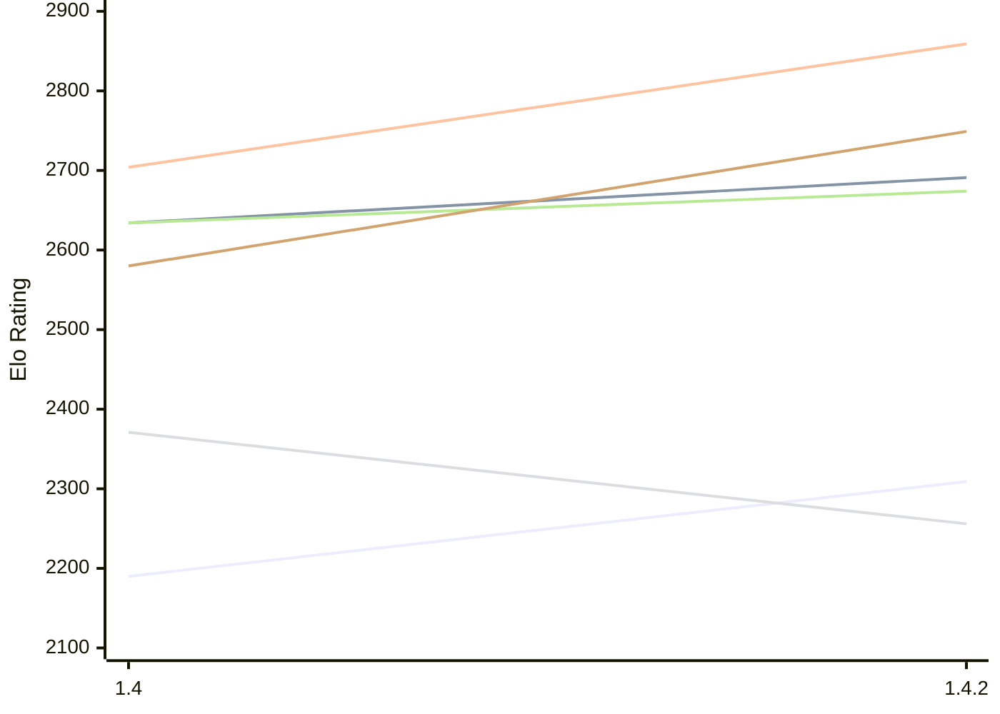
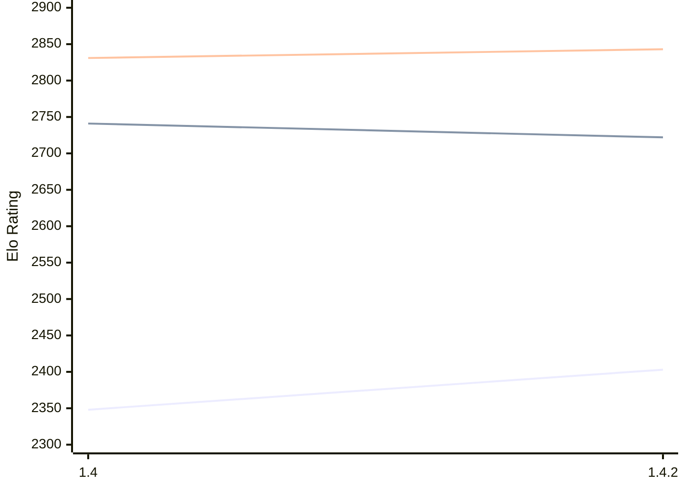

# Engine: Spike

Author: Volker Böhm, Ralf Schäfer

Home: https://github.com/Mangar2/Spike

## Elo Ratings E1 (Ultra 7 265T (1.50 GHz) - E-Core)

| Version | Published | STC 8.0+0.08s  | LTC 60.0+0.60s | VLTC 2m24s+1.12s | Comment |
| --- | --- | --- | --- | --- | --- |
| 1.4.2 | 2026-08-28 | 2309(+119) | 2691(+57) | 2859(+155) |  |
| 1.4 | 2011-02-01 | 2190 | 2634 | 2704 |  |
 | | | cElo (∆ prev) | cElo (∆ prev) | cElo (∆ prev) | 

## Elo Ratings P1 (Ultra 7 265T (1.50 GHz) - P-Core)

| Version | Published | STC 8.0+0.08s  | LTC 60.0+0.60s | VLTC 2m24s+1.12s | Comment |
| --- | --- | --- | --- | --- | --- |
| 1.4.2 | 2026-08-28 | 2256(-115) | 2674(+40) | 2749(+169) |  |
| 1.4 | 2011-02-01 | 2371 | 2634 | 2580 |  |
 | | | cElo (∆ prev) | cElo (∆ prev) | cElo (∆ prev) | 

## Elo Ratings T1 (i5-7500T 2.70GHz)

| Version | Published | STC 8.0+0.08s  | LTC 60.0+0.60s | VLTC 2m24s+1.12s | Comment |
| --- | --- | --- | --- | --- | --- |
| 1.4.2 | 2026-08-28 | 2403(+55) | 2722(-19) | 2843(+12) |  |
| 1.4 | 2011-02-01 | 2348 | 2741 | 2831 |  |
 | | | cElo (∆ prev) | cElo (∆ prev) | cElo (∆ prev) | 

<a href="https://github.com/computer-chess-index/cci/issues/new?template=submit-version.yml&title=[VERSION]+Spike+<version>&body=###%20Engine%20name%0ASpike%0A%0A###%20Version%0A1.4.2" target="_blank">Submit new version</a>

 Test Conditions:

GUI/CLI: <a href=https://github.com/cutechess/cutechess target="_blank">Cute-Chess</a> 
Elo Calculation: <a href=https://www.remi-coulom.fr/Bayesian-Elo/ target="_blank">Bayesian-Elo</a> 
CPU for P1: Intel(R) Core(TM) Ultra 7 265T (1.50 GHz) - P-Core 
CPU for E1: Intel(R) Core(TM) Ultra 7 265T (1.50 GHz) - E-Core 
CPU for T1: Intel(R) Core(TM) i5-7500T 2.70GHz 
Opening book: 8_moves_v3 
\* STC: 8.0+0.08s, LTC: 60.0+0.60s, VLTC: 2m24s+1.12s

 Lists:
Ratings: <a href=https://github.com/computer-chess-index/cci/blob/main/lists/CCIRatings.csv target="_blank">Complete list</a>

Generated: 2026-11-13 05:43:13

## Ratings Verlauf E1 / P1

```mermaid
%%{init: {"theme":"base","themeVariables":{"seriesColors:['#a3a3a3','#222221','#faa371']}}}%%
xychart-beta
  x-axis ["1.4", "1.4.2"]
  y-axis "Elo Rating" 2100 --> 2900
  line "E1: STC (8.0+0.08s)" [2190, 2309]
  line "E1: LTC (60.0+0.60s)" [2634, 2691]
  line "E1: VLTC (2m24s+1.12s)" [2704, 2859]
  line "P1: STC (8.0+0.08s)" [2371, 2256]
  line "P1: LTC (60.0+0.60s)" [2634, 2674]
  line "P1: VLTC (2m24s+1.12s)" [2580, 2749]
```

## Ratings Verlauf T1

```mermaid
%%{init: {"theme":"base","themeVariables":{"seriesColors:['#a3a3a3','#222221','#faa371']}}}%%
xychart-beta
  x-axis ["1.4", "1.4.2"]
  y-axis "Elo Rating" 2300 --> 2900
  line "T1: STC (8.0+0.08s)" [2348, 2403]
  line "T1: LTC (60.0+0.60s)" [2741, 2722]
  line "T1: VLTC (2m24s+1.12s)" [2831, 2843]
```

## Detailed Evaluation Results

| Version | Time Control | Variant | Elo  | Range +/- | Matches | Score | Average Opponent Elo | Draws |
| --- | --- |--- | --- | --- | --- | --- | --- | --- |
| 1.4.2 | VLTC (2m24s+1.12s) | T1 | 2843 | 35 | 258 | 51% | 2839 | 35% |
|  |  | P1 | 2749 | 35 | 274 | 46% | 2788 | 33% |
|  |  | E1 | 2859 | 29 | 394 | 52% | 2835 | 34% |
|  | LTC (60.0+0.60s) | T1 | 2722 | 34 | 282 | 51% | 2718 | 29% |
|  |  | P1 | 2674 | 33 | 296 | 50% | 2676 | 31% |
|  |  | E1 | 2691 | 30 | 368 | 45% | 2738 | 32% |
|  | STC (8.0+0.08s) | T1 | 2403 | 35 | 276 | 51% | 2395 | 30% |
|  |  | P1 | 2256 | 37 | 240 | 47% | 2283 | 28% |
|  |  | E1 | 2309 | 30 | 398 | 49% | 2304 | 24% |
| --- | --- |--- | --- | --- | --- | --- | --- | --- |
| 1.4 | VLTC (2m24s+1.12s) | P1 | 2580 | 100 | 36 | 44% | 2581 | 33% |
|  |  | E1 | 2704 | 105 | 40 | 51% | 2603 | 18% |
|  |  | T1 | 2831 | 45 | 164 | 51% | 2830 | 32% |
|  | LTC (60.0+0.60s) | E1 | 2634 | 91 | 46 | 61% | 2344 | 26% |
|  |  | T1 | 2741 | 48 | 144 | 50% | 2738 | 27% |
|  |  | P1 | 2634 | 169 | 24 | 73% | 2014 | 4% |
|  | STC (8.0+0.08s) | E1 | 2190 | 89 | 52 | 44% | 2183 | 19% |
|  |  | T1 | 2348 | 32 | 404 | 45% | 2417 | 23% |
|  |  | P1 | 2371 | 115 | 36 | 50% | 2072 | 22% |