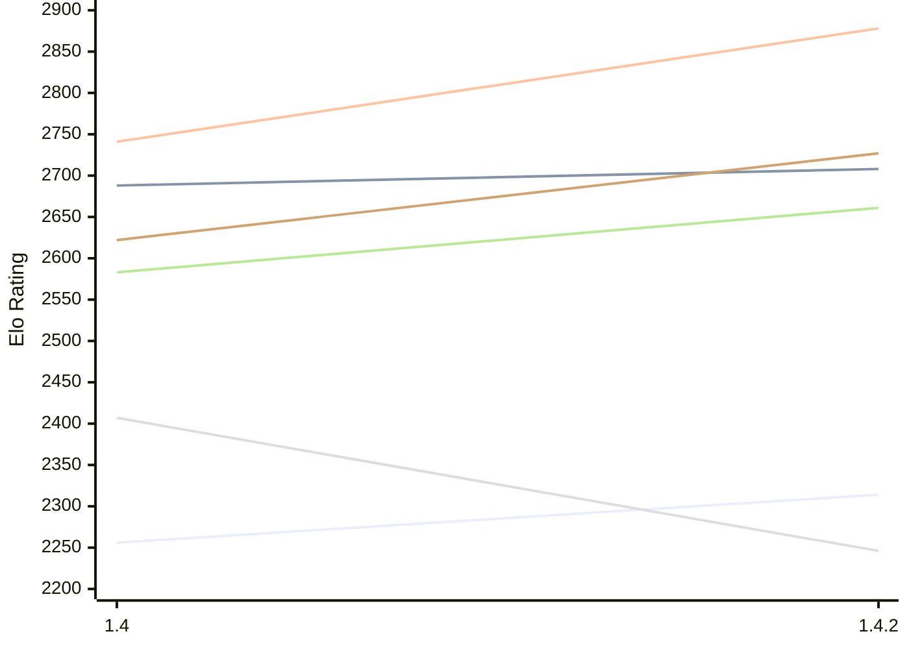
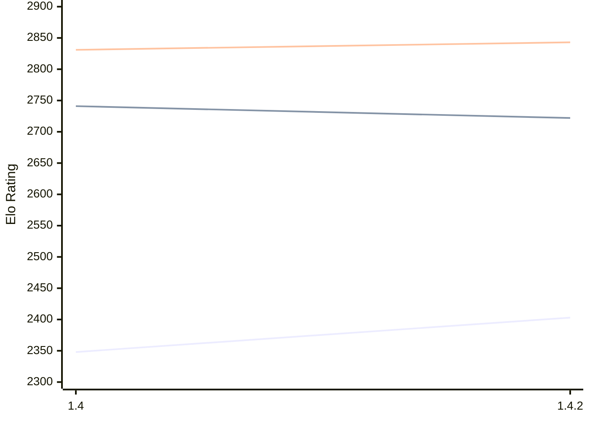

# Engine: Spike

Author: Volker Böhm, Ralf Schäfer

Home: https://github.com/Mangar2/Spike

## Elo Ratings E1 (Ultra 7 265T (1.50 GHz) - E-Core)

| Version | Published | STC 8.0+0.08s  | LTC 60.0+0.60s | VLTC 2m24s+1.12s | Comment |
| --- | --- | --- | --- | --- | --- |
| 1.4.2 | 2026-08-28 | 2314(+58) | 2708(+20) | 2878(+137) |  |
| 1.4 | 2011-02-01 | 2256 | 2688 | 2741 |  |
 | | | cElo (∆ prev) | cElo (∆ prev) | cElo (∆ prev) | 

## Elo Ratings P1 (Ultra 7 265T (1.50 GHz) - P-Core)

| Version | Published | STC 8.0+0.08s  | LTC 60.0+0.60s | VLTC 2m24s+1.12s | Comment |
| --- | --- | --- | --- | --- | --- |
| 1.4.2 | 2026-08-28 | 2246(-161) | 2661(+78) | 2727(+105) |  |
| 1.4 | 2011-02-01 | 2407 | 2583 | 2622 |  |
 | | | cElo (∆ prev) | cElo (∆ prev) | cElo (∆ prev) | 

## Elo Ratings T1 (i5-7500T 2.70GHz)

| Version | Published | STC 8.0+0.08s  | LTC 60.0+0.60s | VLTC 2m24s+1.12s | Comment |
| --- | --- | --- | --- | --- | --- |
| 1.4.2 | 2026-08-28 | 2403(+55) | 2722(-19) | 2843(+12) |  |
| 1.4 | 2011-02-01 | 2348 | 2741 | 2831 |  |
 | | | cElo (∆ prev) | cElo (∆ prev) | cElo (∆ prev) | 

<a href="https://github.com/computer-chess-index/cci/issues/new?template=submit-version.yml&title=[VERSION]+Spike+<version>&body=###%20Engine%20name%0ASpike%0A%0A###%20Version%0A1.4.2" target="_blank">Submit new version</a>

 Test Conditions:

GUI/CLI: <a href=https://github.com/cutechess/cutechess target="_blank">Cute-Chess</a> 
Elo Calculation: <a href=https://www.remi-coulom.fr/Bayesian-Elo/ target="_blank">Bayesian-Elo</a> 
CPU for P1: Intel(R) Core(TM) Ultra 7 265T (1.50 GHz) - P-Core 
CPU for E1: Intel(R) Core(TM) Ultra 7 265T (1.50 GHz) - E-Core 
CPU for T1: Intel(R) Core(TM) i5-7500T 2.70GHz 
Opening book: 8_moves_v3 
\* STC: 8.0+0.08s, LTC: 60.0+0.60s, VLTC: 2m24s+1.12s

 Lists:
Ratings: <a href=https://github.com/computer-chess-index/cci/blob/main/lists/CCIRatings.csv target="_blank">Complete list</a>

Generated: 2026-11-14 05:42:45

## Ratings Verlauf E1 / P1

```mermaid
%%{init: {"theme":"base","themeVariables":{"seriesColors:['#a3a3a3','#222221','#faa371']}}}%%
xychart-beta
  x-axis ["1.4", "1.4.2"]
  y-axis "Elo Rating" 2200 --> 2900
  line "E1: STC (8.0+0.08s)" [2256, 2314]
  line "E1: LTC (60.0+0.60s)" [2688, 2708]
  line "E1: VLTC (2m24s+1.12s)" [2741, 2878]
  line "P1: STC (8.0+0.08s)" [2407, 2246]
  line "P1: LTC (60.0+0.60s)" [2583, 2661]
  line "P1: VLTC (2m24s+1.12s)" [2622, 2727]
```

## Ratings Verlauf T1

```mermaid
%%{init: {"theme":"base","themeVariables":{"seriesColors:['#a3a3a3','#222221','#faa371']}}}%%
xychart-beta
  x-axis ["1.4", "1.4.2"]
  y-axis "Elo Rating" 2300 --> 2900
  line "T1: STC (8.0+0.08s)" [2348, 2403]
  line "T1: LTC (60.0+0.60s)" [2741, 2722]
  line "T1: VLTC (2m24s+1.12s)" [2831, 2843]
```

## Detailed Evaluation Results

| Version | Time Control | Variant | Elo  | Range +/- | Matches | Score | Average Opponent Elo | Draws |
| --- | --- |--- | --- | --- | --- | --- | --- | --- |
| 1.4.2 | VLTC (2m24s+1.12s) | T1 | 2843 | 35 | 258 | 51% | 2839 | 35% |
|  |  | P1 | 2727 | 34 | 286 | 45% | 2777 | 32% |
|  |  | E1 | 2878 | 29 | 398 | 52% | 2855 | 34% |
|  | LTC (60.0+0.60s) | T1 | 2722 | 34 | 282 | 51% | 2718 | 29% |
|  |  | P1 | 2661 | 33 | 296 | 50% | 2662 | 31% |
|  |  | E1 | 2708 | 30 | 380 | 45% | 2754 | 32% |
|  | STC (8.0+0.08s) | T1 | 2403 | 35 | 276 | 51% | 2395 | 30% |
|  |  | P1 | 2246 | 37 | 244 | 47% | 2276 | 27% |
|  |  | E1 | 2314 | 29 | 414 | 49% | 2313 | 23% |
| --- | --- |--- | --- | --- | --- | --- | --- | --- |
| 1.4 | VLTC (2m24s+1.12s) | T1 | 2831 | 45 | 164 | 51% | 2830 | 32% |
|  |  | P1 | 2622 | 90 | 44 | 49% | 2569 | 34% |
|  |  | E1 | 2741 | 89 | 52 | 52% | 2645 | 19% |
|  | LTC (60.0+0.60s) | P1 | 2583 | 109 | 40 | 59% | 2273 | 13% |
|  |  | T1 | 2741 | 48 | 144 | 50% | 2738 | 27% |
|  |  | E1 | 2688 | 80 | 60 | 63% | 2418 | 25% |
|  | STC (8.0+0.08s) | P1 | 2407 | 97 | 48 | 55% | 2157 | 23% |
|  |  | T1 | 2348 | 32 | 404 | 45% | 2417 | 23% |
|  |  | E1 | 2256 | 74 | 72 | 51% | 2187 | 19% |