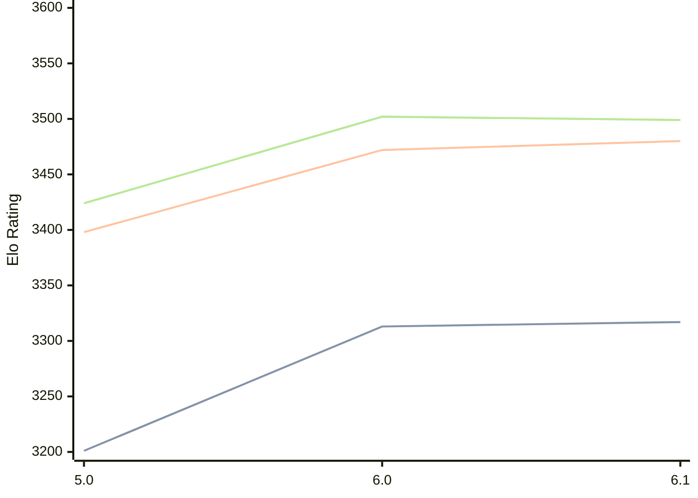

# Engine: Starzix

Author: zzzzz

Home: https://github.com/zzzzz151/Starzix

## Elo Ratings

| Version | Published | STC 8.0+0.08s  | LTC 60.0+0.60s | VLTC 2m24s+1.12s | Comment |
| --- | --- | --- | --- | --- | --- |
| 6.1 | 2025-04-06 | 3317(+4) | 3480(+8) | 3499(-3) |  |
| 6.0 | 2024-10-24 | 3313(+112) | 3472(+74) | 3502(+78) |  |
| 5.0 | 2024-05-23 | 3201(+new) | 3398(+new) | 3424(+new) |  |
| 4.0 | 2024-01-22 |  |  |  |  |
| 3.0 | 2023-11-25 |  |  |  |  |
| 2.1 | 2023-10-22 |  |  |  |  |
| 1.0 | 2023-10-03 |  |  |  |  |
 | | | cElo (∆ prev) | cElo (∆ prev) | cElo (∆ prev) | 

<a href="https://github.com/computer-chess-index/cci/issues/new?template=submit-version.yml&title=[VERSION]+Starzix+<version>&body=###%20Engine%20name%0AStarzix%0A%0A###%20Version%0A6.1" target="_blank">Submit new version</a>

 Test Conditions:

GUI/CLI: <a href=https://github.com/cutechess/cutechess target="_blank">Cute-Chess</a> 
Elo Calculation: <a href=https://www.remi-coulom.fr/Bayesian-Elo/ target="_blank">Bayesian-Elo</a> 
CPU: Intel(R) Core(TM) i5-7500T 2.70GHz 
Opening book: 8_moves_v3 
\* STC: 8.0+0.08s, LTC: 60.0+0.60s, VLTC: 2m24s+1.12s

 Lists:
Ratings: <a href=https://github.com/computer-chess-index/cci/blob/main/lists/CCIRatings.csv target="_blank">Complete list</a>

Generated: 2026-08-06 06:29:53

## Ratings Verlauf

⬛ STC (8.0+0.08s) &nbsp;&nbsp; 🟧 LTC (60.0+0.60s) &nbsp;&nbsp; 🟩 VLTC (2m24s+1.12s)

dark mode: 🟩STC (8.0+0.08s) 🟧LTC (60.0+0.60s) ⬜VLTC (2m24s+1.12s)

## Detailed Evaluation Results

| Version | Time Control | Elo  | Range +/- | Matches | Score | Average Opponent Elo | Draws |
| --- | --- | --- | --- | --- | --- | --- | --- |
| 6.1 | VLTC (2m24s+1.12s) | 3499 | 24 | 408 | 50% | 3502 | 88% |
| 6.1 | LTC (60.0+0.60s) | 3480 | 24 | 412 | 50% | 3480 | 87% |
| 6.1 | STC (8.0+0.08s) | 3317 | 21 | 574 | 49% | 3322 | 71% |
| --- | --- | --- | --- | --- | --- | --- | --- |
| 6.0 | VLTC (2m24s+1.12s) | 3502 | 12 | 1620 | 50% | 3501 | 85% |
| 6.0 | LTC (60.0+0.60s) | 3472 | 12 | 1600 | 50% | 3472 | 82% |
| 6.0 | STC (8.0+0.08s) | 3313 | 13 | 1628 | 50% | 3314 | 68% |
| --- | --- | --- | --- | --- | --- | --- | --- |
| 5.0 | VLTC (2m24s+1.12s) | 3424 | 32 | 236 | 51% | 3418 | 76% |
| 5.0 | LTC (60.0+0.60s) | 3398 | 32 | 240 | 48% | 3409 | 78% |
| 5.0 | STC (8.0+0.08s) | 3201 | 27 | 408 | 53% | 3114 | 56% |
| --- | --- | --- | --- | --- | --- | --- | --- |