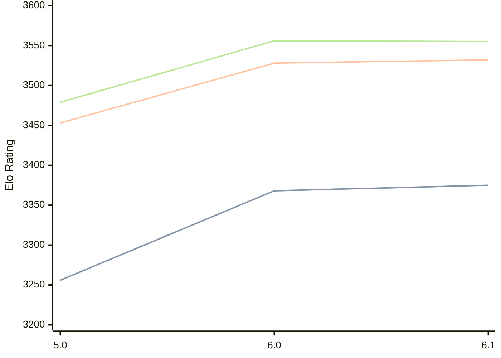

# Engine: Starzix

Author: zzzzz

Home: https://github.com/zzzzz151/Starzix

## Elo Ratings

| Version | Published | STC 8.0+0.08s  | LTC 60.0+0.60s | VLTC 2m24s+1.12s | Comment |
| --- | --- | --- | --- | --- | --- |
| 6.1 | 2025-04-06 | 3375(+7) | 3532(+4) | 3555(-1) |  |
| 6.0 | 2024-10-24 | 3368(+112) | 3528(+75) | 3556(+77) |  |
| 5.0 | 2024-05-23 | 3256(+new) | 3453(+new) | 3479(+new) |  |
| 4.0 | 2024-01-22 |  |  |  |  |
| 3.0 | 2023-11-25 |  |  |  |  |
| 2.1 | 2023-10-22 |  |  |  |  |
| 1.0 | 2023-10-03 |  |  |  |  |
 | | | cElo (∆ prev) | cElo (∆ prev) | cElo (∆ prev) | 

<a href="https://github.com/computer-chess-index/cci/issues/new?template=submit-version.yml&title=[VERSION]+Starzix+<version>&body=###%20Engine%20name%0AStarzix%0A%0A###%20Version%0A6.1" target="_blank">Submit new version</a>

 Test Conditions:

GUI/CLI: <a href=https://github.com/cutechess/cutechess target="_blank">Cute-Chess</a> 
Elo Calculation: <a href=https://www.remi-coulom.fr/Bayesian-Elo/ target="_blank">Bayesian-Elo</a> 
CPU: Intel(R) Core(TM) i5-7500T 2.70GHz 
Opening book: 8_moves_v3 
\* STC: 8.0+0.08s, LTC: 60.0+0.60s, VLTC: 2m24s+1.12s

 Lists:
Ratings: <a href=https://github.com/computer-chess-index/cci/blob/main/lists/CCIRatings.csv target="_blank">Complete list</a>

Generated: 2026-05-03 07:46:35

## Ratings Verlauf

⬛ STC (8.0+0.08s) &nbsp;&nbsp; 🟧 LTC (60.0+0.60s) &nbsp;&nbsp; 🟩 VLTC (2m24s+1.12s)

dark mode: 🟩STC (8.0+0.08s) 🟧LTC (60.0+0.60s) ⬜VLTC (2m24s+1.12s)

## Detailed Evaluation Results

| Version | Time Control | Elo  | Range +/- | Matches | Score | Average Opponent Elo | Draws |
| --- | --- | --- | --- | --- | --- | --- | --- |
| 6.1 | VLTC (2m24s+1.12s) | 3555 | 25 | 352 | 50% | 3557 | 88% |
| 6.1 | D1 | 197 | 56 | 120 | 27% | 419 | 47% |
| 6.1 | D10 | 2535 | 26 | 446 | 51% | 2520 | 41% |
| 6.1 | D11 | 2658 | 29 | 420 | 50% | 2662 | 25% |
| 6.1 | D12 | 2734 | 26 | 432 | 51% | 2726 | 52% |
| 6.1 | D13 | 2835 | 28 | 424 | 48% | 2857 | 29% |
| 6.1 | D14 | 2908 | 25 | 432 | 53% | 2888 | 54% |
| 6.1 | D15 | 3002 | 27 | 434 | 50% | 3004 | 38% |
| 6.1 | D16 | 3042 | 25 | 420 | 49% | 3054 | 61% |
| 6.1 | D17 | 3124 | 26 | 408 | 49% | 3133 | 50% |
| 6.1 | D18 | 3175 | 24 | 472 | 50% | 3175 | 65% |
| 6.1 | D2 | 689 | 42 | 232 | 53% | 629 | 25% |
| 6.1 | D3 | 743 | 42 | 232 | 56% | 648 | 22% |
| 6.1 | D4 | 963 | 34 | 304 | 50% | 961 | 26% |
| 6.1 | D5 | 1261 | 36 | 288 | 50% | 1261 | 16% |
| 6.1 | D6 | 1559 | 33 | 334 | 50% | 1558 | 19% |
| 6.1 | D7 | 1974 | 30 | 428 | 49% | 1993 | 16% |
| 6.1 | D8 | 2206 | 26 | 536 | 51% | 2198 | 25% |
| 6.1 | D9 | 2353 | 28 | 440 | 49% | 2365 | 23% |
| 6.1 | S10 | 3402 | 25 | 380 | 50% | 3398 | 76% |
| 6.1 | S40 | 3524 | 25 | 360 | 50% | 3522 | 84% |
| 6.1 | LTC (60.0+0.60s) | 3532 | 25 | 364 | 50% | 3536 | 88% |
| 6.1 | STC (8.0+0.08s) | 3375 | 23 | 476 | 49% | 3379 | 71% |
| --- | --- | --- | --- | --- | --- | --- | --- |
| 6.0 | VLTC (2m24s+1.12s) | 3556 | 12 | 1620 | 50% | 3556 | 85% |
| 6.0 | D1 | 140 | 33 | 592 | 13% | 682 | 26% |
| 6.0 | D10 | 2527 | 16 | 1272 | 49% | 2531 | 38% |
| 6.0 | D11 | 2633 | 17 | 1188 | 49% | 2639 | 29% |
| 6.0 | D12 | 2745 | 15 | 1228 | 49% | 2750 | 51% |
| 6.0 | D13 | 2855 | 16 | 1256 | 50% | 2851 | 35% |
| 6.0 | D14 | 2903 | 15 | 1256 | 51% | 2894 | 56% |
| 6.0 | D15 | 2979 | 16 | 1264 | 51% | 2974 | 38% |
| 6.0 | D16 | 3028 | 15 | 1244 | 51% | 3021 | 64% |
| 6.0 | D17 | 3124 | 15 | 1352 | 51% | 3116 | 44% |
| 6.0 | D18 | 3166 | 21 | 580 | 49% | 3170 | 71% |
| 6.0 | D2 | 733 | 22 | 896 | 43% | 828 | 16% |
| 6.0 | D3 | 721 | 22 | 860 | 44% | 788 | 18% |
| 6.0 | D4 | 1008 | 17 | 1268 | 48% | 1034 | 23% |
| 6.0 | D5 | 1214 | 17 | 1380 | 49% | 1234 | 16% |
| 6.0 | D6 | 1569 | 17 | 1236 | 52% | 1557 | 20% |
| 6.0 | D7 | 1912 | 17 | 1208 | 49% | 1918 | 20% |
| 6.0 | D8 | 2195 | 17 | 1216 | 52% | 2176 | 28% |
| 6.0 | D9 | 2381 | 17 | 1232 | 48% | 2396 | 24% |
| 6.0 | S10 | 3395 | 13 | 1628 | 51% | 3389 | 69% |
| 6.0 | S40 | 3505 | 12 | 1548 | 50% | 3505 | 80% |
| 6.0 | LTC (60.0+0.60s) | 3528 | 12 | 1600 | 50% | 3526 | 82% |
| 6.0 | STC (8.0+0.08s) | 3368 | 13 | 1628 | 50% | 3370 | 68% |
| --- | --- | --- | --- | --- | --- | --- | --- |
| 5.0 | VLTC (2m24s+1.12s) | 3479 | 32 | 236 | 51% | 3474 | 76% |
| 5.0 | D1 | 120 | 30 | 380 | 26% | 352 | 50% |
| 5.0 | D10 | 2458 | 16 | 1164 | 47% | 2481 | 41% |
| 5.0 | D11 | 2591 | 18 | 985 | 52% | 2570 | 31% |
| 5.0 | D12 | 2709 | 16 | 1089 | 46% | 2741 | 54% |
| 5.0 | D13 | 2766 | 19 | 944 | 48% | 2785 | 33% |
| 5.0 | D14 | 2901 | 16 | 1058 | 50% | 2903 | 61% |
| 5.0 | D15 | 2944 | 18 | 968 | 50% | 2947 | 39% |
| 5.0 | D16 | 3059 | 16 | 1040 | 51% | 3051 | 69% |
| 5.0 | D17 | 3078 | 17 | 1092 | 49% | 3086 | 44% |
| 5.0 | D2 | 610 | 24 | 680 | 54% | 554 | 17% |
| 5.0 | D3 | 795 | 22 | 760 | 49% | 803 | 23% |
| 5.0 | D4 | 1211 | 19 | 940 | 50% | 1211 | 25% |
| 5.0 | D5 | 1462 | 20 | 980 | 50% | 1459 | 14% |
| 5.0 | D6 | 1693 | 19 | 976 | 47% | 1723 | 28% |
| 5.0 | D7 | 1959 | 19 | 1000 | 52% | 1936 | 17% |
| 5.0 | D8 | 2099 | 18 | 1024 | 50% | 2094 | 32% |
| 5.0 | D9 | 2275 | 19 | 1037 | 53% | 2246 | 21% |
| 5.0 | S10 | 3303 | 31 | 268 | 51% | 3293 | 67% |
| 5.0 | S40 | 3428 | 34 | 212 | 51% | 3422 | 73% |
| 5.0 | LTC (60.0+0.60s) | 3453 | 32 | 240 | 48% | 3464 | 78% |
| 5.0 | STC (8.0+0.08s) | 3256 | 27 | 408 | 53% | 3171 | 56% |
| --- | --- | --- | --- | --- | --- | --- | --- |
| 4.0 |  |  |  |  |  |  |  |
| 3.0 |  |  |  |  |  |  |  |
| 2.1 |  |  |  |  |  |  |  |
| 1.0 |  |  |  |  |  |  |  |