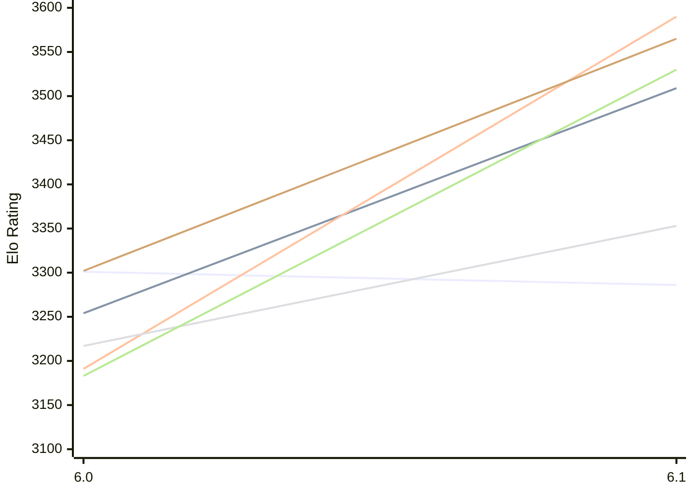
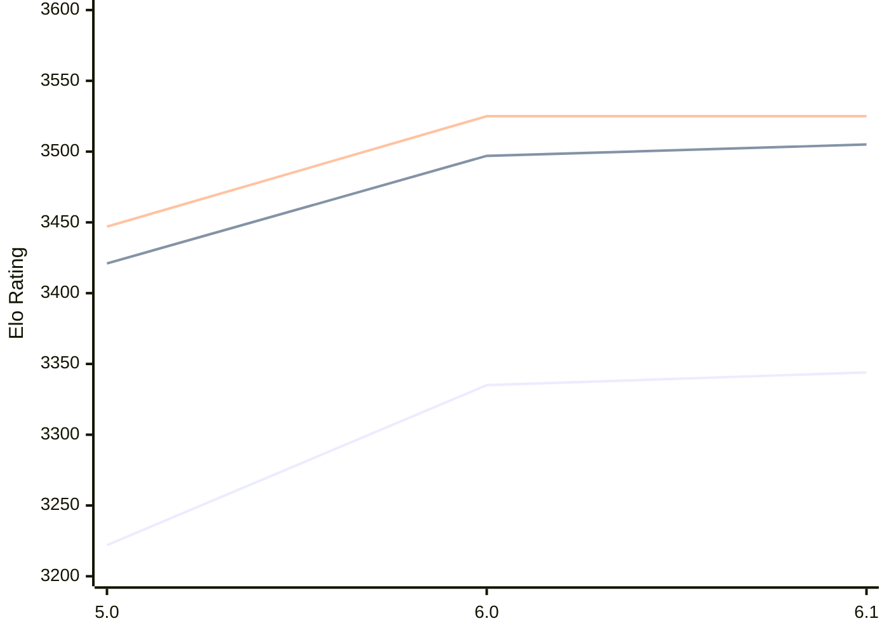

# Engine: Starzix

Author: zzzzz

Home: https://github.com/zzzzz151/Starzix

## Elo Ratings E1 (Ultra 7 265T (1.50 GHz) - E-Core)

| Version | Published | STC 8.0+0.08s  | LTC 60.0+0.60s | VLTC 2m24s+1.12s | Comment |
| --- | --- | --- | --- | --- | --- |
| 6.1 | 2025-04-06 | 3286(-15) | 3509(+255) | 3590(+399) |  |
| 6.0 | 2024-10-24 | 3301 | 3254 | 3191 |  |
 | | | cElo (∆ prev) | cElo (∆ prev) | cElo (∆ prev) | 

## Elo Ratings P1 (Ultra 7 265T (1.50 GHz) - P-Core)

| Version | Published | STC 8.0+0.08s  | LTC 60.0+0.60s | VLTC 2m24s+1.12s | Comment |
| --- | --- | --- | --- | --- | --- |
| 6.1 | 2025-04-06 | 3353(+136) | 3530(+347) | 3565(+263) |  |
| 6.0 | 2024-10-24 | 3217 | 3183 | 3302 |  |
 | | | cElo (∆ prev) | cElo (∆ prev) | cElo (∆ prev) | 

## Elo Ratings T1 (i5-7500T 2.70GHz)

| Version | Published | STC 8.0+0.08s  | LTC 60.0+0.60s | VLTC 2m24s+1.12s | Comment |
| --- | --- | --- | --- | --- | --- |
| 6.1 | 2025-04-06 | 3344(+9) | 3505(+8) | 3525(0) |  |
| 6.0 | 2024-10-24 | 3335(+113) | 3497(+76) | 3525(+78) |  |
| 5.0 | 2024-05-23 | 3222 | 3421 | 3447 |  |
 | | | cElo (∆ prev) | cElo (∆ prev) | cElo (∆ prev) | 

<a href="https://github.com/computer-chess-index/cci/issues/new?template=submit-version.yml&title=[VERSION]+Starzix+<version>&body=###%20Engine%20name%0AStarzix%0A%0A###%20Version%0A6.1" target="_blank">Submit new version</a>

 Test Conditions:

GUI/CLI: <a href=https://github.com/cutechess/cutechess target="_blank">Cute-Chess</a> 
Elo Calculation: <a href=https://www.remi-coulom.fr/Bayesian-Elo/ target="_blank">Bayesian-Elo</a> 
CPU for P1: Intel(R) Core(TM) Ultra 7 265T (1.50 GHz) - P-Core 
CPU for E1: Intel(R) Core(TM) Ultra 7 265T (1.50 GHz) - E-Core 
CPU for T1: Intel(R) Core(TM) i5-7500T 2.70GHz 
Opening book: 8_moves_v3 
\* STC: 8.0+0.08s, LTC: 60.0+0.60s, VLTC: 2m24s+1.12s

 Lists:
Ratings: <a href=https://github.com/computer-chess-index/cci/blob/main/lists/CCIRatings.csv target="_blank">Complete list</a>

Generated: 2026-11-13 05:43:15

## Ratings Verlauf E1 / P1

```mermaid
%%{init: {"theme":"base","themeVariables":{"seriesColors:['#a3a3a3','#222221','#faa371']}}}%%
xychart-beta
  x-axis ["6.0", "6.1"]
  y-axis "Elo Rating" 3100 --> 3600
  line "E1: STC (8.0+0.08s)" [3301, 3286]
  line "E1: LTC (60.0+0.60s)" [3254, 3509]
  line "E1: VLTC (2m24s+1.12s)" [3191, 3590]
  line "P1: STC (8.0+0.08s)" [3217, 3353]
  line "P1: LTC (60.0+0.60s)" [3183, 3530]
  line "P1: VLTC (2m24s+1.12s)" [3302, 3565]
```

## Ratings Verlauf T1

```mermaid
%%{init: {"theme":"base","themeVariables":{"seriesColors:['#a3a3a3','#222221','#faa371']}}}%%
xychart-beta
  x-axis ["5.0", "6.0", "6.1"]
  y-axis "Elo Rating" 3200 --> 3600
  line "T1: STC (8.0+0.08s)" [3222, 3335, 3344]
  line "T1: LTC (60.0+0.60s)" [3421, 3497, 3505]
  line "T1: VLTC (2m24s+1.12s)" [3447, 3525, 3525]
```

## Detailed Evaluation Results

| Version | Time Control | Variant | Elo  | Range +/- | Matches | Score | Average Opponent Elo | Draws |
| --- | --- |--- | --- | --- | --- | --- | --- | --- |
| 6.1 | VLTC (2m24s+1.12s) | E1 | 3590 | 30 | 268 | 48% | 3602 | 78% |
|  |  | T1 | 3525 | 22 | 458 | 50% | 3525 | 87% |
|  |  | P1 | 3565 | 32 | 224 | 52% | 3553 | 84% |
|  | LTC (60.0+0.60s) | T1 | 3505 | 22 | 456 | 50% | 3505 | 86% |
|  |  | P1 | 3530 | 40 | 150 | 51% | 3525 | 81% |
|  |  | E1 | 3509 | 30 | 264 | 50% | 3505 | 78% |
|  | STC (8.0+0.08s) | T1 | 3344 | 20 | 620 | 50% | 3345 | 70% |
|  |  | P1 | 3353 | 29 | 312 | 52% | 3340 | 63% |
|  |  | E1 | 3286 | 25 | 416 | 47% | 3303 | 61% |
| --- | --- |--- | --- | --- | --- | --- | --- | --- |
| 6.0 | VLTC (2m24s+1.12s) | E1 | 3191 | 176 | 8 | 69% | 3020 | 63% |
|  |  | T1 | 3525 | 12 | 1620 | 50% | 3525 | 85% |
|  |  | P1 | 3302 | 181 | 12 | 88% | 2927 | 25% |
|  | LTC (60.0+0.60s) | E1 | 3254 | 139 | 16 | 66% | 3021 | 44% |
|  |  | T1 | 3497 | 12 | 1600 | 50% | 3495 | 82% |
|  |  | P1 | 3183 | 173 | 14 | 89% | 2819 | 21% |
|  | STC (8.0+0.08s) | T1 | 3335 | 13 | 1628 | 50% | 3337 | 68% |
|  |  | P1 | 3217 | 151 | 12 | 67% | 3023 | 50% |
|  |  | E1 | 3301 | 125 | 20 | 73% | 3077 | 45% |
| --- | --- |--- | --- | --- | --- | --- | --- | --- |
| 5.0 | VLTC (2m24s+1.12s) | T1 | 3447 | 32 | 236 | 51% | 3441 | 76% |
|  | LTC (60.0+0.60s) | T1 | 3421 | 32 | 240 | 48% | 3432 | 78% |
|  | STC (8.0+0.08s) | T1 | 3222 | 27 | 408 | 53% | 3136 | 56% |