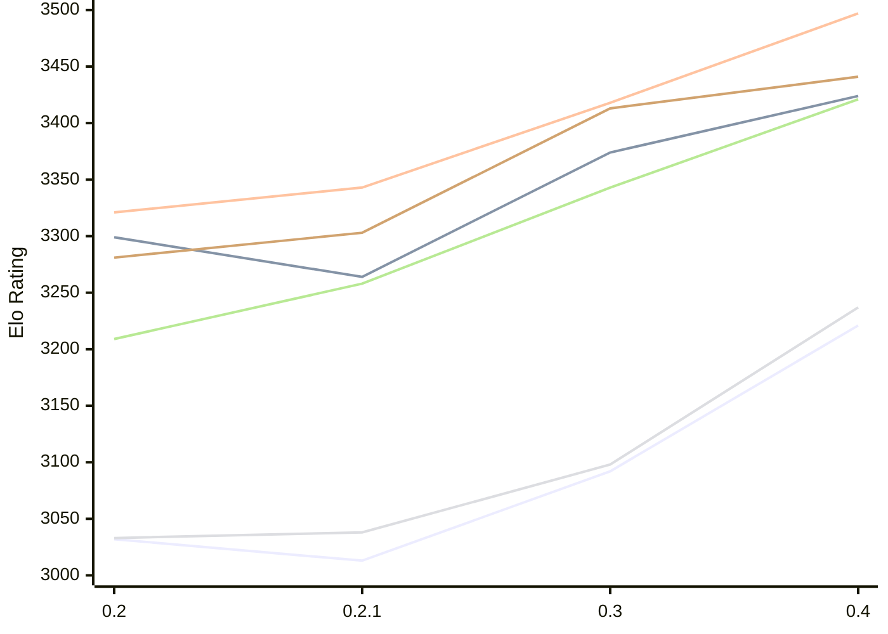

# Engine: StockDory

Author: Shaheryar Sohail

Home: https://github.com/TheBlackPlague/StockDory

## Elo Ratings E1 (Ultra 7 265T (1.50 GHz) - E-Core)

| Version | Published | STC 8.0+0.08s  | LTC 60.0+0.60s | VLTC 2m24s+1.12s | Comment |
| --- | --- | --- | --- | --- | --- |
| 0.4 | 2026-11-02 | 3221(+129) | 3424(+50) | 3497(+79) |  |
| 0.3 | 2026-10-06 | 3092(+79) | 3374(+110) | 3418(+75) |  |
| 0.2.1 | 2026-09-20 | 3013(-19) | 3264(-35) | 3343(+22) |  |
| 0.2 | 2026-09-15 | 3032 | 3299 | 3321 |  |
 | | | cElo (∆ prev) | cElo (∆ prev) | cElo (∆ prev) | 

## Elo Ratings P1 (Ultra 7 265T (1.50 GHz) - P-Core)

| Version | Published | STC 8.0+0.08s  | LTC 60.0+0.60s | VLTC 2m24s+1.12s | Comment |
| --- | --- | --- | --- | --- | --- |
| 0.4 | 2026-11-02 | 3237(+139) | 3421(+78) | 3441(+28) |  |
| 0.3 | 2026-10-06 | 3098(+60) | 3343(+85) | 3413(+110) |  |
| 0.2.1 | 2026-09-20 | 3038(+5) | 3258(+49) | 3303(+22) |  |
| 0.2 | 2026-09-15 | 3033 | 3209 | 3281 |  |
 | | | cElo (∆ prev) | cElo (∆ prev) | cElo (∆ prev) | 

## Elo Ratings T1 (i5-7500T 2.70GHz)

| Version | Published | STC 8.0+0.08s  | LTC 60.0+0.60s | VLTC 2m24s+1.12s | Comment |
| --- | --- | --- | --- | --- | --- |
| 0.2 | 2026-09-15 | 3033 | 3209 | 3281 |  |
 | | | cElo (∆ prev) | cElo (∆ prev) | cElo (∆ prev) | 

<a href="https://github.com/computer-chess-index/cci/issues/new?template=submit-version.yml&title=[VERSION]+StockDory+<version>&body=###%20Engine%20name%0AStockDory%0A%0A###%20Version%0A0.4" target="_blank">Submit new version</a>

 Test Conditions:

GUI/CLI: <a href=https://github.com/cutechess/cutechess target="_blank">Cute-Chess</a> 
Elo Calculation: <a href=https://www.remi-coulom.fr/Bayesian-Elo/ target="_blank">Bayesian-Elo</a> 
CPU for P1: Intel(R) Core(TM) Ultra 7 265T (1.50 GHz) - P-Core 
CPU for E1: Intel(R) Core(TM) Ultra 7 265T (1.50 GHz) - E-Core 
CPU for T1: Intel(R) Core(TM) i5-7500T 2.70GHz 
Opening book: 8_moves_v3 
\* STC: 8.0+0.08s, LTC: 60.0+0.60s, VLTC: 2m24s+1.12s

 Lists:
Ratings: <a href=https://github.com/computer-chess-index/cci/blob/main/lists/CCIRatings.csv target="_blank">Complete list</a>

Generated: 2026-11-25 05:43:32

## Ratings Verlauf E1 / P1

```mermaid
%%{init: {"theme":"base","themeVariables":{"seriesColors:['#a3a3a3','#222221','#faa371']}}}%%
xychart-beta
  x-axis ["0.2", "0.2.1", "0.3", "0.4"]
  y-axis "Elo Rating" 3000 --> 3500
  line "E1: STC (8.0+0.08s)" [3032, 3013, 3092, 3221]
  line "E1: LTC (60.0+0.60s)" [3299, 3264, 3374, 3424]
  line "E1: VLTC (2m24s+1.12s)" [3321, 3343, 3418, 3497]
  line "P1: STC (8.0+0.08s)" [3033, 3038, 3098, 3237]
  line "P1: LTC (60.0+0.60s)" [3209, 3258, 3343, 3421]
  line "P1: VLTC (2m24s+1.12s)" [3281, 3303, 3413, 3441]
```

## Detailed Evaluation Results

| Version | Time Control | Variant | Elo  | Range +/- | Matches | Score | Average Opponent Elo | Draws |
| --- | --- |--- | --- | --- | --- | --- | --- | --- |
| 0.4 | VLTC (2m24s+1.12s) | P1 | 3441 | 37 | 182 | 49% | 3448 | 73% |
|  |  | E1 | 3497 | 31 | 248 | 51% | 3491 | 79% |
|  | LTC (60.0+0.60s) | P1 | 3421 | 40 | 148 | 51% | 3414 | 80% |
|  |  | E1 | 3424 | 29 | 304 | 52% | 3407 | 72% |
|  | STC (8.0+0.08s) | P1 | 3237 | 30 | 286 | 52% | 3227 | 66% |
|  |  | E1 | 3221 | 30 | 294 | 53% | 3197 | 66% |
| --- | --- |--- | --- | --- | --- | --- | --- | --- |
| 0.3 | VLTC (2m24s+1.12s) | P1 | 3413 | 35 | 216 | 53% | 3335 | 69% |
|  |  | E1 | 3418 | 27 | 359 | 56% | 3337 | 67% |
|  | LTC (60.0+0.60s) | E1 | 3374 | 28 | 348 | 55% | 3306 | 62% |
|  |  | P1 | 3343 | 32 | 264 | 54% | 3287 | 59% |
|  | STC (8.0+0.08s) | E1 | 3092 | 29 | 354 | 54% | 3036 | 52% |
|  |  | P1 | 3098 | 41 | 182 | 56% | 2998 | 50% |
| --- | --- |--- | --- | --- | --- | --- | --- | --- |
| 0.2.1 | VLTC (2m24s+1.12s) | P1 | 3303 | 41 | 148 | 54% | 3272 | 72% |
|  |  | E1 | 3343 | 35 | 216 | 47% | 3368 | 66% |
|  | LTC (60.0+0.60s) | P1 | 3258 | 44 | 130 | 47% | 3281 | 73% |
|  |  | E1 | 3264 | 37 | 188 | 47% | 3291 | 68% |
|  | STC (8.0+0.08s) | P1 | 3038 | 47 | 128 | 45% | 3075 | 54% |
|  |  | E1 | 3013 | 36 | 214 | 50% | 3019 | 52% |
| --- | --- |--- | --- | --- | --- | --- | --- | --- |
| 0.2 | VLTC (2m24s+1.12s) | P1 | 3281 | 69 | 56 | 43% | 3335 | 57% |
|  |  | E1 | 3321 | 40 | 158 | 53% | 3303 | 67% |
|  | LTC (60.0+0.60s) | P1 | 3209 | 60 | 72 | 42% | 3266 | 68% |
|  |  | E1 | 3299 | 44 | 134 | 43% | 3349 | 63% |
|  | STC (8.0+0.08s) | P1 | 3033 | 91 | 36 | 47% | 3060 | 39% |
|  |  | E1 | 3032 | 45 | 146 | 54% | 2994 | 46% |