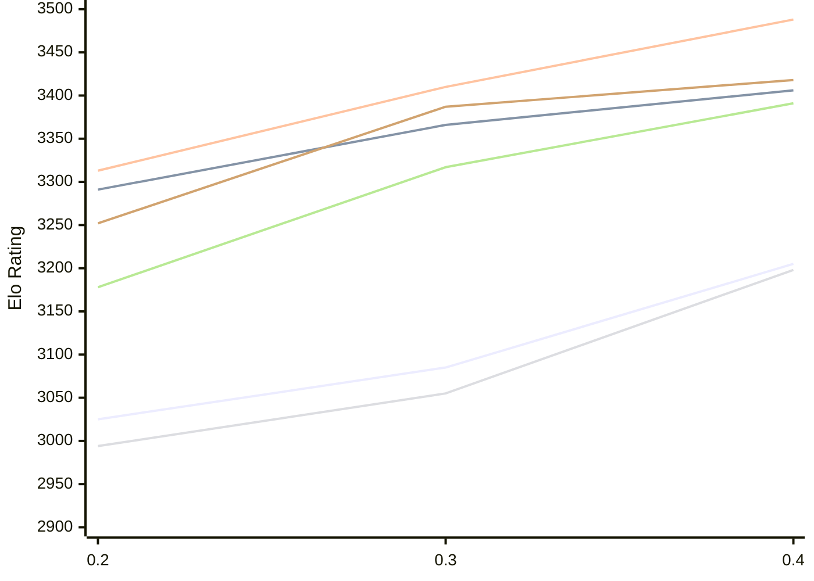

# Engine: StockDory

Author: Shaheryar Sohail

Home: https://github.com/TheBlackPlague/StockDory

## Elo Ratings E1 (Ultra 7 265T (1.50 GHz) - E-Core)

| Version | Published | STC 8.0+0.08s  | LTC 60.0+0.60s | VLTC 2m24s+1.12s | Comment |
| --- | --- | --- | --- | --- | --- |
| 0.4 | 2026-11-02 | 3205(+120) | 3406(+40) | 3488(+78) |  |
| 0.3 | 2026-10-06 | 3085(+60) | 3366(+75) | 3410(+97) |  |
| 0.2 | 2026-09-15 | 3025 | 3291 | 3313 |  |
 | | | cElo (∆ prev) | cElo (∆ prev) | cElo (∆ prev) | 

## Elo Ratings P1 (Ultra 7 265T (1.50 GHz) - P-Core)

| Version | Published | STC 8.0+0.08s  | LTC 60.0+0.60s | VLTC 2m24s+1.12s | Comment |
| --- | --- | --- | --- | --- | --- |
| 0.4 | 2026-11-02 | 3198(+143) | 3391(+74) | 3418(+31) |  |
| 0.3 | 2026-10-06 | 3055(+61) | 3317(+139) | 3387(+135) |  |
| 0.2 | 2026-09-15 | 2994 | 3178 | 3252 |  |
 | | | cElo (∆ prev) | cElo (∆ prev) | cElo (∆ prev) | 

## Elo Ratings T1 (i5-7500T 2.70GHz)

| Version | Published | STC 8.0+0.08s  | LTC 60.0+0.60s | VLTC 2m24s+1.12s | Comment |
| --- | --- | --- | --- | --- | --- |
| 0.2 | 2026-09-15 | 2994 | 3178 | 3252 |  |
 | | | cElo (∆ prev) | cElo (∆ prev) | cElo (∆ prev) | 

<a href="https://github.com/computer-chess-index/cci/issues/new?template=submit-version.yml&title=[VERSION]+StockDory+<version>&body=###%20Engine%20name%0AStockDory%0A%0A###%20Version%0A0.4" target="_blank">Submit new version</a>

 Test Conditions:

GUI/CLI: <a href=https://github.com/cutechess/cutechess target="_blank">Cute-Chess</a> 
Elo Calculation: <a href=https://www.remi-coulom.fr/Bayesian-Elo/ target="_blank">Bayesian-Elo</a> 
CPU for P1: Intel(R) Core(TM) Ultra 7 265T (1.50 GHz) - P-Core 
CPU for E1: Intel(R) Core(TM) Ultra 7 265T (1.50 GHz) - E-Core 
CPU for T1: Intel(R) Core(TM) i5-7500T 2.70GHz 
Opening book: 8_moves_v3 
\* STC: 8.0+0.08s, LTC: 60.0+0.60s, VLTC: 2m24s+1.12s

 Lists:
Ratings: <a href=https://github.com/computer-chess-index/cci/blob/main/lists/CCIRatings.csv target="_blank">Complete list</a>

Generated: 2026-11-15 05:43:10

## Ratings Verlauf E1 / P1

```mermaid
%%{init: {"theme":"base","themeVariables":{"seriesColors:['#a3a3a3','#222221','#faa371']}}}%%
xychart-beta
  x-axis ["0.2", "0.3", "0.4"]
  y-axis "Elo Rating" 2900 --> 3500
  line "E1: STC (8.0+0.08s)" [3025, 3085, 3205]
  line "E1: LTC (60.0+0.60s)" [3291, 3366, 3406]
  line "E1: VLTC (2m24s+1.12s)" [3313, 3410, 3488]
  line "P1: STC (8.0+0.08s)" [2994, 3055, 3198]
  line "P1: LTC (60.0+0.60s)" [3178, 3317, 3391]
  line "P1: VLTC (2m24s+1.12s)" [3252, 3387, 3418]
```

## Detailed Evaluation Results

| Version | Time Control | Variant | Elo  | Range +/- | Matches | Score | Average Opponent Elo | Draws |
| --- | --- |--- | --- | --- | --- | --- | --- | --- |
| 0.4 | VLTC (2m24s+1.12s) | P1 | 3418 | 37 | 182 | 49% | 3424 | 73% |
|  |  | E1 | 3488 | 31 | 242 | 51% | 3483 | 79% |
|  | LTC (60.0+0.60s) | P1 | 3391 | 44 | 124 | 51% | 3386 | 79% |
|  |  | E1 | 3406 | 30 | 268 | 51% | 3397 | 72% |
|  | STC (8.0+0.08s) | P1 | 3198 | 32 | 252 | 52% | 3187 | 67% |
|  |  | E1 | 3205 | 31 | 258 | 53% | 3186 | 68% |
| --- | --- |--- | --- | --- | --- | --- | --- | --- |
| 0.3 | VLTC (2m24s+1.12s) | E1 | 3410 | 28 | 335 | 57% | 3322 | 67% |
|  |  | P1 | 3387 | 35 | 216 | 53% | 3309 | 69% |
|  | LTC (60.0+0.60s) | P1 | 3317 | 32 | 264 | 54% | 3260 | 59% |
|  |  | E1 | 3366 | 29 | 336 | 55% | 3295 | 61% |
|  | STC (8.0+0.08s) | P1 | 3055 | 42 | 174 | 57% | 2951 | 48% |
|  |  | E1 | 3085 | 29 | 350 | 54% | 3032 | 52% |
| --- | --- |--- | --- | --- | --- | --- | --- | --- |
| 0.2 | VLTC (2m24s+1.12s) | P1 | 3252 | 69 | 56 | 43% | 3306 | 57% |
|  |  | E1 | 3313 | 40 | 158 | 53% | 3294 | 67% |
|  | LTC (60.0+0.60s) | P1 | 3178 | 60 | 72 | 42% | 3235 | 68% |
|  |  | E1 | 3291 | 44 | 134 | 43% | 3340 | 63% |
|  | STC (8.0+0.08s) | P1 | 2994 | 91 | 36 | 47% | 3021 | 39% |
|  |  | E1 | 3025 | 45 | 146 | 54% | 2988 | 46% |