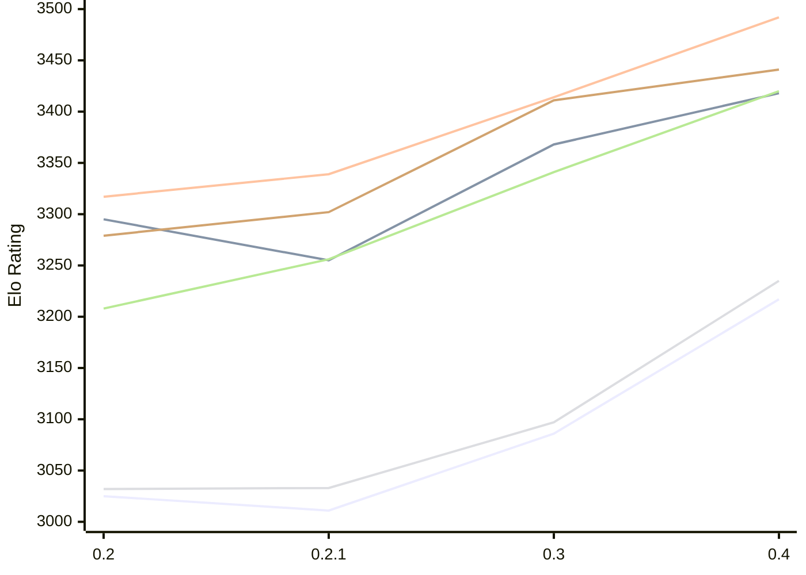

# Engine: StockDory

Author: Shaheryar Sohail

Home: https://github.com/TheBlackPlague/StockDory

## Elo Ratings E1 (Ultra 7 265T (1.50 GHz) - E-Core)

| Version | Published | STC 8.0+0.08s  | LTC 60.0+0.60s | VLTC 2m24s+1.12s | Comment |
| --- | --- | --- | --- | --- | --- |
| 0.4 | 2026-11-02 | 3217(+131) | 3418(+50) | 3492(+78) |  |
| 0.3 | 2026-10-06 | 3086(+75) | 3368(+113) | 3414(+75) |  |
| 0.2.1 | 2026-09-20 | 3011(-14) | 3255(-40) | 3339(+22) |  |
| 0.2 | 2026-09-15 | 3025 | 3295 | 3317 |  |
 | | | cElo (∆ prev) | cElo (∆ prev) | cElo (∆ prev) | 

## Elo Ratings P1 (Ultra 7 265T (1.50 GHz) - P-Core)

| Version | Published | STC 8.0+0.08s  | LTC 60.0+0.60s | VLTC 2m24s+1.12s | Comment |
| --- | --- | --- | --- | --- | --- |
| 0.4 | 2026-11-02 | 3235(+138) | 3420(+79) | 3441(+30) |  |
| 0.3 | 2026-10-06 | 3097(+64) | 3341(+85) | 3411(+109) |  |
| 0.2.1 | 2026-09-20 | 3033(+1) | 3256(+48) | 3302(+23) |  |
| 0.2 | 2026-09-15 | 3032 | 3208 | 3279 |  |
 | | | cElo (∆ prev) | cElo (∆ prev) | cElo (∆ prev) | 

## Elo Ratings T1 (i5-7500T 2.70GHz)

| Version | Published | STC 8.0+0.08s  | LTC 60.0+0.60s | VLTC 2m24s+1.12s | Comment |
| --- | --- | --- | --- | --- | --- |
| 0.2 | 2026-09-15 | 3032 | 3208 | 3279 |  |
 | | | cElo (∆ prev) | cElo (∆ prev) | cElo (∆ prev) | 

<a href="https://github.com/computer-chess-index/cci/issues/new?template=submit-version.yml&title=[VERSION]+StockDory+<version>&body=###%20Engine%20name%0AStockDory%0A%0A###%20Version%0A0.4" target="_blank">Submit new version</a>

 Test Conditions:

GUI/CLI: <a href=https://github.com/cutechess/cutechess target="_blank">Cute-Chess</a> 
Elo Calculation: <a href=https://www.remi-coulom.fr/Bayesian-Elo/ target="_blank">Bayesian-Elo</a> 
CPU for P1: Intel(R) Core(TM) Ultra 7 265T (1.50 GHz) - P-Core 
CPU for E1: Intel(R) Core(TM) Ultra 7 265T (1.50 GHz) - E-Core 
CPU for T1: Intel(R) Core(TM) i5-7500T 2.70GHz 
Opening book: 8_moves_v3 
\* STC: 8.0+0.08s, LTC: 60.0+0.60s, VLTC: 2m24s+1.12s

 Lists:
Ratings: <a href=https://github.com/computer-chess-index/cci/blob/main/lists/CCIRatings.csv target="_blank">Complete list</a>

Generated: 2026-11-26 05:43:43

## Ratings Verlauf E1 / P1

```mermaid
%%{init: {"theme":"base","themeVariables":{"seriesColors:['#a3a3a3','#222221','#faa371']}}}%%
xychart-beta
  x-axis ["0.2", "0.2.1", "0.3", "0.4"]
  y-axis "Elo Rating" 3000 --> 3500
  line "E1: STC (8.0+0.08s)" [3025, 3011, 3086, 3217]
  line "E1: LTC (60.0+0.60s)" [3295, 3255, 3368, 3418]
  line "E1: VLTC (2m24s+1.12s)" [3317, 3339, 3414, 3492]
  line "P1: STC (8.0+0.08s)" [3032, 3033, 3097, 3235]
  line "P1: LTC (60.0+0.60s)" [3208, 3256, 3341, 3420]
  line "P1: VLTC (2m24s+1.12s)" [3279, 3302, 3411, 3441]
```

## Detailed Evaluation Results

| Version | Time Control | Variant | Elo  | Range +/- | Matches | Score | Average Opponent Elo | Draws |
| --- | --- |--- | --- | --- | --- | --- | --- | --- |
| 0.4 | VLTC (2m24s+1.12s) | E1 | 3492 | 31 | 248 | 51% | 3487 | 79% |
|  |  | P1 | 3441 | 37 | 182 | 49% | 3447 | 73% |
|  | LTC (60.0+0.60s) | E1 | 3418 | 29 | 304 | 52% | 3402 | 72% |
|  |  | P1 | 3420 | 40 | 148 | 51% | 3413 | 80% |
|  | STC (8.0+0.08s) | E1 | 3217 | 30 | 298 | 53% | 3193 | 65% |
|  |  | P1 | 3235 | 30 | 286 | 52% | 3224 | 66% |
| --- | --- |--- | --- | --- | --- | --- | --- | --- |
| 0.3 | VLTC (2m24s+1.12s) | P1 | 3411 | 35 | 216 | 53% | 3333 | 69% |
|  |  | E1 | 3414 | 27 | 359 | 56% | 3333 | 67% |
|  | LTC (60.0+0.60s) | P1 | 3341 | 32 | 264 | 54% | 3286 | 59% |
|  |  | E1 | 3368 | 28 | 348 | 55% | 3302 | 62% |
|  | STC (8.0+0.08s) | P1 | 3097 | 41 | 182 | 56% | 2997 | 50% |
|  |  | E1 | 3086 | 29 | 354 | 54% | 3032 | 52% |
| --- | --- |--- | --- | --- | --- | --- | --- | --- |
| 0.2.1 | VLTC (2m24s+1.12s) | P1 | 3302 | 41 | 148 | 54% | 3271 | 72% |
|  |  | E1 | 3339 | 35 | 216 | 47% | 3363 | 66% |
|  | LTC (60.0+0.60s) | P1 | 3256 | 43 | 132 | 47% | 3278 | 73% |
|  |  | E1 | 3255 | 35 | 212 | 46% | 3283 | 67% |
|  | STC (8.0+0.08s) | E1 | 3011 | 36 | 222 | 50% | 3012 | 52% |
|  |  | P1 | 3033 | 39 | 184 | 46% | 3063 | 51% |
| --- | --- |--- | --- | --- | --- | --- | --- | --- |
| 0.2 | VLTC (2m24s+1.12s) | P1 | 3279 | 69 | 56 | 43% | 3333 | 57% |
|  |  | E1 | 3317 | 40 | 158 | 53% | 3298 | 67% |
|  | LTC (60.0+0.60s) | P1 | 3208 | 60 | 72 | 42% | 3266 | 68% |
|  |  | E1 | 3295 | 44 | 134 | 43% | 3344 | 63% |
|  | STC (8.0+0.08s) | P1 | 3032 | 91 | 36 | 47% | 3059 | 39% |
|  |  | E1 | 3025 | 45 | 146 | 54% | 2988 | 46% |