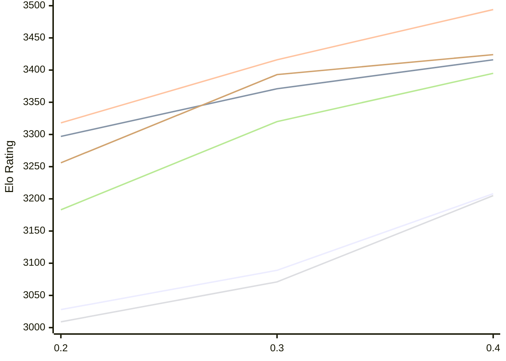

# Engine: StockDory

Author: Shaheryar Sohail

Home: https://github.com/TheBlackPlague/StockDory

## Elo Ratings E1 (Ultra 7 265T (1.50 GHz) - E-Core)

| Version | Published | STC 8.0+0.08s  | LTC 60.0+0.60s | VLTC 2m24s+1.12s | Comment |
| --- | --- | --- | --- | --- | --- |
| 0.4 | 2026-11-02 | 3208(+119) | 3416(+45) | 3494(+78) |  |
| 0.3 | 2026-10-06 | 3089(+61) | 3371(+74) | 3416(+98) |  |
| 0.2 | 2026-09-15 | 3028 | 3297 | 3318 |  |
 | | | cElo (∆ prev) | cElo (∆ prev) | cElo (∆ prev) | 

## Elo Ratings P1 (Ultra 7 265T (1.50 GHz) - P-Core)

| Version | Published | STC 8.0+0.08s  | LTC 60.0+0.60s | VLTC 2m24s+1.12s | Comment |
| --- | --- | --- | --- | --- | --- |
| 0.4 | 2026-11-02 | 3205(+134) | 3395(+75) | 3424(+31) |  |
| 0.3 | 2026-10-06 | 3071(+62) | 3320(+137) | 3393(+137) |  |
| 0.2 | 2026-09-15 | 3009 | 3183 | 3256 |  |
 | | | cElo (∆ prev) | cElo (∆ prev) | cElo (∆ prev) | 

## Elo Ratings T1 (i5-7500T 2.70GHz)

| Version | Published | STC 8.0+0.08s  | LTC 60.0+0.60s | VLTC 2m24s+1.12s | Comment |
| --- | --- | --- | --- | --- | --- |
| 0.2 | 2026-09-15 | 3009 | 3183 | 3256 |  |
 | | | cElo (∆ prev) | cElo (∆ prev) | cElo (∆ prev) | 

<a href="https://github.com/computer-chess-index/cci/issues/new?template=submit-version.yml&title=[VERSION]+StockDory+<version>&body=###%20Engine%20name%0AStockDory%0A%0A###%20Version%0A0.4" target="_blank">Submit new version</a>

 Test Conditions:

GUI/CLI: <a href=https://github.com/cutechess/cutechess target="_blank">Cute-Chess</a> 
Elo Calculation: <a href=https://www.remi-coulom.fr/Bayesian-Elo/ target="_blank">Bayesian-Elo</a> 
CPU for P1: Intel(R) Core(TM) Ultra 7 265T (1.50 GHz) - P-Core 
CPU for E1: Intel(R) Core(TM) Ultra 7 265T (1.50 GHz) - E-Core 
CPU for T1: Intel(R) Core(TM) i5-7500T 2.70GHz 
Opening book: 8_moves_v3 
\* STC: 8.0+0.08s, LTC: 60.0+0.60s, VLTC: 2m24s+1.12s

 Lists:
Ratings: <a href=https://github.com/computer-chess-index/cci/blob/main/lists/CCIRatings.csv target="_blank">Complete list</a>

Generated: 2026-11-18 05:43:44

## Ratings Verlauf E1 / P1

```mermaid
%%{init: {"theme":"base","themeVariables":{"seriesColors:['#a3a3a3','#222221','#faa371']}}}%%
xychart-beta
  x-axis ["0.2", "0.3", "0.4"]
  y-axis "Elo Rating" 3000 --> 3500
  line "E1: STC (8.0+0.08s)" [3028, 3089, 3208]
  line "E1: LTC (60.0+0.60s)" [3297, 3371, 3416]
  line "E1: VLTC (2m24s+1.12s)" [3318, 3416, 3494]
  line "P1: STC (8.0+0.08s)" [3009, 3071, 3205]
  line "P1: LTC (60.0+0.60s)" [3183, 3320, 3395]
  line "P1: VLTC (2m24s+1.12s)" [3256, 3393, 3424]
```

## Detailed Evaluation Results

| Version | Time Control | Variant | Elo  | Range +/- | Matches | Score | Average Opponent Elo | Draws |
| --- | --- |--- | --- | --- | --- | --- | --- | --- |
| 0.4 | VLTC (2m24s+1.12s) | P1 | 3424 | 37 | 182 | 49% | 3430 | 73% |
|  |  | E1 | 3494 | 31 | 246 | 51% | 3490 | 80% |
|  | LTC (60.0+0.60s) | E1 | 3416 | 30 | 284 | 52% | 3403 | 72% |
|  |  | P1 | 3395 | 42 | 132 | 51% | 3390 | 80% |
|  | STC (8.0+0.08s) | E1 | 3208 | 31 | 262 | 52% | 3191 | 68% |
|  |  | P1 | 3205 | 30 | 278 | 51% | 3195 | 67% |
| --- | --- |--- | --- | --- | --- | --- | --- | --- |
| 0.3 | VLTC (2m24s+1.12s) | P1 | 3393 | 35 | 216 | 53% | 3314 | 69% |
|  |  | E1 | 3416 | 27 | 359 | 56% | 3335 | 67% |
|  | LTC (60.0+0.60s) | P1 | 3320 | 32 | 264 | 54% | 3264 | 59% |
|  |  | E1 | 3371 | 28 | 348 | 55% | 3305 | 62% |
|  | STC (8.0+0.08s) | P1 | 3071 | 41 | 182 | 56% | 2971 | 50% |
|  |  | E1 | 3089 | 29 | 354 | 54% | 3035 | 52% |
| --- | --- |--- | --- | --- | --- | --- | --- | --- |
| 0.2 | VLTC (2m24s+1.12s) | P1 | 3256 | 69 | 56 | 43% | 3310 | 57% |
|  |  | E1 | 3318 | 40 | 158 | 53% | 3301 | 67% |
|  | LTC (60.0+0.60s) | P1 | 3183 | 60 | 72 | 42% | 3241 | 68% |
|  |  | E1 | 3297 | 44 | 134 | 43% | 3345 | 63% |
|  | STC (8.0+0.08s) | P1 | 3009 | 91 | 36 | 47% | 3035 | 39% |
|  |  | E1 | 3028 | 45 | 146 | 54% | 2990 | 46% |