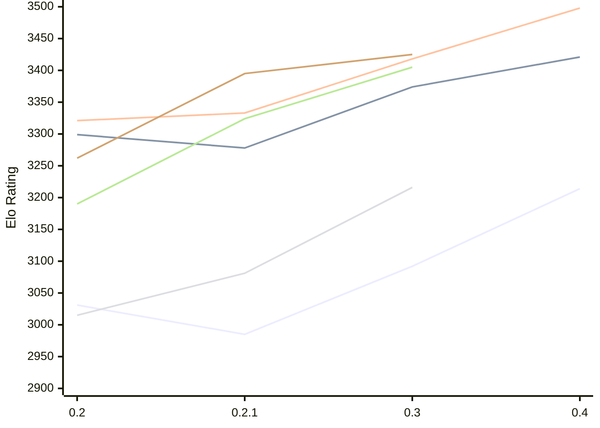

# Engine: StockDory

Author: Shaheryar Sohail

Home: https://github.com/TheBlackPlague/StockDory

## Elo Ratings E1 (Ultra 7 265T (1.50 GHz) - E-Core)

| Version | Published | STC 8.0+0.08s  | LTC 60.0+0.60s | VLTC 2m24s+1.12s | Comment |
| --- | --- | --- | --- | --- | --- |
| 0.4 | 2026-11-02 | 3214(+122) | 3421(+47) | 3498(+80) |  |
| 0.3 | 2026-10-06 | 3092(+107) | 3374(+96) | 3418(+85) |  |
| 0.2.1 | 2026-09-20 | 2985(-46) | 3278(-21) | 3333(+12) |  |
| 0.2 | 2026-09-15 | 3031 | 3299 | 3321 |  |
 | | | cElo (∆ prev) | cElo (∆ prev) | cElo (∆ prev) | 

## Elo Ratings P1 (Ultra 7 265T (1.50 GHz) - P-Core)

| Version | Published | STC 8.0+0.08s  | LTC 60.0+0.60s | VLTC 2m24s+1.12s | Comment |
| --- | --- | --- | --- | --- | --- |
| 0.4 | 2026-11-02 | 3216(+135) | 3405(+81) | 3425(+30) |  |
| 0.3 | 2026-10-06 | 3081(+66) | 3324(+134) | 3395(+133) |  |
| 0.2 | 2026-09-15 | 3015 | 3190 | 3262 |  |
 | | | cElo (∆ prev) | cElo (∆ prev) | cElo (∆ prev) | 

## Elo Ratings T1 (i5-7500T 2.70GHz)

| Version | Published | STC 8.0+0.08s  | LTC 60.0+0.60s | VLTC 2m24s+1.12s | Comment |
| --- | --- | --- | --- | --- | --- |
| 0.2 | 2026-09-15 | 3015 | 3190 | 3262 |  |
 | | | cElo (∆ prev) | cElo (∆ prev) | cElo (∆ prev) | 

<a href="https://github.com/computer-chess-index/cci/issues/new?template=submit-version.yml&title=[VERSION]+StockDory+<version>&body=###%20Engine%20name%0AStockDory%0A%0A###%20Version%0A0.4" target="_blank">Submit new version</a>

 Test Conditions:

GUI/CLI: <a href=https://github.com/cutechess/cutechess target="_blank">Cute-Chess</a> 
Elo Calculation: <a href=https://www.remi-coulom.fr/Bayesian-Elo/ target="_blank">Bayesian-Elo</a> 
CPU for P1: Intel(R) Core(TM) Ultra 7 265T (1.50 GHz) - P-Core 
CPU for E1: Intel(R) Core(TM) Ultra 7 265T (1.50 GHz) - E-Core 
CPU for T1: Intel(R) Core(TM) i5-7500T 2.70GHz 
Opening book: 8_moves_v3 
\* STC: 8.0+0.08s, LTC: 60.0+0.60s, VLTC: 2m24s+1.12s

 Lists:
Ratings: <a href=https://github.com/computer-chess-index/cci/blob/main/lists/CCIRatings.csv target="_blank">Complete list</a>

Generated: 2026-11-22 05:43:14

## Ratings Verlauf E1 / P1

```mermaid
%%{init: {"theme":"base","themeVariables":{"seriesColors:['#a3a3a3','#222221','#faa371']}}}%%
xychart-beta
  x-axis ["0.2", "0.2.1", "0.3", "0.4"]
  y-axis "Elo Rating" 2900 --> 3500
  line "E1: STC (8.0+0.08s)" [3031, 2985, 3092, 3214]
  line "E1: LTC (60.0+0.60s)" [3299, 3278, 3374, 3421]
  line "E1: VLTC (2m24s+1.12s)" [3321, 3333, 3418, 3498]
  line "P1: STC (8.0+0.08s)" [3015, 3081, 3216]
  line "P1: LTC (60.0+0.60s)" [3190, 3324, 3405]
  line "P1: VLTC (2m24s+1.12s)" [3262, 3395, 3425]
```

## Detailed Evaluation Results

| Version | Time Control | Variant | Elo  | Range +/- | Matches | Score | Average Opponent Elo | Draws |
| --- | --- |--- | --- | --- | --- | --- | --- | --- |
| 0.4 | VLTC (2m24s+1.12s) | P1 | 3425 | 37 | 182 | 49% | 3430 | 73% |
|  |  | E1 | 3498 | 31 | 248 | 51% | 3492 | 79% |
|  | LTC (60.0+0.60s) | P1 | 3405 | 41 | 144 | 51% | 3397 | 80% |
|  |  | E1 | 3421 | 29 | 296 | 52% | 3407 | 72% |
|  | STC (8.0+0.08s) | P1 | 3216 | 30 | 282 | 52% | 3206 | 67% |
|  |  | E1 | 3214 | 31 | 266 | 53% | 3194 | 67% |
| --- | --- |--- | --- | --- | --- | --- | --- | --- |
| 0.3 | VLTC (2m24s+1.12s) | P1 | 3395 | 35 | 216 | 53% | 3317 | 69% |
|  |  | E1 | 3418 | 27 | 359 | 56% | 3337 | 67% |
|  | LTC (60.0+0.60s) | P1 | 3324 | 32 | 264 | 54% | 3268 | 59% |
|  |  | E1 | 3374 | 28 | 348 | 55% | 3308 | 62% |
|  | STC (8.0+0.08s) | E1 | 3092 | 29 | 354 | 54% | 3036 | 52% |
|  |  | P1 | 3081 | 41 | 182 | 56% | 2981 | 50% |
| --- | --- |--- | --- | --- | --- | --- | --- | --- |
| 0.2.1 | VLTC (2m24s+1.12s) | E1 | 3333 | 46 | 124 | 44% | 3383 | 65% |
|  | LTC (60.0+0.60s) | E1 | 3278 | 47 | 116 | 47% | 3305 | 67% |
|  | STC (8.0+0.08s) | E1 | 2985 | 52 | 104 | 44% | 3032 | 52% |
| --- | --- |--- | --- | --- | --- | --- | --- | --- |
| 0.2 | VLTC (2m24s+1.12s) | P1 | 3262 | 69 | 56 | 43% | 3316 | 57% |
|  |  | E1 | 3321 | 40 | 158 | 53% | 3302 | 67% |
|  | LTC (60.0+0.60s) | E1 | 3299 | 44 | 134 | 43% | 3348 | 63% |
|  |  | P1 | 3190 | 60 | 72 | 42% | 3247 | 68% |
|  | STC (8.0+0.08s) | E1 | 3031 | 45 | 146 | 54% | 2993 | 46% |
|  |  | P1 | 3015 | 91 | 36 | 47% | 3042 | 39% |