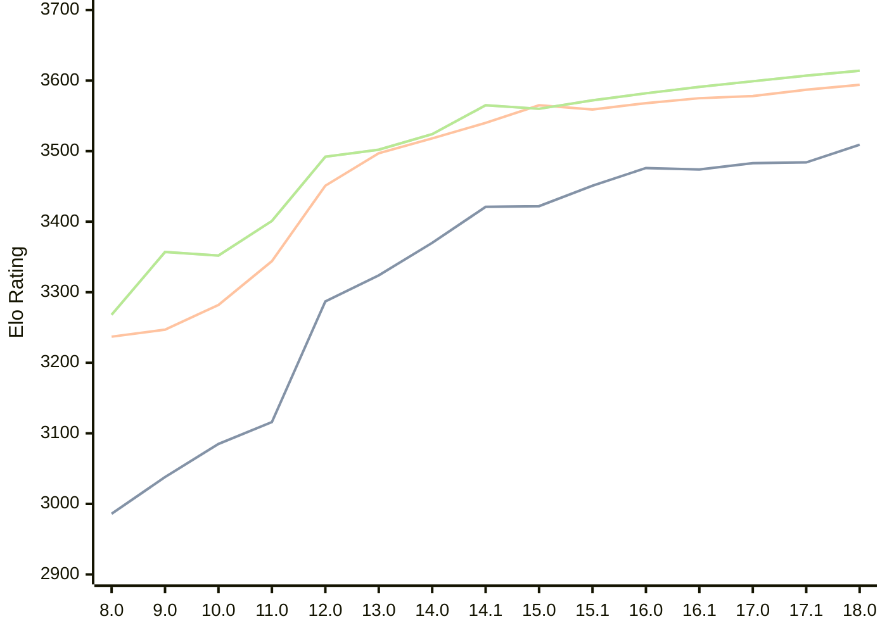

# Engine: Stockfish

Author: <a href="https://github.com/official-stockfish/Stockfish/blob/master/AUTHORS" target="_blank">Stockfish Authors</a>

Home: https://github.com/official-stockfish/Stockfish

## Elo Ratings

| Version | Published | STC 8.0+0.08s  | LTC 60.0+0.60s | VLTC 2m24s+1.12s | Comment |
| --- | --- | --- | --- | --- | --- |
| 18.0 | 2026-01-31 | 3509(+25) | 3594(+7) | 3614(+7) |  |
| 17.1 | 2025-03-30 | 3484(+1) | 3587(+9) | 3607(+8) |  |
| 17.0 | 2024-09-06 | 3483(+9) | 3578(+3) | 3599(+8) |  |
| 16.1 | 2024-02-24 | 3474(-2) | 3575(+7) | 3591(+9) |  |
| 16.0 | 2023-06-30 | 3476(+25) | 3568(+9) | 3582(+10) |  |
| 15.1 | 2022-12-04 | 3451(+29) | 3559(-6) | 3572(+12) |  |
| 15.0 | 2022-04-18 | 3422(+1) | 3565(+25) | 3560(-5) |  |
| 14.1 | 2021-10-28 | 3421(+51) | 3540(+22) | 3565(+41) |  |
| 14.0 | 2021-07-02 | 3370(+46) | 3518(+21) | 3524(+22) |  |
| 13.0 | 2021-02-19 | 3324(+37) | 3497(+46) | 3502(+10) |  |
| 12.0 | 2020-09-02 | 3287(+171) | 3451(+107) | 3492(+91) |  |
| 11.0 | 2020-01-18 | 3116(+31) | 3344(+62) | 3401(+49) |  |
| 10.0 | 2018-11-29 | 3085(+47) | 3282(+35) | 3352(-5) |  |
| 9.0 | 2018-02-01 | 3038(+52) | 3247(+10) | 3357(+89) |  |
| 8.0 | 2016-11-01 | 2986 | 3237 | 3268 |  |
 | | | cElo (∆ prev) | cElo (∆ prev) | cElo (∆ prev) | 

<a href="https://github.com/computer-chess-index/cci/issues/new?template=submit-version.yml&title=[VERSION]+Stockfish+<version>&body=###%20Engine%20name%0AStockfish%0A%0A###%20Version%0A18.0" target="_blank">Submit new version</a>

 Test Conditions:

GUI/CLI: <a href=https://github.com/cutechess/cutechess target="_blank">Cute-Chess</a> 
Elo Calculation: <a href=https://www.remi-coulom.fr/Bayesian-Elo/ target="_blank">Bayesian-Elo</a> 
CPU: Intel(R) Core(TM) i5-7500T 2.70GHz 
Opening book: 8_moves_v3 
\* STC: 8.0+0.08s, LTC: 60.0+0.60s, VLTC: 2m24s+1.12s

 Lists:
Ratings: <a href=https://github.com/computer-chess-index/cci/blob/main/lists/CCIRatings.csv target="_blank">Complete list</a>

Generated: 2026-08-31 04:39:32

## Ratings Verlauf

## Detailed Evaluation Results

| Version | Time Control | Elo  | Range +/- | Matches | Score | Average Opponent Elo | Draws |
| --- | --- | --- | --- | --- | --- | --- | --- |
| 18.0 | VLTC (2m24s+1.12s) | 3614 | 35 | 184 | 55% | 3578 | 88% |
| 18.0 | LTC (60.0+0.60s) | 3594 | 30 | 254 | 53% | 3572 | 90% |
| 18.0 | STC (8.0+0.08s) | 3509 | 20 | 606 | 49% | 3513 | 83% |
| --- | --- | --- | --- | --- | --- | --- | --- |
| 17.1 | VLTC (2m24s+1.12s) | 3607 | 28 | 292 | 57% | 3561 | 85% |
| 17.1 | LTC (60.0+0.60s) | 3587 | 26 | 336 | 54% | 3561 | 88% |
| 17.1 | STC (8.0+0.08s) | 3484 | 18 | 776 | 51% | 3474 | 79% |
| --- | --- | --- | --- | --- | --- | --- | --- |
| 17.0 | VLTC (2m24s+1.12s) | 3599 | 19 | 648 | 58% | 3544 | 83% |
| 17.0 | LTC (60.0+0.60s) | 3578 | 19 | 664 | 54% | 3551 | 87% |
| 17.0 | STC (8.0+0.08s) | 3483 | 14 | 1276 | 50% | 3483 | 81% |
| --- | --- | --- | --- | --- | --- | --- | --- |
| 16.1 | VLTC (2m24s+1.12s) | 3591 | 77 | 36 | 51% | 3582 | 97% |
| 16.1 | LTC (60.0+0.60s) | 3575 | 43 | 116 | 51% | 3569 | 95% |
| 16.1 | STC (8.0+0.08s) | 3474 | 38 | 164 | 49% | 3479 | 78% |
| --- | --- | --- | --- | --- | --- | --- | --- |
| 16.0 | VLTC (2m24s+1.12s) | 3582 | 89 | 28 | 50% | 3582 | 86% |
| 16.0 | LTC (60.0+0.60s) | 3568 | 47 | 100 | 50% | 3571 | 95% |
| 16.0 | STC (8.0+0.08s) | 3476 | 42 | 132 | 50% | 3478 | 83% |
| --- | --- | --- | --- | --- | --- | --- | --- |
| 15.1 | VLTC (2m24s+1.12s) | 3572 | 49 | 92 | 50% | 3573 | 93% |
| 15.1 | LTC (60.0+0.60s) | 3559 | 44 | 116 | 50% | 3563 | 94% |
| 15.1 | STC (8.0+0.08s) | 3451 | 31 | 256 | 54% | 3425 | 76% |
| --- | --- | --- | --- | --- | --- | --- | --- |
| 15.0 | VLTC (2m24s+1.12s) | 3560 | 40 | 144 | 51% | 3557 | 90% |
| 15.0 | LTC (60.0+0.60s) | 3565 | 49 | 96 | 50% | 3567 | 88% |
| 15.0 | STC (8.0+0.08s) | 3422 | 36 | 184 | 48% | 3437 | 77% |
| --- | --- | --- | --- | --- | --- | --- | --- |
| 14.1 | VLTC (2m24s+1.12s) | 3565 | 31 | 232 | 50% | 3564 | 90% |
| 14.1 | LTC (60.0+0.60s) | 3540 | 29 | 282 | 51% | 3536 | 85% |
| 14.1 | STC (8.0+0.08s) | 3421 | 26 | 364 | 52% | 3402 | 78% |
| --- | --- | --- | --- | --- | --- | --- | --- |
| 14.0 | VLTC (2m24s+1.12s) | 3524 | 51 | 84 | 49% | 3528 | 94% |
| 14.0 | LTC (60.0+0.60s) | 3518 | 52 | 84 | 49% | 3522 | 87% |
| 14.0 | STC (8.0+0.08s) | 3370 | 44 | 124 | 49% | 3379 | 77% |
| --- | --- | --- | --- | --- | --- | --- | --- |
| 13.0 | VLTC (2m24s+1.12s) | 3502 | 41 | 138 | 50% | 3502 | 83% |
| 13.0 | LTC (60.0+0.60s) | 3497 | 38 | 160 | 50% | 3499 | 82% |
| 13.0 | STC (8.0+0.08s) | 3324 | 37 | 186 | 49% | 3328 | 68% |
| --- | --- | --- | --- | --- | --- | --- | --- |
| 12.0 | VLTC (2m24s+1.12s) | 3492 | 46 | 108 | 50% | 3494 | 87% |
| 12.0 | LTC (60.0+0.60s) | 3451 | 41 | 144 | 48% | 3464 | 78% |
| 12.0 | STC (8.0+0.08s) | 3287 | 35 | 204 | 46% | 3316 | 67% |
| --- | --- | --- | --- | --- | --- | --- | --- |
| 11.0 | VLTC (2m24s+1.12s) | 3401 | 36 | 200 | 51% | 3394 | 69% |
| 11.0 | LTC (60.0+0.60s) | 3344 | 33 | 240 | 46% | 3371 | 65% |
| 11.0 | STC (8.0+0.08s) | 3116 | 41 | 176 | 47% | 3135 | 46% |
| --- | --- | --- | --- | --- | --- | --- | --- |
| 10.0 | VLTC (2m24s+1.12s) | 3352 | 36 | 212 | 49% | 3362 | 56% |
| 10.0 | LTC (60.0+0.60s) | 3282 | 35 | 216 | 50% | 3282 | 63% |
| 10.0 | STC (8.0+0.08s) | 3085 | 37 | 224 | 50% | 3086 | 42% |
| --- | --- | --- | --- | --- | --- | --- | --- |
| 9.0 | VLTC (2m24s+1.12s) | 3357 | 34 | 230 | 50% | 3362 | 57% |
| 9.0 | LTC (60.0+0.60s) | 3247 | 38 | 200 | 50% | 3254 | 48% |
| 9.0 | STC (8.0+0.08s) | 3038 | 33 | 268 | 52% | 3021 | 49% |
| --- | --- | --- | --- | --- | --- | --- | --- |
| 8.0 | VLTC (2m24s+1.12s) | 3268 | 36 | 204 | 49% | 3272 | 63% |
| 8.0 | LTC (60.0+0.60s) | 3237 | 32 | 278 | 47% | 3260 | 55% |
| 8.0 | STC (8.0+0.08s) | 2986 | 37 | 220 | 49% | 2994 | 40% |
| --- | --- | --- | --- | --- | --- | --- | --- |