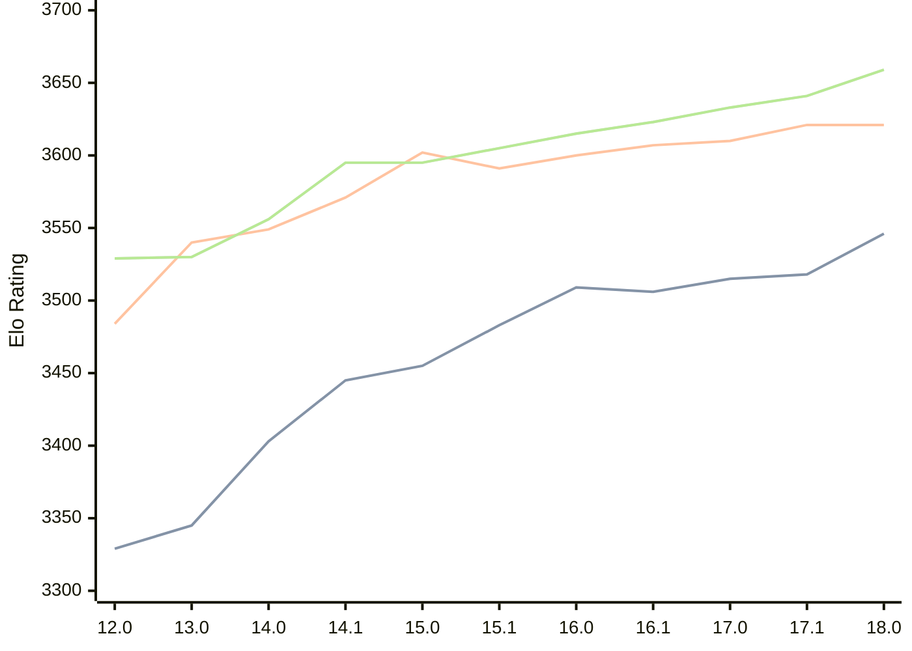

# Engine: Stockfish

Author: <a href="https://github.com/official-stockfish/Stockfish/blob/master/AUTHORS" target="_blank">Stockfish Authors</a>

Home: https://github.com/official-stockfish/Stockfish

## Ratings nach Version

| Version | Published | STC 8.0+0.08s  | LTC 60.0+0.60s | VLTC 2m24s+1.12s | Comment |
| --- | --- | --- | --- | --- | --- |
| 18.0 | 2026-01-31 | 3546(+28) | 3621(0) | 3659(+18) |  |
| 17.1 | 2025-03-30 | 3518(+3) | 3621(+11) | 3641(+8) |  |
| 17.0 | 2024-09-06 | 3515(+9) | 3610(+3) | 3633(+10) |  |
| 16.1 | 2024-02-24 | 3506(-3) | 3607(+7) | 3623(+8) |  |
| 16.0 | 2023-06-30 | 3509(+26) | 3600(+9) | 3615(+10) |  |
| 15.1 | 2022-12-04 | 3483(+28) | 3591(-11) | 3605(+10) |  |
| 15.0 | 2022-04-18 | 3455(+10) | 3602(+31) | 3595(+0) |  |
| 14.1 | 2021-10-28 | 3445(+42) | 3571(+22) | 3595(+39) |  |
| 14.0 | 2021-07-02 | 3403(+58) | 3549(+9) | 3556(+26) |  |
| 13.0 | 2021-02-19 | 3345(+16) | 3540(+56) | 3530(+1) |  |
| 12.0 | 2020-09-02 | 3329(new) | 3484(new) | 3529(new) |  |
| 11.0 | 2020-01-18 |  |  |  |  |
| 10.0 | 2018-11-29 |  |  |  |  |
| 9.0 | 2018-02-01 |  |  |  |  |
 | | | cElo (∆ prev) | cElo (∆ prev) | cElo (∆ prev) | 

 Test Conditions:

GUI/CLI: <a href=https://github.com/cutechess/cutechess target="_blank">Cute-Chess</a> 
Elo Calculation: <a href=https://www.remi-coulom.fr/Bayesian-Elo/ target="_blank">Bayesian-Elo</a> 
CPU: Intel(R) Core(TM) i5-7500T 2.70GHz 
Opening book: 8_moves_v3 
\* STC: 8.0+0.08s, LTC: 60.0+0.60s, VLTC: 2m24s+1.12s

 Lists:
Ratings: <a href=https://github.com/computer-chess-index/cci/blob/main/lists/CCIRatings.csv target="_blank">Complete list</a>

Generated: 2026-02-18 17:29:29

## Ratings Verlauf

⬛ STC (8.0+0.08s) &nbsp;&nbsp; 🟧 LTC (60.0+0.60s) &nbsp;&nbsp; 🟩 VLTC (2m24s+1.12s)

