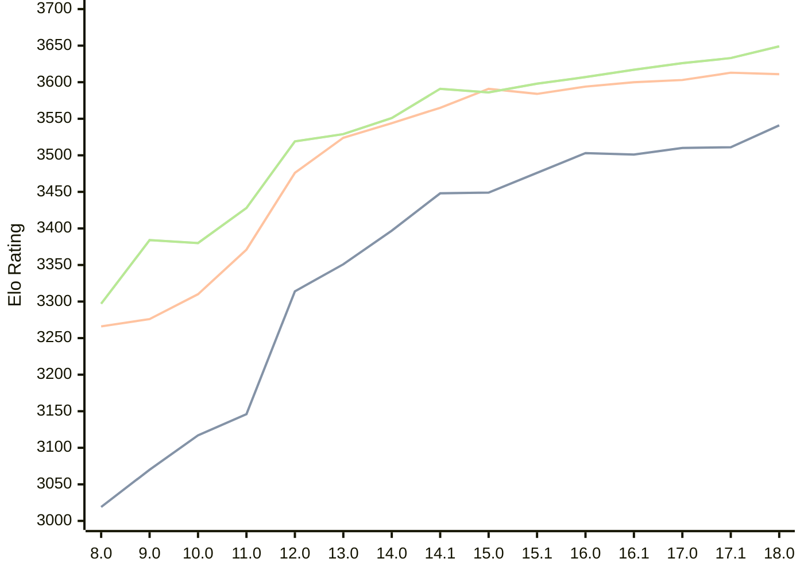

# Engine: Stockfish

Author: <a href="https://github.com/official-stockfish/Stockfish/blob/master/AUTHORS" target="_blank">Stockfish Authors</a>

Home: https://github.com/official-stockfish/Stockfish

## Ratings nach Version

| Version | Published | STC 8.0+0.08s  | LTC 60.0+0.60s | VLTC 2m24s+1.12s | Comment |
| --- | --- | --- | --- | --- | --- |
| 18.0 | 2026-01-31 | 3541(+30) | 3611(-2) | 3649(+16) |  |
| 17.1 | 2025-03-30 | 3511(+1) | 3613(+10) | 3633(+7) |  |
| 17.0 | 2024-09-06 | 3510(+9) | 3603(+3) | 3626(+9) |  |
| 16.1 | 2024-02-24 | 3501(-2) | 3600(+6) | 3617(+10) |  |
| 16.0 | 2023-06-30 | 3503(+27) | 3594(+10) | 3607(+9) |  |
| 15.1 | 2022-12-04 | 3476(+27) | 3584(-7) | 3598(+12) |  |
| 15.0 | 2022-04-18 | 3449(+1) | 3591(+26) | 3586(-5) |  |
| 14.1 | 2021-10-28 | 3448(+51) | 3565(+21) | 3591(+40) |  |
| 14.0 | 2021-07-02 | 3397(+46) | 3544(+20) | 3551(+22) |  |
| 13.0 | 2021-02-19 | 3351(+37) | 3524(+48) | 3529(+10) |  |
| 12.0 | 2020-09-02 | 3314(+168) | 3476(+105) | 3519(+91) |  |
| 11.0 | 2020-01-18 | 3146(+29) | 3371(+61) | 3428(+48) |  |
| 10.0 | 2018-11-29 | 3117(+47) | 3310(+34) | 3380(-4) |  |
| 9.0 | 2018-02-01 | 3070(+51) | 3276(+10) | 3384(+87) |  |
| 8.0 | 2016-11-01 | 3019(+new) | 3266(+new) | 3297(+new) |  |
| 7.0 | 2016-01-05 |  |  |  |  |
 | | | cElo (∆ prev) | cElo (∆ prev) | cElo (∆ prev) | 

<a href="https://github.com/computer-chess-index/cci/issues/new?template=submit-version.yml&title=[VERSION]+Stockfish+<version>&body=###%20Engine%20name%0AStockfish%0A%0A###%20Version%0A18.0" target="_blank">Submit new version</a>

 Test Conditions:

GUI/CLI: <a href=https://github.com/cutechess/cutechess target="_blank">Cute-Chess</a> 
Elo Calculation: <a href=https://www.remi-coulom.fr/Bayesian-Elo/ target="_blank">Bayesian-Elo</a> 
CPU: Intel(R) Core(TM) i5-7500T 2.70GHz 
Opening book: 8_moves_v3 
\* STC: 8.0+0.08s, LTC: 60.0+0.60s, VLTC: 2m24s+1.12s

 Lists:
Ratings: <a href=https://github.com/computer-chess-index/cci/blob/main/lists/CCIRatings.csv target="_blank">Complete list</a>

Generated: 2026-04-13 06:27:02

## Ratings Verlauf

⬛ STC (8.0+0.08s) &nbsp;&nbsp; 🟧 LTC (60.0+0.60s) &nbsp;&nbsp; 🟩 VLTC (2m24s+1.12s)

dark mode: 🟩STC (8.0+0.08s) 🟧LTC (60.0+0.60s) ⬜VLTC (2m24s+1.12s)

