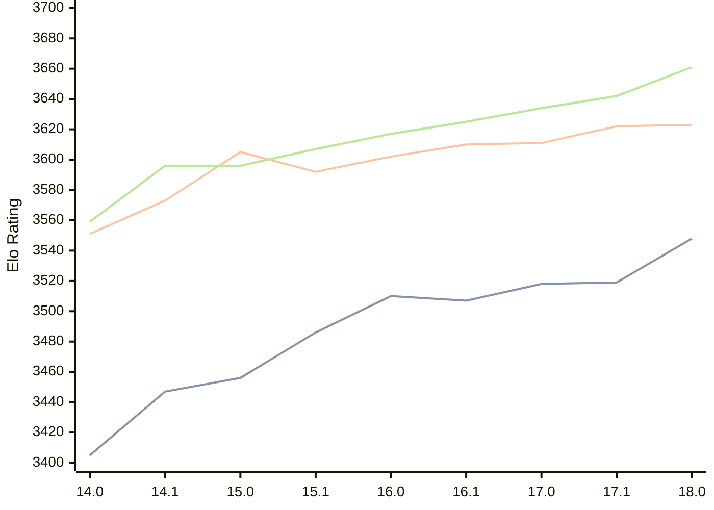

# Engine: Stockfish

Author: <a href="https://github.com/official-stockfish/Stockfish/blob/master/AUTHORS" target="_blank">Stockfish Authors</a>

Home: https://github.com/official-stockfish/Stockfish

## Ratings nach Version

| Version | Published | STC 8.0+0.08s  | LTC 60.0+0.60s | VLTC 2m24s+1.12s | Comment |
| --- | --- | --- | --- | --- | --- |
| 18.0 | 2026-01-31 | 3548(+29) | 3623(+1) | 3661(+19) |  |
| 17.1 | 2025-03-30 | 3519(+1) | 3622(+11) | 3642(+8) |  |
| 17.0 | 2024-09-06 | 3518(+11) | 3611(+1) | 3634(+9) |  |
| 16.1 | 2024-02-24 | 3507(-3) | 3610(+8) | 3625(+8) |  |
| 16.0 | 2023-06-30 | 3510(+24) | 3602(+10) | 3617(+10) |  |
| 15.1 | 2022-12-04 | 3486(+30) | 3592(-13) | 3607(+11) |  |
| 15.0 | 2022-04-18 | 3456(+9) | 3605(+32) | 3596(+0) |  |
| 14.1 | 2021-10-28 | 3447(+42) | 3573(+22) | 3596(+37) |  |
| 14.0 | 2021-07-02 | 3405(new) | 3551(new) | 3559(new) |  |
| 13.0 | 2021-02-19 |  |  |  |  |
| 12.0 | 2020-09-02 |  |  |  |  |
| 11.0 | 2020-01-18 |  |  |  |  |
| 10.0 | 2018-11-29 |  |  |  |  |
| 9.0 | 2018-02-01 |  |  |  |  |
 | | | cElo (∆ prev) | cElo (∆ prev) | cElo (∆ prev) | 

 Test Conditions:

GUI/CLI: <a href=https://github.com/cutechess/cutechess target="_blank">Cute-Chess</a> 
Elo Calculation: <a href=https://www.remi-coulom.fr/Bayesian-Elo/ target="_blank">Bayesian-Elo</a> 
CPU: Intel(R) Core(TM) i5-7500T 2.70GHz 
Opening book: 8_moves_v3 
\* STC: 8.0+0.08s, LTC: 60.0+0.60s, VLTC: 2m24s+1.12s

 Lists:
Ratings: <a href=https://github.com/computer-chess-index/cci/blob/main/lists/CCIRatings.csv target="_blank">Complete list</a>

Generated: 2026-02-17 19:47:18

## Ratings Verlauf

⬛ STC (8.0+0.08s) &nbsp;&nbsp; 🟧 LTC (60.0+0.60s) &nbsp;&nbsp; 🟩 VLTC (2m24s+1.12s)

