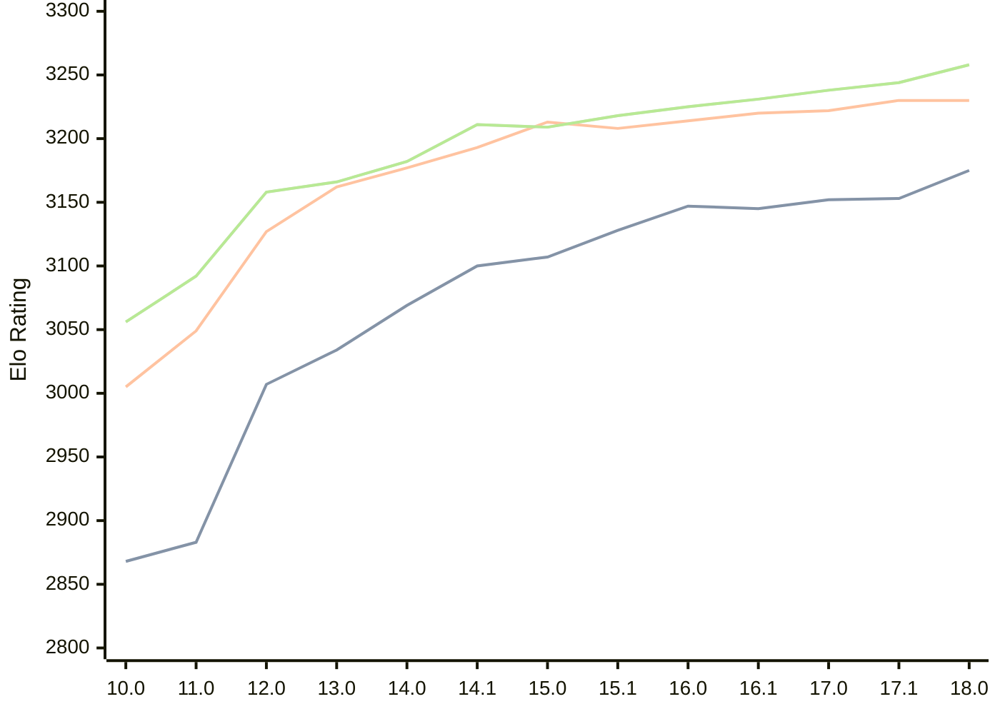

# Engine: Stockfish

Author: <a href="https://github.com/official-stockfish/Stockfish/blob/master/AUTHORS" target="_blank">Stockfish Authors</a>

Home: https://github.com/official-stockfish/Stockfish

## Ratings nach Version

| Version | Published | STC 8.0+0.08s  | LTC 60.0+0.60s | VLTC 2m24s+1.12s | Comment |
| --- | --- | --- | --- | --- | --- |
| 18.0 | 2026-01-31 | 3175(+22) | 3230(0) | 3258(+14) |  |
| 17.1 | 2025-03-30 | 3153(+1) | 3230(+8) | 3244(+6) |  |
| 17.0 | 2024-09-06 | 3152(+7) | 3222(+2) | 3238(+7) |  |
| 16.1 | 2024-02-24 | 3145(-2) | 3220(+6) | 3231(+6) |  |
| 16.0 | 2023-06-30 | 3147(+19) | 3214(+6) | 3225(+7) |  |
| 15.1 | 2022-12-04 | 3128(+21) | 3208(-5) | 3218(+9) |  |
| 15.0 | 2022-04-18 | 3107(+7) | 3213(+20) | 3209(-2) |  |
| 14.1 | 2021-10-28 | 3100(+31) | 3193(+16) | 3211(+29) |  |
| 14.0 | 2021-07-02 | 3069(+35) | 3177(+15) | 3182(+16) |  |
| 13.0 | 2021-02-19 | 3034(+27) | 3162(+35) | 3166(+8) |  |
| 12.0 | 2020-09-02 | 3007(+124) | 3127(+78) | 3158(+66) |  |
| 11.0 | 2020-01-18 | 2883(+15) | 3049(+44) | 3092(+36) |  |
| 10.0 | 2018-11-29 | 2868(+new) | 3005(+new) | 3056(+new) |  |
| 9.0 | 2018-02-01 |  |  |  |  |
 | | | cElo (∆ prev) | cElo (∆ prev) | cElo (∆ prev) | 

 Test Conditions:

GUI/CLI: <a href=https://github.com/cutechess/cutechess target="_blank">Cute-Chess</a> 
Elo Calculation: <a href=https://www.remi-coulom.fr/Bayesian-Elo/ target="_blank">Bayesian-Elo</a> 
CPU: Intel(R) Core(TM) i5-7500T 2.70GHz 
Opening book: 8_moves_v3 
\* STC: 8.0+0.08s, LTC: 60.0+0.60s, VLTC: 2m24s+1.12s

 Lists:
Ratings: <a href=https://github.com/computer-chess-index/cci/blob/main/lists/CCIRatings.csv target="_blank">Complete list</a>

Generated: 2026-02-23 06:26:45

## Ratings Verlauf

⬛ STC (8.0+0.08s) &nbsp;&nbsp; 🟧 LTC (60.0+0.60s) &nbsp;&nbsp; 🟩 VLTC (2m24s+1.12s)

