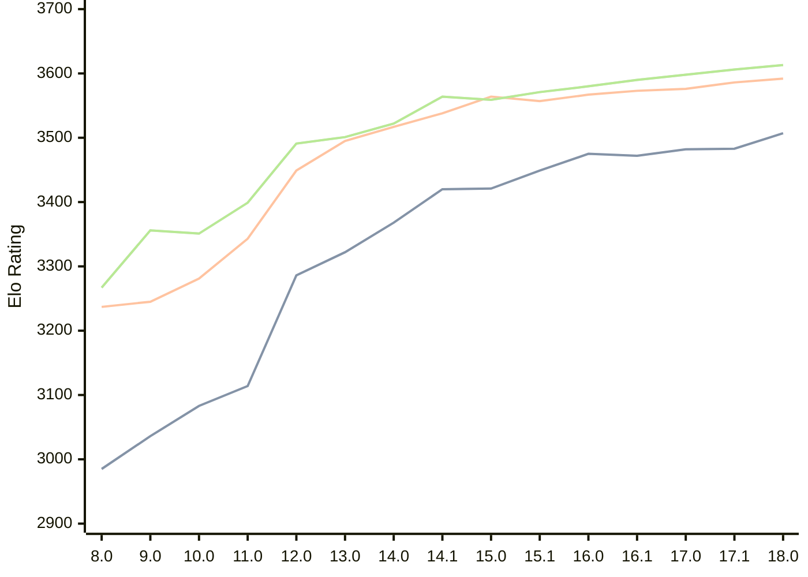

# Engine: Stockfish

Author: <a href="https://github.com/official-stockfish/Stockfish/blob/master/AUTHORS" target="_blank">Stockfish Authors</a>

Home: https://github.com/official-stockfish/Stockfish

## Elo Ratings

| Version | Published | STC 8.0+0.08s  | LTC 60.0+0.60s | VLTC 2m24s+1.12s | Comment |
| --- | --- | --- | --- | --- | --- |
| 18.0 | 2026-01-31 | 3507(+24) | 3592(+6) | 3613(+7) |  |
| 17.1 | 2025-03-30 | 3483(+1) | 3586(+10) | 3606(+8) |  |
| 17.0 | 2024-09-06 | 3482(+10) | 3576(+3) | 3598(+8) |  |
| 16.1 | 2024-02-24 | 3472(-3) | 3573(+6) | 3590(+10) |  |
| 16.0 | 2023-06-30 | 3475(+26) | 3567(+10) | 3580(+9) |  |
| 15.1 | 2022-12-04 | 3449(+28) | 3557(-7) | 3571(+12) |  |
| 15.0 | 2022-04-18 | 3421(+1) | 3564(+26) | 3559(-5) |  |
| 14.1 | 2021-10-28 | 3420(+52) | 3538(+21) | 3564(+42) |  |
| 14.0 | 2021-07-02 | 3368(+46) | 3517(+22) | 3522(+21) |  |
| 13.0 | 2021-02-19 | 3322(+36) | 3495(+46) | 3501(+10) |  |
| 12.0 | 2020-09-02 | 3286(+172) | 3449(+106) | 3491(+92) |  |
| 11.0 | 2020-01-18 | 3114(+31) | 3343(+62) | 3399(+48) |  |
| 10.0 | 2018-11-29 | 3083(+47) | 3281(+36) | 3351(-5) |  |
| 9.0 | 2018-02-01 | 3036(+51) | 3245(+8) | 3356(+89) |  |
| 8.0 | 2016-11-01 | 2985 | 3237 | 3267 |  |
 | | | cElo (∆ prev) | cElo (∆ prev) | cElo (∆ prev) | 

<a href="https://github.com/computer-chess-index/cci/issues/new?template=submit-version.yml&title=[VERSION]+Stockfish+<version>&body=###%20Engine%20name%0AStockfish%0A%0A###%20Version%0A18.0" target="_blank">Submit new version</a>

 Test Conditions:

GUI/CLI: <a href=https://github.com/cutechess/cutechess target="_blank">Cute-Chess</a> 
Elo Calculation: <a href=https://www.remi-coulom.fr/Bayesian-Elo/ target="_blank">Bayesian-Elo</a> 
CPU: Intel(R) Core(TM) i5-7500T 2.70GHz 
Opening book: 8_moves_v3 
\* STC: 8.0+0.08s, LTC: 60.0+0.60s, VLTC: 2m24s+1.12s

 Lists:
Ratings: <a href=https://github.com/computer-chess-index/cci/blob/main/lists/CCIRatings.csv target="_blank">Complete list</a>

Generated: 2026-08-26 06:29:52

## Ratings Verlauf

⬛ STC (8.0+0.08s) &nbsp;&nbsp; 🟧 LTC (60.0+0.60s) &nbsp;&nbsp; 🟩 VLTC (2m24s+1.12s)

dark mode: 🟩STC (8.0+0.08s) 🟧LTC (60.0+0.60s) ⬜VLTC (2m24s+1.12s)

## Detailed Evaluation Results

| Version | Time Control | Elo  | Range +/- | Matches | Score | Average Opponent Elo | Draws |
| --- | --- | --- | --- | --- | --- | --- | --- |
| 18.0 | VLTC (2m24s+1.12s) | 3613 | 35 | 184 | 55% | 3576 | 88% |
| 18.0 | LTC (60.0+0.60s) | 3592 | 30 | 254 | 53% | 3572 | 90% |
| 18.0 | STC (8.0+0.08s) | 3507 | 20 | 592 | 49% | 3511 | 83% |
| --- | --- | --- | --- | --- | --- | --- | --- |
| 17.1 | VLTC (2m24s+1.12s) | 3606 | 28 | 292 | 57% | 3560 | 85% |
| 17.1 | LTC (60.0+0.60s) | 3586 | 26 | 336 | 54% | 3560 | 88% |
| 17.1 | STC (8.0+0.08s) | 3483 | 18 | 776 | 51% | 3472 | 79% |
| --- | --- | --- | --- | --- | --- | --- | --- |
| 17.0 | VLTC (2m24s+1.12s) | 3598 | 19 | 648 | 58% | 3542 | 83% |
| 17.0 | LTC (60.0+0.60s) | 3576 | 19 | 664 | 54% | 3549 | 87% |
| 17.0 | STC (8.0+0.08s) | 3482 | 14 | 1276 | 50% | 3482 | 81% |
| --- | --- | --- | --- | --- | --- | --- | --- |
| 16.1 | VLTC (2m24s+1.12s) | 3590 | 77 | 36 | 51% | 3580 | 97% |
| 16.1 | LTC (60.0+0.60s) | 3573 | 43 | 116 | 51% | 3568 | 95% |
| 16.1 | STC (8.0+0.08s) | 3472 | 38 | 164 | 49% | 3478 | 78% |
| --- | --- | --- | --- | --- | --- | --- | --- |
| 16.0 | VLTC (2m24s+1.12s) | 3580 | 89 | 28 | 50% | 3580 | 86% |
| 16.0 | LTC (60.0+0.60s) | 3567 | 47 | 100 | 50% | 3569 | 95% |
| 16.0 | STC (8.0+0.08s) | 3475 | 42 | 132 | 50% | 3476 | 83% |
| --- | --- | --- | --- | --- | --- | --- | --- |
| 15.1 | VLTC (2m24s+1.12s) | 3571 | 49 | 92 | 50% | 3572 | 93% |
| 15.1 | LTC (60.0+0.60s) | 3557 | 44 | 116 | 50% | 3561 | 94% |
| 15.1 | STC (8.0+0.08s) | 3449 | 31 | 256 | 54% | 3424 | 76% |
| --- | --- | --- | --- | --- | --- | --- | --- |
| 15.0 | VLTC (2m24s+1.12s) | 3559 | 40 | 144 | 51% | 3556 | 90% |
| 15.0 | LTC (60.0+0.60s) | 3564 | 49 | 96 | 50% | 3565 | 88% |
| 15.0 | STC (8.0+0.08s) | 3421 | 36 | 184 | 48% | 3436 | 77% |
| --- | --- | --- | --- | --- | --- | --- | --- |
| 14.1 | VLTC (2m24s+1.12s) | 3564 | 31 | 232 | 50% | 3563 | 90% |
| 14.1 | LTC (60.0+0.60s) | 3538 | 29 | 282 | 51% | 3534 | 85% |
| 14.1 | STC (8.0+0.08s) | 3420 | 26 | 364 | 52% | 3401 | 78% |
| --- | --- | --- | --- | --- | --- | --- | --- |
| 14.0 | VLTC (2m24s+1.12s) | 3522 | 51 | 84 | 49% | 3526 | 94% |
| 14.0 | LTC (60.0+0.60s) | 3517 | 52 | 84 | 49% | 3521 | 87% |
| 14.0 | STC (8.0+0.08s) | 3368 | 44 | 124 | 49% | 3378 | 77% |
| --- | --- | --- | --- | --- | --- | --- | --- |
| 13.0 | VLTC (2m24s+1.12s) | 3501 | 41 | 138 | 50% | 3501 | 83% |
| 13.0 | LTC (60.0+0.60s) | 3495 | 38 | 160 | 50% | 3497 | 82% |
| 13.0 | STC (8.0+0.08s) | 3322 | 37 | 186 | 49% | 3326 | 68% |
| --- | --- | --- | --- | --- | --- | --- | --- |
| 12.0 | VLTC (2m24s+1.12s) | 3491 | 46 | 108 | 50% | 3492 | 87% |
| 12.0 | LTC (60.0+0.60s) | 3449 | 41 | 144 | 48% | 3463 | 78% |
| 12.0 | STC (8.0+0.08s) | 3286 | 35 | 204 | 46% | 3314 | 67% |
| --- | --- | --- | --- | --- | --- | --- | --- |
| 11.0 | VLTC (2m24s+1.12s) | 3399 | 36 | 200 | 51% | 3393 | 69% |
| 11.0 | LTC (60.0+0.60s) | 3343 | 33 | 240 | 46% | 3370 | 65% |
| 11.0 | STC (8.0+0.08s) | 3114 | 41 | 176 | 47% | 3133 | 46% |
| --- | --- | --- | --- | --- | --- | --- | --- |
| 10.0 | VLTC (2m24s+1.12s) | 3351 | 36 | 212 | 49% | 3360 | 56% |
| 10.0 | LTC (60.0+0.60s) | 3281 | 35 | 216 | 50% | 3281 | 63% |
| 10.0 | STC (8.0+0.08s) | 3083 | 37 | 224 | 50% | 3086 | 42% |
| --- | --- | --- | --- | --- | --- | --- | --- |
| 9.0 | VLTC (2m24s+1.12s) | 3356 | 34 | 230 | 50% | 3360 | 57% |
| 9.0 | LTC (60.0+0.60s) | 3245 | 38 | 200 | 50% | 3252 | 48% |
| 9.0 | STC (8.0+0.08s) | 3036 | 33 | 268 | 52% | 3020 | 49% |
| --- | --- | --- | --- | --- | --- | --- | --- |
| 8.0 | VLTC (2m24s+1.12s) | 3267 | 36 | 204 | 49% | 3271 | 63% |
| 8.0 | LTC (60.0+0.60s) | 3237 | 32 | 278 | 47% | 3259 | 55% |
| 8.0 | STC (8.0+0.08s) | 2985 | 37 | 220 | 49% | 2993 | 40% |
| --- | --- | --- | --- | --- | --- | --- | --- |