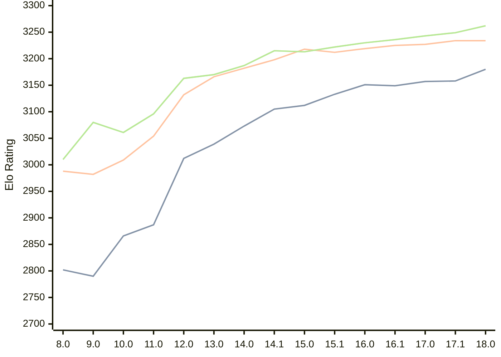

# Engine: Stockfish

Author: <a href="https://github.com/official-stockfish/Stockfish/blob/master/AUTHORS" target="_blank">Stockfish Authors</a>

Home: https://github.com/official-stockfish/Stockfish

## Ratings nach Version

| Version | Published | STC 8.0+0.08s  | LTC 60.0+0.60s | VLTC 2m24s+1.12s | Comment |
| --- | --- | --- | --- | --- | --- |
| 18.0 | 2026-01-31 | 3180(+22) | 3234(0) | 3262(+13) |  |
| 17.1 | 2025-03-30 | 3158(+1) | 3234(+7) | 3249(+6) |  |
| 17.0 | 2024-09-06 | 3157(+8) | 3227(+2) | 3243(+7) |  |
| 16.1 | 2024-02-24 | 3149(-2) | 3225(+6) | 3236(+6) |  |
| 16.0 | 2023-06-30 | 3151(+18) | 3219(+7) | 3230(+8) |  |
| 15.1 | 2022-12-04 | 3133(+21) | 3212(-6) | 3222(+9) |  |
| 15.0 | 2022-04-18 | 3112(+7) | 3218(+20) | 3213(-2) |  |
| 14.1 | 2021-10-28 | 3105(+32) | 3198(+16) | 3215(+28) |  |
| 14.0 | 2021-07-02 | 3073(+34) | 3182(+16) | 3187(+17) |  |
| 13.0 | 2021-02-19 | 3039(+27) | 3166(+34) | 3170(+7) |  |
| 12.0 | 2020-09-02 | 3012(+125) | 3132(+78) | 3163(+67) |  |
| 11.0 | 2020-01-18 | 2887(+21) | 3054(+45) | 3096(+35) |  |
| 10.0 | 2018-11-29 | 2866(+76) | 3009(+27) | 3061(-19) |  |
| 9.0 | 2018-02-01 | 2790(-12) | 2982(-6) | 3080(+70) |  |
| 8.0 | 2016-11-01 | 2802(+new) | 2988(+new) | 3010(+new) |  |
 | | | cElo (∆ prev) | cElo (∆ prev) | cElo (∆ prev) | 

 Test Conditions:

GUI/CLI: <a href=https://github.com/cutechess/cutechess target="_blank">Cute-Chess</a> 
Elo Calculation: <a href=https://www.remi-coulom.fr/Bayesian-Elo/ target="_blank">Bayesian-Elo</a> 
CPU: Intel(R) Core(TM) i5-7500T 2.70GHz 
Opening book: 8_moves_v3 
\* STC: 8.0+0.08s, LTC: 60.0+0.60s, VLTC: 2m24s+1.12s

 Lists:
Ratings: <a href=https://github.com/computer-chess-index/cci/blob/main/lists/CCIRatings.csv target="_blank">Complete list</a>

Generated: 2026-02-24 13:31:57

## Ratings Verlauf

⬛ STC (8.0+0.08s) &nbsp;&nbsp; 🟧 LTC (60.0+0.60s) &nbsp;&nbsp; 🟩 VLTC (2m24s+1.12s)

