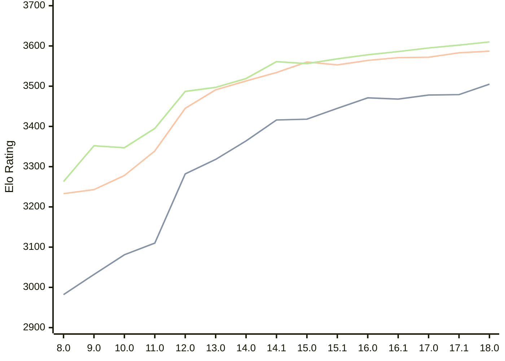

# Engine: Stockfish

Author: <a href="https://github.com/official-stockfish/Stockfish/blob/master/AUTHORS" target="_blank">Stockfish Authors</a>

Home: https://github.com/official-stockfish/Stockfish

## Elo Ratings

| Version | Published | STC 8.0+0.08s  | LTC 60.0+0.60s | VLTC 2m24s+1.12s | Comment |
| --- | --- | --- | --- | --- | --- |
| 18.0 | 2026-01-31 | 3505(+26) | 3587(+4) | 3610(+8) |  |
| 17.1 | 2025-03-30 | 3479(+1) | 3583(+11) | 3602(+7) |  |
| 17.0 | 2024-09-06 | 3478(+10) | 3572(+1) | 3595(+9) |  |
| 16.1 | 2024-02-24 | 3468(-3) | 3571(+7) | 3586(+8) |  |
| 16.0 | 2023-06-30 | 3471(+26) | 3564(+11) | 3578(+10) |  |
| 15.1 | 2022-12-04 | 3445(+27) | 3553(-7) | 3568(+12) |  |
| 15.0 | 2022-04-18 | 3418(+2) | 3560(+26) | 3556(-5) |  |
| 14.1 | 2021-10-28 | 3416(+52) | 3534(+21) | 3561(+42) |  |
| 14.0 | 2021-07-02 | 3364(+46) | 3513(+22) | 3519(+22) |  |
| 13.0 | 2021-02-19 | 3318(+36) | 3491(+46) | 3497(+10) |  |
| 12.0 | 2020-09-02 | 3282(+172) | 3445(+106) | 3487(+92) |  |
| 11.0 | 2020-01-18 | 3110(+29) | 3339(+61) | 3395(+48) |  |
| 10.0 | 2018-11-29 | 3081(+49) | 3278(+35) | 3347(-5) |  |
| 9.0 | 2018-02-01 | 3032(+50) | 3243(+10) | 3352(+89) |  |
| 8.0 | 2016-11-01 | 2982 | 3233 | 3263 |  |
 | | | cElo (∆ prev) | cElo (∆ prev) | cElo (∆ prev) | 

<a href="https://github.com/computer-chess-index/cci/issues/new?template=submit-version.yml&title=[VERSION]+Stockfish+<version>&body=###%20Engine%20name%0AStockfish%0A%0A###%20Version%0A18.0" target="_blank">Submit new version</a>

 Test Conditions:

GUI/CLI: <a href=https://github.com/cutechess/cutechess target="_blank">Cute-Chess</a> 
Elo Calculation: <a href=https://www.remi-coulom.fr/Bayesian-Elo/ target="_blank">Bayesian-Elo</a> 
CPU: Intel(R) Core(TM) i5-7500T 2.70GHz 
Opening book: 8_moves_v3 
\* STC: 8.0+0.08s, LTC: 60.0+0.60s, VLTC: 2m24s+1.12s

 Lists:
Ratings: <a href=https://github.com/computer-chess-index/cci/blob/main/lists/CCIRatings.csv target="_blank">Complete list</a>

Generated: 2026-08-21 06:31:31

## Ratings Verlauf

⬛ STC (8.0+0.08s) &nbsp;&nbsp; 🟧 LTC (60.0+0.60s) &nbsp;&nbsp; 🟩 VLTC (2m24s+1.12s)

dark mode: 🟩STC (8.0+0.08s) 🟧LTC (60.0+0.60s) ⬜VLTC (2m24s+1.12s)

## Detailed Evaluation Results

| Version | Time Control | Elo  | Range +/- | Matches | Score | Average Opponent Elo | Draws |
| --- | --- | --- | --- | --- | --- | --- | --- |
| 18.0 | VLTC (2m24s+1.12s) | 3610 | 36 | 180 | 56% | 3572 | 88% |
| 18.0 | LTC (60.0+0.60s) | 3587 | 30 | 246 | 53% | 3568 | 90% |
| 18.0 | STC (8.0+0.08s) | 3505 | 20 | 568 | 49% | 3507 | 83% |
| --- | --- | --- | --- | --- | --- | --- | --- |
| 17.1 | VLTC (2m24s+1.12s) | 3602 | 28 | 292 | 57% | 3556 | 85% |
| 17.1 | LTC (60.0+0.60s) | 3583 | 26 | 336 | 54% | 3556 | 88% |
| 17.1 | STC (8.0+0.08s) | 3479 | 18 | 776 | 51% | 3468 | 79% |
| --- | --- | --- | --- | --- | --- | --- | --- |
| 17.0 | VLTC (2m24s+1.12s) | 3595 | 19 | 648 | 58% | 3540 | 83% |
| 17.0 | LTC (60.0+0.60s) | 3572 | 19 | 664 | 54% | 3545 | 87% |
| 17.0 | STC (8.0+0.08s) | 3478 | 14 | 1276 | 50% | 3478 | 81% |
| --- | --- | --- | --- | --- | --- | --- | --- |
| 16.1 | VLTC (2m24s+1.12s) | 3586 | 77 | 36 | 51% | 3578 | 97% |
| 16.1 | LTC (60.0+0.60s) | 3571 | 43 | 116 | 51% | 3564 | 95% |
| 16.1 | STC (8.0+0.08s) | 3468 | 38 | 164 | 49% | 3475 | 78% |
| --- | --- | --- | --- | --- | --- | --- | --- |
| 16.0 | VLTC (2m24s+1.12s) | 3578 | 89 | 28 | 50% | 3578 | 86% |
| 16.0 | LTC (60.0+0.60s) | 3564 | 47 | 100 | 50% | 3567 | 95% |
| 16.0 | STC (8.0+0.08s) | 3471 | 42 | 132 | 50% | 3472 | 83% |
| --- | --- | --- | --- | --- | --- | --- | --- |
| 15.1 | VLTC (2m24s+1.12s) | 3568 | 49 | 92 | 50% | 3568 | 93% |
| 15.1 | LTC (60.0+0.60s) | 3553 | 44 | 116 | 50% | 3557 | 94% |
| 15.1 | STC (8.0+0.08s) | 3445 | 31 | 256 | 54% | 3420 | 76% |
| --- | --- | --- | --- | --- | --- | --- | --- |
| 15.0 | VLTC (2m24s+1.12s) | 3556 | 40 | 144 | 51% | 3552 | 90% |
| 15.0 | LTC (60.0+0.60s) | 3560 | 49 | 96 | 50% | 3561 | 88% |
| 15.0 | STC (8.0+0.08s) | 3418 | 36 | 184 | 48% | 3432 | 77% |
| --- | --- | --- | --- | --- | --- | --- | --- |
| 14.1 | VLTC (2m24s+1.12s) | 3561 | 31 | 232 | 50% | 3559 | 90% |
| 14.1 | LTC (60.0+0.60s) | 3534 | 29 | 282 | 51% | 3530 | 85% |
| 14.1 | STC (8.0+0.08s) | 3416 | 26 | 364 | 52% | 3397 | 78% |
| --- | --- | --- | --- | --- | --- | --- | --- |
| 14.0 | VLTC (2m24s+1.12s) | 3519 | 51 | 84 | 49% | 3522 | 94% |
| 14.0 | LTC (60.0+0.60s) | 3513 | 52 | 84 | 49% | 3517 | 87% |
| 14.0 | STC (8.0+0.08s) | 3364 | 44 | 124 | 49% | 3374 | 77% |
| --- | --- | --- | --- | --- | --- | --- | --- |
| 13.0 | VLTC (2m24s+1.12s) | 3497 | 41 | 138 | 50% | 3497 | 83% |
| 13.0 | LTC (60.0+0.60s) | 3491 | 38 | 160 | 50% | 3494 | 82% |
| 13.0 | STC (8.0+0.08s) | 3318 | 37 | 186 | 49% | 3322 | 68% |
| --- | --- | --- | --- | --- | --- | --- | --- |
| 12.0 | VLTC (2m24s+1.12s) | 3487 | 46 | 108 | 50% | 3488 | 87% |
| 12.0 | LTC (60.0+0.60s) | 3445 | 41 | 144 | 48% | 3460 | 78% |
| 12.0 | STC (8.0+0.08s) | 3282 | 35 | 204 | 46% | 3312 | 67% |
| --- | --- | --- | --- | --- | --- | --- | --- |
| 11.0 | VLTC (2m24s+1.12s) | 3395 | 36 | 200 | 51% | 3389 | 69% |
| 11.0 | LTC (60.0+0.60s) | 3339 | 33 | 240 | 46% | 3366 | 65% |
| 11.0 | STC (8.0+0.08s) | 3110 | 41 | 176 | 47% | 3129 | 46% |
| --- | --- | --- | --- | --- | --- | --- | --- |
| 10.0 | VLTC (2m24s+1.12s) | 3347 | 36 | 212 | 49% | 3356 | 56% |
| 10.0 | LTC (60.0+0.60s) | 3278 | 35 | 216 | 50% | 3276 | 63% |
| 10.0 | STC (8.0+0.08s) | 3081 | 37 | 224 | 50% | 3082 | 42% |
| --- | --- | --- | --- | --- | --- | --- | --- |
| 9.0 | VLTC (2m24s+1.12s) | 3352 | 34 | 230 | 50% | 3356 | 57% |
| 9.0 | LTC (60.0+0.60s) | 3243 | 38 | 200 | 50% | 3248 | 48% |
| 9.0 | STC (8.0+0.08s) | 3032 | 33 | 268 | 52% | 3017 | 49% |
| --- | --- | --- | --- | --- | --- | --- | --- |
| 8.0 | VLTC (2m24s+1.12s) | 3263 | 36 | 204 | 49% | 3267 | 63% |
| 8.0 | LTC (60.0+0.60s) | 3233 | 32 | 278 | 47% | 3256 | 55% |
| 8.0 | STC (8.0+0.08s) | 2982 | 37 | 220 | 49% | 2989 | 40% |
| --- | --- | --- | --- | --- | --- | --- | --- |