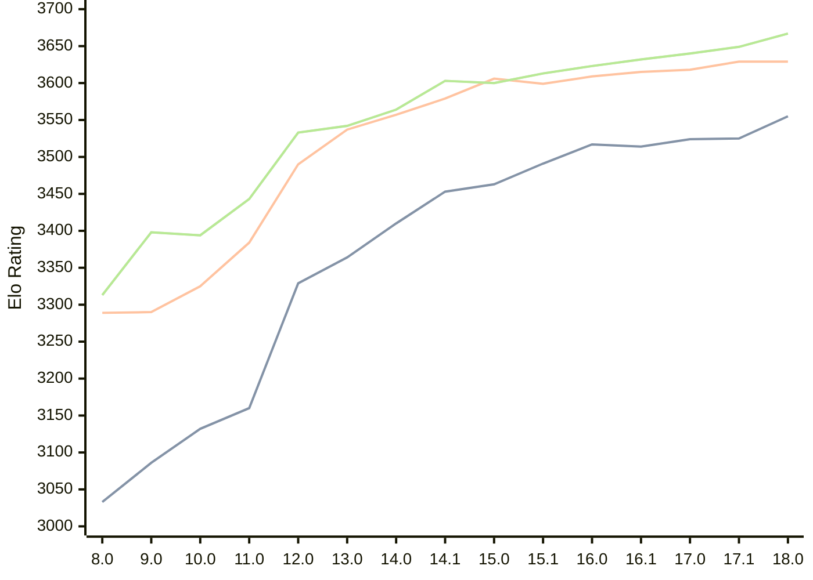

# Engine: Stockfish

Author: <a href="https://github.com/official-stockfish/Stockfish/blob/master/AUTHORS" target="_blank">Stockfish Authors</a>

Home: https://github.com/official-stockfish/Stockfish

## Ratings nach Version

| Version | Published | STC 8.0+0.08s  | LTC 60.0+0.60s | VLTC 2m24s+1.12s | Comment |
| --- | --- | --- | --- | --- | --- |
| 18.0 | 2026-01-31 | 3555(+30) | 3629(0) | 3667(+18) |  |
| 17.1 | 2025-03-30 | 3525(+1) | 3629(+11) | 3649(+9) |  |
| 17.0 | 2024-09-06 | 3524(+10) | 3618(+3) | 3640(+8) |  |
| 16.1 | 2024-02-24 | 3514(-3) | 3615(+6) | 3632(+9) |  |
| 16.0 | 2023-06-30 | 3517(+26) | 3609(+10) | 3623(+10) |  |
| 15.1 | 2022-12-04 | 3491(+28) | 3599(-7) | 3613(+13) |  |
| 15.0 | 2022-04-18 | 3463(+10) | 3606(+27) | 3600(-3) |  |
| 14.1 | 2021-10-28 | 3453(+43) | 3579(+22) | 3603(+39) |  |
| 14.0 | 2021-07-02 | 3410(+46) | 3557(+20) | 3564(+22) |  |
| 13.0 | 2021-02-19 | 3364(+35) | 3537(+47) | 3542(+9) |  |
| 12.0 | 2020-09-02 | 3329(+169) | 3490(+106) | 3533(+90) |  |
| 11.0 | 2020-01-18 | 3160(+28) | 3384(+59) | 3443(+49) |  |
| 10.0 | 2018-11-29 | 3132(+46) | 3325(+35) | 3394(-4) |  |
| 9.0 | 2018-02-01 | 3086(+53) | 3290(+1) | 3398(+85) |  |
| 8.0 | 2016-11-01 | 3033(+new) | 3289(+new) | 3313(+new) |  |
| 7.0 | 2016-01-05 |  |  |  |  |
 | | | cElo (∆ prev) | cElo (∆ prev) | cElo (∆ prev) | 

 Test Conditions:

GUI/CLI: <a href=https://github.com/cutechess/cutechess target="_blank">Cute-Chess</a> 
Elo Calculation: <a href=https://www.remi-coulom.fr/Bayesian-Elo/ target="_blank">Bayesian-Elo</a> 
CPU: Intel(R) Core(TM) i5-7500T 2.70GHz 
Opening book: 8_moves_v3 
\* STC: 8.0+0.08s, LTC: 60.0+0.60s, VLTC: 2m24s+1.12s

 Lists:
Ratings: <a href=https://github.com/computer-chess-index/cci/blob/main/lists/CCIRatings.csv target="_blank">Complete list</a>

Generated: 2026-03-03 06:27:00

## Ratings Verlauf

⬛ STC (8.0+0.08s) &nbsp;&nbsp; 🟧 LTC (60.0+0.60s) &nbsp;&nbsp; 🟩 VLTC (2m24s+1.12s)

