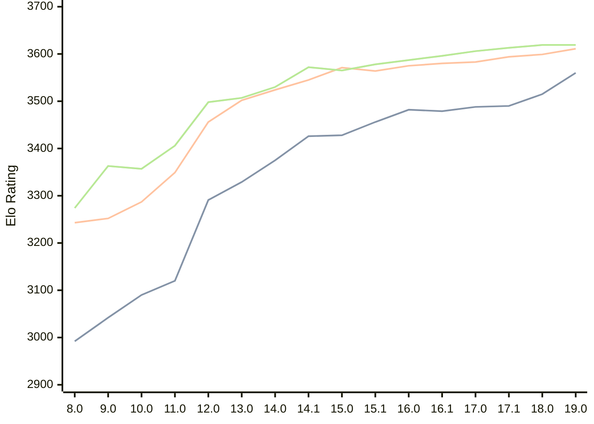

# Engine: Stockfish

Author: <a href="https://github.com/official-stockfish/Stockfish/blob/master/AUTHORS" target="_blank">Stockfish Authors</a>

Home: https://github.com/official-stockfish/Stockfish

## Elo Ratings

| Version | Published | STC 8.0+0.08s  | LTC 60.0+0.60s | VLTC 2m24s+1.12s | Comment |
| --- | --- | --- | --- | --- | --- |
| 19.0 | 2026-09-05 | 3560(+45) | 3611(+12) | 3619(0) |  |
| 18.0 | 2026-01-31 | 3515(+25) | 3599(+5) | 3619(+6) |  |
| 17.1 | 2025-03-30 | 3490(+2) | 3594(+11) | 3613(+7) |  |
| 17.0 | 2024-09-06 | 3488(+9) | 3583(+3) | 3606(+10) |  |
| 16.1 | 2024-02-24 | 3479(-3) | 3580(+5) | 3596(+9) |  |
| 16.0 | 2023-06-30 | 3482(+26) | 3575(+11) | 3587(+9) |  |
| 15.1 | 2022-12-04 | 3456(+28) | 3564(-7) | 3578(+13) |  |
| 15.0 | 2022-04-18 | 3428(+2) | 3571(+26) | 3565(-7) |  |
| 14.1 | 2021-10-28 | 3426(+51) | 3545(+21) | 3572(+42) |  |
| 14.0 | 2021-07-02 | 3375(+46) | 3524(+22) | 3530(+23) |  |
| 13.0 | 2021-02-19 | 3329(+38) | 3502(+46) | 3507(+9) |  |
| 12.0 | 2020-09-02 | 3291(+171) | 3456(+107) | 3498(+92) |  |
| 11.0 | 2020-01-18 | 3120(+30) | 3349(+62) | 3406(+49) |  |
| 10.0 | 2018-11-29 | 3090(+48) | 3287(+35) | 3357(-6) |  |
| 9.0 | 2018-02-01 | 3042(+50) | 3252(+9) | 3363(+89) |  |
| 8.0 | 2016-11-01 | 2992 | 3243 | 3274 |  |
 | | | cElo (∆ prev) | cElo (∆ prev) | cElo (∆ prev) | 

<a href="https://github.com/computer-chess-index/cci/issues/new?template=submit-version.yml&title=[VERSION]+Stockfish+<version>&body=###%20Engine%20name%0AStockfish%0A%0A###%20Version%0A19.0" target="_blank">Submit new version</a>

 Test Conditions:

GUI/CLI: <a href=https://github.com/cutechess/cutechess target="_blank">Cute-Chess</a> 
Elo Calculation: <a href=https://www.remi-coulom.fr/Bayesian-Elo/ target="_blank">Bayesian-Elo</a> 
CPU: Intel(R) Core(TM) i5-7500T 2.70GHz 
Opening book: 8_moves_v3 
\* STC: 8.0+0.08s, LTC: 60.0+0.60s, VLTC: 2m24s+1.12s

 Lists:
Ratings: <a href=https://github.com/computer-chess-index/cci/blob/main/lists/CCIRatings.csv target="_blank">Complete list</a>

Generated: 2026-09-17 04:42:41

## Ratings Verlauf

## Detailed Evaluation Results

| Version | Time Control | Elo  | Range +/- | Matches | Score | Average Opponent Elo | Draws |
| --- | --- | --- | --- | --- | --- | --- | --- |
| 19.0 | VLTC (2m24s+1.12s) | 3619 | 54 | 76 | 55% | 3586 | 89% |
| 19.0 | LTC (60.0+0.60s) | 3611 | 51 | 86 | 54% | 3584 | 87% |
| 19.0 | STC (8.0+0.08s) | 3560 | 36 | 184 | 51% | 3553 | 83% |
| --- | --- | --- | --- | --- | --- | --- | --- |
| 18.0 | VLTC (2m24s+1.12s) | 3619 | 35 | 184 | 55% | 3583 | 88% |
| 18.0 | LTC (60.0+0.60s) | 3599 | 30 | 254 | 53% | 3578 | 90% |
| 18.0 | STC (8.0+0.08s) | 3515 | 20 | 614 | 49% | 3518 | 83% |
| --- | --- | --- | --- | --- | --- | --- | --- |
| 17.1 | VLTC (2m24s+1.12s) | 3613 | 28 | 292 | 57% | 3567 | 85% |
| 17.1 | LTC (60.0+0.60s) | 3594 | 26 | 336 | 54% | 3567 | 88% |
| 17.1 | STC (8.0+0.08s) | 3490 | 18 | 776 | 51% | 3479 | 79% |
| --- | --- | --- | --- | --- | --- | --- | --- |
| 17.0 | VLTC (2m24s+1.12s) | 3606 | 19 | 648 | 58% | 3551 | 83% |
| 17.0 | LTC (60.0+0.60s) | 3583 | 19 | 664 | 54% | 3556 | 87% |
| 17.0 | STC (8.0+0.08s) | 3488 | 14 | 1276 | 50% | 3488 | 81% |
| --- | --- | --- | --- | --- | --- | --- | --- |
| 16.1 | VLTC (2m24s+1.12s) | 3596 | 77 | 36 | 51% | 3588 | 97% |
| 16.1 | LTC (60.0+0.60s) | 3580 | 43 | 116 | 51% | 3575 | 95% |
| 16.1 | STC (8.0+0.08s) | 3479 | 38 | 164 | 49% | 3486 | 78% |
| --- | --- | --- | --- | --- | --- | --- | --- |
| 16.0 | VLTC (2m24s+1.12s) | 3587 | 89 | 28 | 50% | 3588 | 86% |
| 16.0 | LTC (60.0+0.60s) | 3575 | 47 | 100 | 50% | 3578 | 95% |
| 16.0 | STC (8.0+0.08s) | 3482 | 42 | 132 | 50% | 3483 | 83% |
| --- | --- | --- | --- | --- | --- | --- | --- |
| 15.1 | VLTC (2m24s+1.12s) | 3578 | 49 | 92 | 50% | 3579 | 93% |
| 15.1 | LTC (60.0+0.60s) | 3564 | 44 | 116 | 50% | 3568 | 94% |
| 15.1 | STC (8.0+0.08s) | 3456 | 31 | 256 | 54% | 3430 | 76% |
| --- | --- | --- | --- | --- | --- | --- | --- |
| 15.0 | VLTC (2m24s+1.12s) | 3565 | 40 | 144 | 51% | 3563 | 90% |
| 15.0 | LTC (60.0+0.60s) | 3571 | 49 | 96 | 50% | 3572 | 88% |
| 15.0 | STC (8.0+0.08s) | 3428 | 36 | 184 | 48% | 3443 | 77% |
| --- | --- | --- | --- | --- | --- | --- | --- |
| 14.1 | VLTC (2m24s+1.12s) | 3572 | 31 | 232 | 50% | 3569 | 90% |
| 14.1 | LTC (60.0+0.60s) | 3545 | 29 | 282 | 51% | 3541 | 85% |
| 14.1 | STC (8.0+0.08s) | 3426 | 26 | 364 | 52% | 3407 | 78% |
| --- | --- | --- | --- | --- | --- | --- | --- |
| 14.0 | VLTC (2m24s+1.12s) | 3530 | 51 | 84 | 49% | 3533 | 94% |
| 14.0 | LTC (60.0+0.60s) | 3524 | 52 | 84 | 49% | 3528 | 87% |
| 14.0 | STC (8.0+0.08s) | 3375 | 44 | 124 | 49% | 3384 | 77% |
| --- | --- | --- | --- | --- | --- | --- | --- |
| 13.0 | VLTC (2m24s+1.12s) | 3507 | 41 | 138 | 50% | 3507 | 83% |
| 13.0 | LTC (60.0+0.60s) | 3502 | 38 | 160 | 50% | 3505 | 82% |
| 13.0 | STC (8.0+0.08s) | 3329 | 37 | 186 | 49% | 3333 | 68% |
| --- | --- | --- | --- | --- | --- | --- | --- |
| 12.0 | VLTC (2m24s+1.12s) | 3498 | 46 | 108 | 50% | 3499 | 87% |
| 12.0 | LTC (60.0+0.60s) | 3456 | 41 | 144 | 48% | 3471 | 78% |
| 12.0 | STC (8.0+0.08s) | 3291 | 35 | 204 | 46% | 3321 | 67% |
| --- | --- | --- | --- | --- | --- | --- | --- |
| 11.0 | VLTC (2m24s+1.12s) | 3406 | 36 | 200 | 51% | 3399 | 69% |
| 11.0 | LTC (60.0+0.60s) | 3349 | 33 | 240 | 46% | 3375 | 65% |
| 11.0 | STC (8.0+0.08s) | 3120 | 41 | 176 | 47% | 3139 | 46% |
| --- | --- | --- | --- | --- | --- | --- | --- |
| 10.0 | VLTC (2m24s+1.12s) | 3357 | 36 | 212 | 49% | 3367 | 56% |
| 10.0 | LTC (60.0+0.60s) | 3287 | 35 | 216 | 50% | 3287 | 63% |
| 10.0 | STC (8.0+0.08s) | 3090 | 37 | 224 | 50% | 3092 | 42% |
| --- | --- | --- | --- | --- | --- | --- | --- |
| 9.0 | VLTC (2m24s+1.12s) | 3363 | 34 | 230 | 50% | 3367 | 57% |
| 9.0 | LTC (60.0+0.60s) | 3252 | 38 | 200 | 50% | 3258 | 48% |
| 9.0 | STC (8.0+0.08s) | 3042 | 33 | 268 | 52% | 3027 | 49% |
| --- | --- | --- | --- | --- | --- | --- | --- |
| 8.0 | VLTC (2m24s+1.12s) | 3274 | 36 | 204 | 49% | 3276 | 63% |
| 8.0 | LTC (60.0+0.60s) | 3243 | 32 | 278 | 47% | 3266 | 55% |
| 8.0 | STC (8.0+0.08s) | 2992 | 37 | 220 | 49% | 3000 | 40% |
| --- | --- | --- | --- | --- | --- | --- | --- |