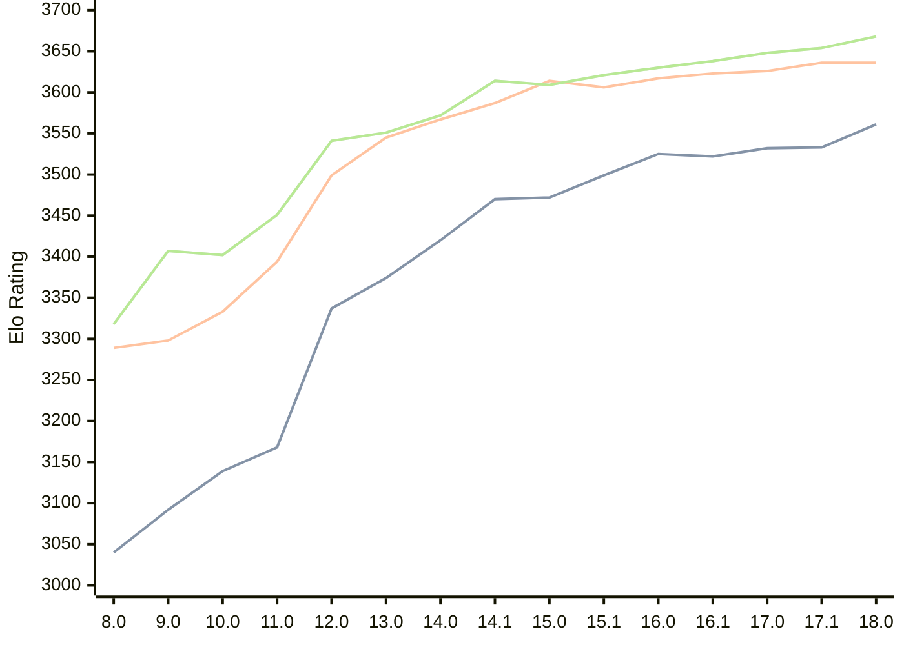

# Engine: Stockfish

Author: <a href="https://github.com/official-stockfish/Stockfish/blob/master/AUTHORS" target="_blank">Stockfish Authors</a>

Home: https://github.com/official-stockfish/Stockfish

## Elo Ratings

| Version | Published | STC 8.0+0.08s  | LTC 60.0+0.60s | VLTC 2m24s+1.12s | Comment |
| --- | --- | --- | --- | --- | --- |
| 18.0 | 2026-01-31 | 3561(+28) | 3636(0) | 3668(+14) |  |
| 17.1 | 2025-03-30 | 3533(+1) | 3636(+10) | 3654(+6) |  |
| 17.0 | 2024-09-06 | 3532(+10) | 3626(+3) | 3648(+10) |  |
| 16.1 | 2024-02-24 | 3522(-3) | 3623(+6) | 3638(+8) |  |
| 16.0 | 2023-06-30 | 3525(+26) | 3617(+11) | 3630(+9) |  |
| 15.1 | 2022-12-04 | 3499(+27) | 3606(-8) | 3621(+12) |  |
| 15.0 | 2022-04-18 | 3472(+2) | 3614(+27) | 3609(-5) |  |
| 14.1 | 2021-10-28 | 3470(+50) | 3587(+20) | 3614(+42) |  |
| 14.0 | 2021-07-02 | 3420(+46) | 3567(+22) | 3572(+21) |  |
| 13.0 | 2021-02-19 | 3374(+37) | 3545(+46) | 3551(+10) |  |
| 12.0 | 2020-09-02 | 3337(+169) | 3499(+105) | 3541(+90) |  |
| 11.0 | 2020-01-18 | 3168(+29) | 3394(+61) | 3451(+49) |  |
| 10.0 | 2018-11-29 | 3139(+47) | 3333(+35) | 3402(-5) |  |
| 9.0 | 2018-02-01 | 3092(+52) | 3298(+9) | 3407(+89) |  |
| 8.0 | 2016-11-01 | 3040(+new) | 3289(+new) | 3318(+new) |  |
| 7.0 | 2016-01-05 |  |  |  |  |
 | | | cElo (∆ prev) | cElo (∆ prev) | cElo (∆ prev) | 

<a href="https://github.com/computer-chess-index/cci/issues/new?template=submit-version.yml&title=[VERSION]+Stockfish+<version>&body=###%20Engine%20name%0AStockfish%0A%0A###%20Version%0A18.0" target="_blank">Submit new version</a>

 Test Conditions:

GUI/CLI: <a href=https://github.com/cutechess/cutechess target="_blank">Cute-Chess</a> 
Elo Calculation: <a href=https://www.remi-coulom.fr/Bayesian-Elo/ target="_blank">Bayesian-Elo</a> 
CPU: Intel(R) Core(TM) i5-7500T 2.70GHz 
Opening book: 8_moves_v3 
\* STC: 8.0+0.08s, LTC: 60.0+0.60s, VLTC: 2m24s+1.12s

 Lists:
Ratings: <a href=https://github.com/computer-chess-index/cci/blob/main/lists/CCIRatings.csv target="_blank">Complete list</a>

Generated: 2026-05-17 06:28:44

## Ratings Verlauf

⬛ STC (8.0+0.08s) &nbsp;&nbsp; 🟧 LTC (60.0+0.60s) &nbsp;&nbsp; 🟩 VLTC (2m24s+1.12s)

dark mode: 🟩STC (8.0+0.08s) 🟧LTC (60.0+0.60s) ⬜VLTC (2m24s+1.12s)

## Detailed Evaluation Results

| Version | Time Control | Elo  | Range +/- | Matches | Score | Average Opponent Elo | Draws |
| --- | --- | --- | --- | --- | --- | --- | --- |
| 18.0 | VLTC (2m24s+1.12s) | 3668 | 41 | 136 | 57% | 3623 | 85% |
| 18.0 | LTC (60.0+0.60s) | 3636 | 34 | 194 | 53% | 3618 | 90% |
| 18.0 | STC (8.0+0.08s) | 3561 | 25 | 378 | 50% | 3560 | 83% |
| --- | --- | --- | --- | --- | --- | --- | --- |
| 17.1 | VLTC (2m24s+1.12s) | 3654 | 28 | 292 | 57% | 3610 | 85% |
| 17.1 | LTC (60.0+0.60s) | 3636 | 26 | 336 | 54% | 3610 | 88% |
| 17.1 | STC (8.0+0.08s) | 3533 | 18 | 776 | 51% | 3522 | 79% |
| --- | --- | --- | --- | --- | --- | --- | --- |
| 17.0 | VLTC (2m24s+1.12s) | 3648 | 19 | 648 | 58% | 3592 | 83% |
| 17.0 | LTC (60.0+0.60s) | 3626 | 19 | 664 | 54% | 3599 | 87% |
| 17.0 | STC (8.0+0.08s) | 3532 | 14 | 1276 | 50% | 3532 | 81% |
| --- | --- | --- | --- | --- | --- | --- | --- |
| 16.1 | VLTC (2m24s+1.12s) | 3638 | 77 | 36 | 51% | 3630 | 97% |
| 16.1 | LTC (60.0+0.60s) | 3623 | 43 | 116 | 51% | 3617 | 95% |
| 16.1 | STC (8.0+0.08s) | 3522 | 38 | 164 | 49% | 3528 | 78% |
| --- | --- | --- | --- | --- | --- | --- | --- |
| 16.0 | VLTC (2m24s+1.12s) | 3630 | 89 | 28 | 50% | 3630 | 86% |
| 16.0 | LTC (60.0+0.60s) | 3617 | 47 | 100 | 50% | 3619 | 95% |
| 16.0 | STC (8.0+0.08s) | 3525 | 42 | 132 | 50% | 3526 | 83% |
| --- | --- | --- | --- | --- | --- | --- | --- |
| 15.1 | VLTC (2m24s+1.12s) | 3621 | 49 | 92 | 50% | 3621 | 93% |
| 15.1 | LTC (60.0+0.60s) | 3606 | 44 | 116 | 50% | 3610 | 94% |
| 15.1 | STC (8.0+0.08s) | 3499 | 31 | 256 | 54% | 3474 | 76% |
| --- | --- | --- | --- | --- | --- | --- | --- |
| 15.0 | VLTC (2m24s+1.12s) | 3609 | 40 | 144 | 51% | 3605 | 90% |
| 15.0 | LTC (60.0+0.60s) | 3614 | 49 | 96 | 50% | 3614 | 88% |
| 15.0 | STC (8.0+0.08s) | 3472 | 36 | 184 | 48% | 3486 | 77% |
| --- | --- | --- | --- | --- | --- | --- | --- |
| 14.1 | VLTC (2m24s+1.12s) | 3614 | 31 | 232 | 50% | 3611 | 90% |
| 14.1 | LTC (60.0+0.60s) | 3587 | 29 | 282 | 51% | 3584 | 85% |
| 14.1 | STC (8.0+0.08s) | 3470 | 26 | 364 | 52% | 3452 | 78% |
| --- | --- | --- | --- | --- | --- | --- | --- |
| 14.0 | VLTC (2m24s+1.12s) | 3572 | 51 | 84 | 49% | 3576 | 94% |
| 14.0 | LTC (60.0+0.60s) | 3567 | 52 | 84 | 49% | 3571 | 87% |
| 14.0 | STC (8.0+0.08s) | 3420 | 44 | 124 | 49% | 3429 | 77% |
| --- | --- | --- | --- | --- | --- | --- | --- |
| 13.0 | VLTC (2m24s+1.12s) | 3551 | 41 | 138 | 50% | 3551 | 83% |
| 13.0 | LTC (60.0+0.60s) | 3545 | 38 | 160 | 50% | 3546 | 82% |
| 13.0 | STC (8.0+0.08s) | 3374 | 37 | 186 | 49% | 3378 | 68% |
| --- | --- | --- | --- | --- | --- | --- | --- |
| 12.0 | VLTC (2m24s+1.12s) | 3541 | 46 | 108 | 50% | 3542 | 87% |
| 12.0 | LTC (60.0+0.60s) | 3499 | 41 | 144 | 48% | 3513 | 78% |
| 12.0 | STC (8.0+0.08s) | 3337 | 35 | 204 | 46% | 3366 | 67% |
| --- | --- | --- | --- | --- | --- | --- | --- |
| 11.0 | VLTC (2m24s+1.12s) | 3451 | 36 | 200 | 51% | 3444 | 69% |
| 11.0 | LTC (60.0+0.60s) | 3394 | 33 | 240 | 46% | 3420 | 65% |
| 11.0 | STC (8.0+0.08s) | 3168 | 41 | 176 | 47% | 3186 | 46% |
| --- | --- | --- | --- | --- | --- | --- | --- |
| 10.0 | VLTC (2m24s+1.12s) | 3402 | 36 | 212 | 49% | 3410 | 56% |
| 10.0 | LTC (60.0+0.60s) | 3333 | 35 | 216 | 50% | 3332 | 63% |
| 10.0 | STC (8.0+0.08s) | 3139 | 37 | 224 | 50% | 3140 | 42% |
| --- | --- | --- | --- | --- | --- | --- | --- |
| 9.0 | VLTC (2m24s+1.12s) | 3407 | 34 | 230 | 50% | 3410 | 57% |
| 9.0 | LTC (60.0+0.60s) | 3298 | 38 | 200 | 50% | 3303 | 48% |
| 9.0 | STC (8.0+0.08s) | 3092 | 33 | 268 | 52% | 3075 | 49% |
| --- | --- | --- | --- | --- | --- | --- | --- |
| 8.0 | VLTC (2m24s+1.12s) | 3318 | 36 | 204 | 49% | 3322 | 63% |
| 8.0 | LTC (60.0+0.60s) | 3289 | 32 | 278 | 47% | 3312 | 55% |
| 8.0 | STC (8.0+0.08s) | 3040 | 37 | 220 | 49% | 3047 | 40% |
| --- | --- | --- | --- | --- | --- | --- | --- |