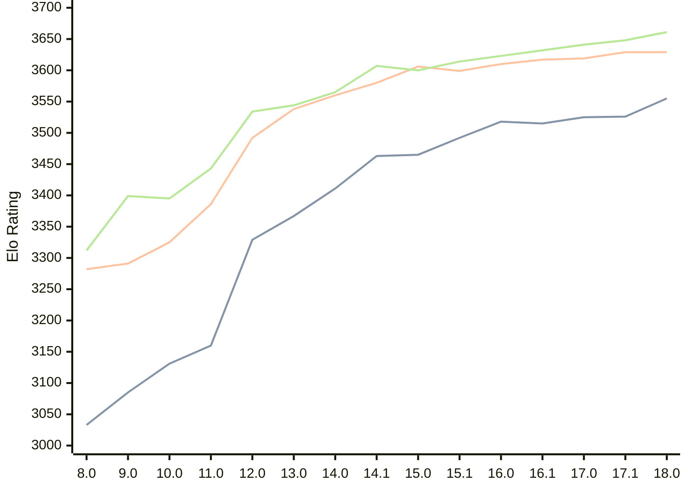

# Engine: Stockfish

Author: <a href="https://github.com/official-stockfish/Stockfish/blob/master/AUTHORS" target="_blank">Stockfish Authors</a>

Home: https://github.com/official-stockfish/Stockfish

## Ratings nach Version

| Version | Published | STC 8.0+0.08s  | LTC 60.0+0.60s | VLTC 2m24s+1.12s | Comment |
| --- | --- | --- | --- | --- | --- |
| 18.0 | 2026-01-31 | 3555(+29) | 3629(0) | 3661(+13) |  |
| 17.1 | 2025-03-30 | 3526(+1) | 3629(+10) | 3648(+7) |  |
| 17.0 | 2024-09-06 | 3525(+10) | 3619(+2) | 3641(+9) |  |
| 16.1 | 2024-02-24 | 3515(-3) | 3617(+7) | 3632(+9) |  |
| 16.0 | 2023-06-30 | 3518(+26) | 3610(+11) | 3623(+9) |  |
| 15.1 | 2022-12-04 | 3492(+27) | 3599(-7) | 3614(+14) |  |
| 15.0 | 2022-04-18 | 3465(+2) | 3606(+26) | 3600(-7) |  |
| 14.1 | 2021-10-28 | 3463(+52) | 3580(+20) | 3607(+42) |  |
| 14.0 | 2021-07-02 | 3411(+44) | 3560(+22) | 3565(+21) |  |
| 13.0 | 2021-02-19 | 3367(+38) | 3538(+46) | 3544(+10) |  |
| 12.0 | 2020-09-02 | 3329(+169) | 3492(+106) | 3534(+91) |  |
| 11.0 | 2020-01-18 | 3160(+29) | 3386(+61) | 3443(+48) |  |
| 10.0 | 2018-11-29 | 3131(+46) | 3325(+34) | 3395(-4) |  |
| 9.0 | 2018-02-01 | 3085(+52) | 3291(+9) | 3399(+87) |  |
| 8.0 | 2016-11-01 | 3033(+new) | 3282(+new) | 3312(+new) |  |
| 7.0 | 2016-01-05 |  |  |  |  |
 | | | cElo (∆ prev) | cElo (∆ prev) | cElo (∆ prev) | 

<a href="https://github.com/computer-chess-index/cci/issues/new?template=submit-version.yml&title=[VERSION]+Stockfish+<version>&body=###%20Engine%20name%0AStockfish%0A%0A###%20Version%0A18.0" target="_blank">Submit new version</a>

 Test Conditions:

GUI/CLI: <a href=https://github.com/cutechess/cutechess target="_blank">Cute-Chess</a> 
Elo Calculation: <a href=https://www.remi-coulom.fr/Bayesian-Elo/ target="_blank">Bayesian-Elo</a> 
CPU: Intel(R) Core(TM) i5-7500T 2.70GHz 
Opening book: 8_moves_v3 
\* STC: 8.0+0.08s, LTC: 60.0+0.60s, VLTC: 2m24s+1.12s

 Lists:
Ratings: <a href=https://github.com/computer-chess-index/cci/blob/main/lists/CCIRatings.csv target="_blank">Complete list</a>

Generated: 2026-05-02 06:28:21

## Ratings Verlauf

⬛ STC (8.0+0.08s) &nbsp;&nbsp; 🟧 LTC (60.0+0.60s) &nbsp;&nbsp; 🟩 VLTC (2m24s+1.12s)

dark mode: 🟩STC (8.0+0.08s) 🟧LTC (60.0+0.60s) ⬜VLTC (2m24s+1.12s)

