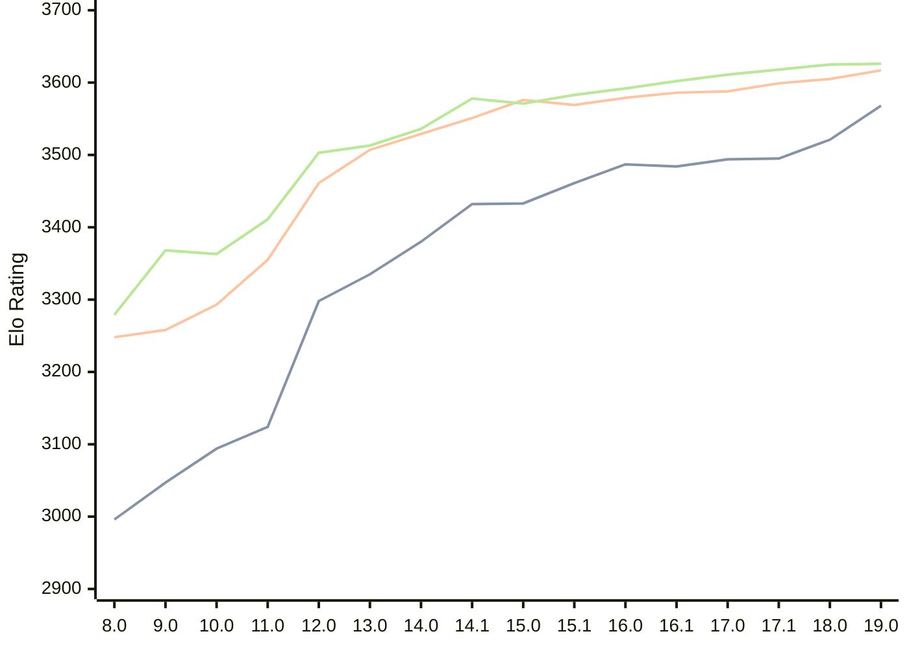

# Engine: Stockfish

Author: <a href="https://github.com/official-stockfish/Stockfish/blob/master/AUTHORS" target="_blank">Stockfish Authors</a>

Home: https://github.com/official-stockfish/Stockfish

## Elo Ratings

| Version | Published | STC 8.0+0.08s  | LTC 60.0+0.60s | VLTC 2m24s+1.12s | Comment |
| --- | --- | --- | --- | --- | --- |
| 19.0 | 2026-09-05 | 3568(+47) | 3617(+12) | 3626(+1) |  |
| 18.0 | 2026-01-31 | 3521(+26) | 3605(+6) | 3625(+7) |  |
| 17.1 | 2025-03-30 | 3495(+1) | 3599(+11) | 3618(+7) |  |
| 17.0 | 2024-09-06 | 3494(+10) | 3588(+2) | 3611(+9) |  |
| 16.1 | 2024-02-24 | 3484(-3) | 3586(+7) | 3602(+10) |  |
| 16.0 | 2023-06-30 | 3487(+26) | 3579(+10) | 3592(+9) |  |
| 15.1 | 2022-12-04 | 3461(+28) | 3569(-7) | 3583(+12) |  |
| 15.0 | 2022-04-18 | 3433(+1) | 3576(+25) | 3571(-7) |  |
| 14.1 | 2021-10-28 | 3432(+52) | 3551(+22) | 3578(+42) |  |
| 14.0 | 2021-07-02 | 3380(+45) | 3529(+22) | 3536(+23) |  |
| 13.0 | 2021-02-19 | 3335(+37) | 3507(+46) | 3513(+10) |  |
| 12.0 | 2020-09-02 | 3298(+174) | 3461(+106) | 3503(+92) |  |
| 11.0 | 2020-01-18 | 3124(+30) | 3355(+62) | 3411(+48) |  |
| 10.0 | 2018-11-29 | 3094(+47) | 3293(+35) | 3363(-5) |  |
| 9.0 | 2018-02-01 | 3047(+51) | 3258(+10) | 3368(+89) |  |
| 8.0 | 2016-11-01 | 2996 | 3248 | 3279 |  |
 | | | cElo (∆ prev) | cElo (∆ prev) | cElo (∆ prev) | 

<a href="https://github.com/computer-chess-index/cci/issues/new?template=submit-version.yml&title=[VERSION]+Stockfish+<version>&body=###%20Engine%20name%0AStockfish%0A%0A###%20Version%0A19.0" target="_blank">Submit new version</a>

 Test Conditions:

GUI/CLI: <a href=https://github.com/cutechess/cutechess target="_blank">Cute-Chess</a> 
Elo Calculation: <a href=https://www.remi-coulom.fr/Bayesian-Elo/ target="_blank">Bayesian-Elo</a> 
CPU: Intel(R) Core(TM) i5-7500T 2.70GHz 
Opening book: 8_moves_v3 
\* STC: 8.0+0.08s, LTC: 60.0+0.60s, VLTC: 2m24s+1.12s

 Lists:
Ratings: <a href=https://github.com/computer-chess-index/cci/blob/main/lists/CCIRatings.csv target="_blank">Complete list</a>

Generated: 2026-10-09 04:43:28

## Ratings Verlauf

```mermaid
%%{init: {"theme":"base","themeVariables":{"seriesColors:['#a3a3a3','#222221','#faa371']}}}%%
xychart-beta
  x-axis ["8.0", "9.0", "10.0", "11.0", "12.0", "13.0", "14.0", "14.1", "15.0", "15.1", "16.0", "16.1", "17.0", "17.1", "18.0", "19.0"]
  y-axis "Elo Rating" 2900 --> 3700
  line "" [2996, 3047, 3094, 3124, 3298, 3335, 3380, 3432, 3433, 3461, 3487, 3484, 3494, 3495, 3521, 3568]
  line "STC (8.0+0.08s)" [2996, 3047, 3094, 3124, 3298, 3335, 3380, 3432, 3433, 3461, 3487, 3484, 3494, 3495, 3521, 3568]
  line "LTC (60.0+0.60s)" [3248, 3258, 3293, 3355, 3461, 3507, 3529, 3551, 3576, 3569, 3579, 3586, 3588, 3599, 3605, 3617]
  line "" [3279, 3368, 3363, 3411, 3503, 3513, 3536, 3578, 3571, 3583, 3592, 3602, 3611, 3618, 3625, 3626]
  line "VLTC (2m24s+1.12s)" [3279, 3368, 3363, 3411, 3503, 3513, 3536, 3578, 3571, 3583, 3592, 3602, 3611, 3618, 3625, 3626]
```

## Detailed Evaluation Results

| Version | Time Control | Elo  | Range +/- | Matches | Score | Average Opponent Elo | Draws |
| --- | --- | --- | --- | --- | --- | --- | --- |
| 19.0 | VLTC (2m24s+1.12s) | 3626 | 52 | 84 | 56% | 3587 | 88% |
| 19.0 | LTC (60.0+0.60s) | 3617 | 50 | 92 | 54% | 3588 | 87% |
| 19.0 | STC (8.0+0.08s) | 3568 | 35 | 196 | 52% | 3557 | 83% |
| --- | --- | --- | --- | --- | --- | --- | --- |
| 18.0 | VLTC (2m24s+1.12s) | 3625 | 35 | 184 | 55% | 3588 | 88% |
| 18.0 | LTC (60.0+0.60s) | 3605 | 30 | 254 | 53% | 3583 | 90% |
| 18.0 | STC (8.0+0.08s) | 3521 | 20 | 614 | 49% | 3524 | 83% |
| --- | --- | --- | --- | --- | --- | --- | --- |
| 17.1 | VLTC (2m24s+1.12s) | 3618 | 28 | 292 | 57% | 3572 | 85% |
| 17.1 | LTC (60.0+0.60s) | 3599 | 26 | 336 | 54% | 3572 | 88% |
| 17.1 | STC (8.0+0.08s) | 3495 | 18 | 776 | 51% | 3484 | 79% |
| --- | --- | --- | --- | --- | --- | --- | --- |
| 17.0 | VLTC (2m24s+1.12s) | 3611 | 19 | 648 | 58% | 3556 | 83% |
| 17.0 | LTC (60.0+0.60s) | 3588 | 19 | 664 | 54% | 3561 | 87% |
| 17.0 | STC (8.0+0.08s) | 3494 | 14 | 1276 | 50% | 3494 | 81% |
| --- | --- | --- | --- | --- | --- | --- | --- |
| 16.1 | VLTC (2m24s+1.12s) | 3602 | 77 | 36 | 51% | 3592 | 97% |
| 16.1 | LTC (60.0+0.60s) | 3586 | 43 | 116 | 51% | 3580 | 95% |
| 16.1 | STC (8.0+0.08s) | 3484 | 38 | 164 | 49% | 3491 | 78% |
| --- | --- | --- | --- | --- | --- | --- | --- |
| 16.0 | VLTC (2m24s+1.12s) | 3592 | 89 | 28 | 50% | 3592 | 86% |
| 16.0 | LTC (60.0+0.60s) | 3579 | 47 | 100 | 50% | 3582 | 95% |
| 16.0 | STC (8.0+0.08s) | 3487 | 42 | 132 | 50% | 3488 | 83% |
| --- | --- | --- | --- | --- | --- | --- | --- |
| 15.1 | VLTC (2m24s+1.12s) | 3583 | 49 | 92 | 50% | 3584 | 93% |
| 15.1 | LTC (60.0+0.60s) | 3569 | 44 | 116 | 50% | 3573 | 94% |
| 15.1 | STC (8.0+0.08s) | 3461 | 31 | 256 | 54% | 3436 | 76% |
| --- | --- | --- | --- | --- | --- | --- | --- |
| 15.0 | VLTC (2m24s+1.12s) | 3571 | 40 | 144 | 51% | 3568 | 90% |
| 15.0 | LTC (60.0+0.60s) | 3576 | 49 | 96 | 50% | 3578 | 88% |
| 15.0 | STC (8.0+0.08s) | 3433 | 36 | 184 | 48% | 3448 | 77% |
| --- | --- | --- | --- | --- | --- | --- | --- |
| 14.1 | VLTC (2m24s+1.12s) | 3578 | 31 | 232 | 50% | 3575 | 90% |
| 14.1 | LTC (60.0+0.60s) | 3551 | 29 | 282 | 51% | 3546 | 85% |
| 14.1 | STC (8.0+0.08s) | 3432 | 26 | 364 | 52% | 3413 | 78% |
| --- | --- | --- | --- | --- | --- | --- | --- |
| 14.0 | VLTC (2m24s+1.12s) | 3536 | 51 | 84 | 49% | 3538 | 94% |
| 14.0 | LTC (60.0+0.60s) | 3529 | 52 | 84 | 49% | 3533 | 87% |
| 14.0 | STC (8.0+0.08s) | 3380 | 44 | 124 | 49% | 3390 | 77% |
| --- | --- | --- | --- | --- | --- | --- | --- |
| 13.0 | VLTC (2m24s+1.12s) | 3513 | 41 | 138 | 50% | 3513 | 83% |
| 13.0 | LTC (60.0+0.60s) | 3507 | 38 | 160 | 50% | 3510 | 82% |
| 13.0 | STC (8.0+0.08s) | 3335 | 37 | 186 | 49% | 3339 | 68% |
| --- | --- | --- | --- | --- | --- | --- | --- |
| 12.0 | VLTC (2m24s+1.12s) | 3503 | 46 | 108 | 50% | 3505 | 87% |
| 12.0 | LTC (60.0+0.60s) | 3461 | 41 | 144 | 48% | 3476 | 78% |
| 12.0 | STC (8.0+0.08s) | 3298 | 35 | 204 | 46% | 3326 | 67% |
| --- | --- | --- | --- | --- | --- | --- | --- |
| 11.0 | VLTC (2m24s+1.12s) | 3411 | 36 | 200 | 51% | 3405 | 69% |
| 11.0 | LTC (60.0+0.60s) | 3355 | 33 | 240 | 46% | 3382 | 65% |
| 11.0 | STC (8.0+0.08s) | 3124 | 41 | 176 | 47% | 3143 | 46% |
| --- | --- | --- | --- | --- | --- | --- | --- |
| 10.0 | VLTC (2m24s+1.12s) | 3363 | 36 | 212 | 49% | 3372 | 56% |
| 10.0 | LTC (60.0+0.60s) | 3293 | 35 | 216 | 50% | 3293 | 63% |
| 10.0 | STC (8.0+0.08s) | 3094 | 37 | 224 | 50% | 3096 | 42% |
| --- | --- | --- | --- | --- | --- | --- | --- |
| 9.0 | VLTC (2m24s+1.12s) | 3368 | 34 | 230 | 50% | 3372 | 57% |
| 9.0 | LTC (60.0+0.60s) | 3258 | 38 | 200 | 50% | 3263 | 48% |
| 9.0 | STC (8.0+0.08s) | 3047 | 33 | 268 | 52% | 3031 | 49% |
| --- | --- | --- | --- | --- | --- | --- | --- |
| 8.0 | VLTC (2m24s+1.12s) | 3279 | 36 | 204 | 49% | 3282 | 63% |
| 8.0 | LTC (60.0+0.60s) | 3248 | 32 | 278 | 47% | 3271 | 55% |
| 8.0 | STC (8.0+0.08s) | 2996 | 37 | 220 | 49% | 3004 | 40% |
| --- | --- | --- | --- | --- | --- | --- | --- |