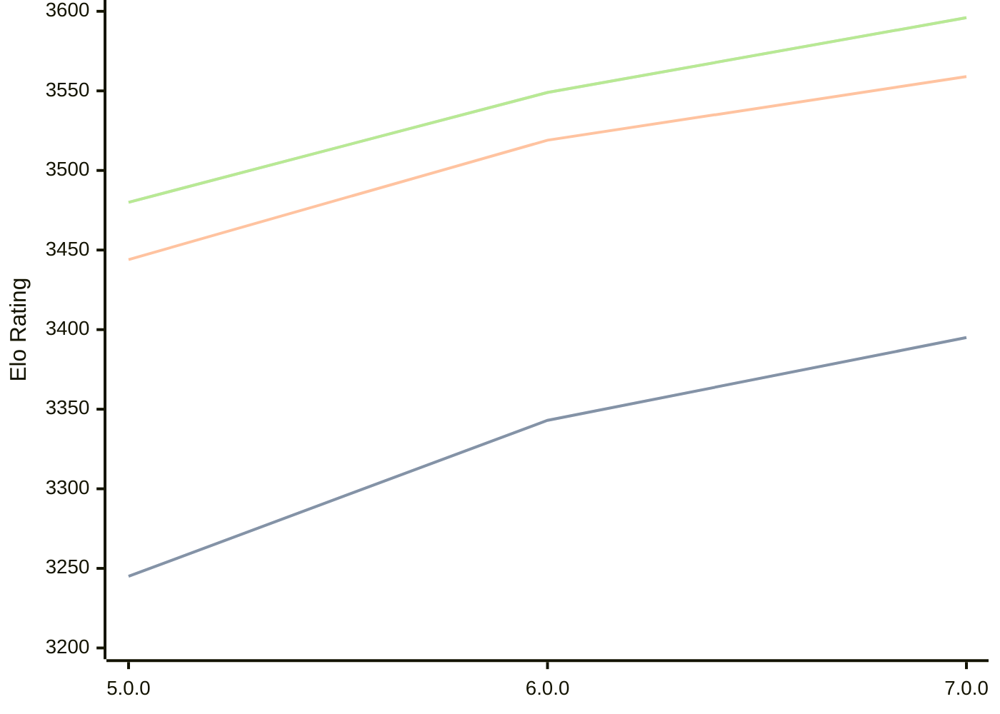

# Engine: Stormphrax

Author: Ciekce

Home: https://github.com/Ciekce/Stormphrax

## Elo Ratings

| Version | Published | STC 8.0+0.08s  | LTC 60.0+0.60s | VLTC 2m24s+1.12s | Comment |
| --- | --- | --- | --- | --- | --- |
| 7.0.0 | 2025-06-24 | 3395(+52) | 3559(+40) | 3596(+47) |  |
| 6.0.0 | 2024-10-29 | 3343(+98) | 3519(+75) | 3549(+69) |  |
| 5.0.0 | 2024-06-26 | 3245(+new) | 3444(+new) | 3480(+new) |  |
| 4.1.0 | 2024-03-11 |  |  |  |  |
| 4.0.0 | 2023-12-17 |  |  |  |  |
| 3.0.0 | 2023-11-02 |  |  |  |  |
| 2.0.0 | 2023-09-24 |  |  |  |  |
| 1.0.0 | 2023-07-25 |  |  |  |  |
 | | | cElo (∆ prev) | cElo (∆ prev) | cElo (∆ prev) | 

<a href="https://github.com/computer-chess-index/cci/issues/new?template=submit-version.yml&title=[VERSION]+Stormphrax+<version>&body=###%20Engine%20name%0AStormphrax%0A%0A###%20Version%0A7.0.0" target="_blank">Submit new version</a>

 Test Conditions:

GUI/CLI: <a href=https://github.com/cutechess/cutechess target="_blank">Cute-Chess</a> 
Elo Calculation: <a href=https://www.remi-coulom.fr/Bayesian-Elo/ target="_blank">Bayesian-Elo</a> 
CPU: Intel(R) Core(TM) i5-7500T 2.70GHz 
Opening book: 8_moves_v3 
\* STC: 8.0+0.08s, LTC: 60.0+0.60s, VLTC: 2m24s+1.12s

 Lists:
Ratings: <a href=https://github.com/computer-chess-index/cci/blob/main/lists/CCIRatings.csv target="_blank">Complete list</a>

Generated: 2026-05-03 07:46:40

## Ratings Verlauf

⬛ STC (8.0+0.08s) &nbsp;&nbsp; 🟧 LTC (60.0+0.60s) &nbsp;&nbsp; 🟩 VLTC (2m24s+1.12s)

dark mode: 🟩STC (8.0+0.08s) 🟧LTC (60.0+0.60s) ⬜VLTC (2m24s+1.12s)

## Detailed Evaluation Results

| Version | Time Control | Elo  | Range +/- | Matches | Score | Average Opponent Elo | Draws |
| --- | --- | --- | --- | --- | --- | --- | --- |
| 7.0.0 | VLTC (2m24s+1.12s) | 3596 | 18 | 714 | 51% | 3594 | 87% |
| 7.0.0 | D1 | 441 | 31 | 448 | 31% | 697 | 35% |
| 7.0.0 | D10 | 2799 | 20 | 804 | 51% | 2788 | 40% |
| 7.0.0 | D11 | 2961 | 18 | 862 | 50% | 2962 | 50% |
| 7.0.0 | D12 | 3052 | 19 | 820 | 51% | 3047 | 51% |
| 7.0.0 | D13 | 3156 | 18 | 872 | 51% | 3144 | 56% |
| 7.0.0 | D14 | 3249 | 17 | 896 | 50% | 3241 | 62% |
| 7.0.0 | D15 | 3293 | 17 | 912 | 49% | 3302 | 64% |
| 7.0.0 | D16 | 3367 | 17 | 900 | 50% | 3364 | 70% |
| 7.0.0 | D17 | 3407 | 17 | 890 | 51% | 3403 | 76% |
| 7.0.0 | D18 | 3451 | 16 | 984 | 51% | 3443 | 75% |
| 7.0.0 | D19 | 3479 | 16 | 932 | 50% | 3478 | 77% |
| 7.0.0 | D2 | 1192 | 23 | 724 | 51% | 1180 | 11% |
| 7.0.0 | D20 | 3505 | 16 | 964 | 49% | 3510 | 81% |
| 7.0.0 | D3 | 1467 | 23 | 714 | 48% | 1486 | 16% |
| 7.0.0 | D4 | 1677 | 23 | 692 | 49% | 1686 | 19% |
| 7.0.0 | D5 | 1898 | 23 | 732 | 51% | 1883 | 17% |
| 7.0.0 | D6 | 2061 | 21 | 804 | 49% | 2067 | 23% |
| 7.0.0 | D7 | 2236 | 20 | 890 | 50% | 2238 | 22% |
| 7.0.0 | D8 | 2392 | 20 | 806 | 52% | 2375 | 28% |
| 7.0.0 | D9 | 2596 | 20 | 822 | 51% | 2585 | 35% |
| 7.0.0 | S10 | 3426 | 17 | 848 | 50% | 3425 | 74% |
| 7.0.0 | S40 | 3534 | 17 | 772 | 50% | 3537 | 83% |
| 7.0.0 | LTC (60.0+0.60s) | 3559 | 17 | 820 | 51% | 3556 | 87% |
| 7.0.0 | STC (8.0+0.08s) | 3395 | 17 | 886 | 51% | 3387 | 69% |
| --- | --- | --- | --- | --- | --- | --- | --- |
| 6.0.0 | VLTC (2m24s+1.12s) | 3549 | 14 | 1184 | 50% | 3548 | 82% |
| 6.0.0 | D1 | 950 | 21 | 908 | 56% | 861 | 17% |
| 6.0.0 | D10 | 2622 | 18 | 968 | 49% | 2628 | 37% |
| 6.0.0 | D11 | 2800 | 18 | 968 | 51% | 2792 | 46% |
| 6.0.0 | D12 | 2954 | 18 | 940 | 51% | 2950 | 49% |
| 6.0.0 | D13 | 3044 | 17 | 1008 | 50% | 3043 | 55% |
| 6.0.0 | D14 | 3148 | 16 | 1080 | 50% | 3147 | 59% |
| 6.0.0 | D15 | 3213 | 16 | 1072 | 51% | 3209 | 63% |
| 6.0.0 | D16 | 3283 | 15 | 1140 | 49% | 3287 | 65% |
| 6.0.0 | D17 | 3336 | 15 | 1092 | 50% | 3337 | 69% |
| 6.0.0 | D18 | 3376 | 15 | 1156 | 51% | 3374 | 72% |
| 6.0.0 | D19 | 3424 | 27 | 336 | 49% | 3433 | 75% |
| 6.0.0 | D2 | 1058 | 19 | 1072 | 49% | 1075 | 15% |
| 6.0.0 | D20 | 3449 | 27 | 328 | 49% | 3459 | 77% |
| 6.0.0 | D3 | 1233 | 19 | 1088 | 51% | 1230 | 13% |
| 6.0.0 | D4 | 1485 | 19 | 1000 | 51% | 1477 | 16% |
| 6.0.0 | D5 | 1685 | 19 | 1028 | 48% | 1708 | 18% |
| 6.0.0 | D6 | 1898 | 19 | 948 | 50% | 1905 | 22% |
| 6.0.0 | D7 | 2006 | 19 | 964 | 50% | 2007 | 25% |
| 6.0.0 | D8 | 2191 | 19 | 976 | 51% | 2186 | 27% |
| 6.0.0 | D9 | 2461 | 18 | 992 | 50% | 2464 | 29% |
| 6.0.0 | S10 | 3374 | 14 | 1196 | 49% | 3376 | 72% |
| 6.0.0 | S40 | 3492 | 14 | 1220 | 51% | 3488 | 77% |
| 6.0.0 | LTC (60.0+0.60s) | 3519 | 14 | 1228 | 50% | 3522 | 80% |
| 6.0.0 | STC (8.0+0.08s) | 3343 | 15 | 1188 | 50% | 3341 | 67% |
| --- | --- | --- | --- | --- | --- | --- | --- |
| 5.0.0 | VLTC (2m24s+1.12s) | 3480 | 32 | 248 | 51% | 3474 | 73% |
| 5.0.0 | D1 | 949 | 19 | 1051 | 48% | 975 | 18% |
| 5.0.0 | D10 | 2601 | 18 | 936 | 47% | 2627 | 40% |
| 5.0.0 | D11 | 2749 | 17 | 1085 | 48% | 2763 | 43% |
| 5.0.0 | D12 | 2900 | 18 | 956 | 49% | 2909 | 46% |
| 5.0.0 | D13 | 2996 | 16 | 1060 | 50% | 2990 | 52% |
| 5.0.0 | D14 | 3093 | 17 | 911 | 49% | 3100 | 58% |
| 5.0.0 | D15 | 3158 | 16 | 1022 | 50% | 3156 | 61% |
| 5.0.0 | D16 | 3225 | 16 | 988 | 48% | 3239 | 61% |
| 5.0.0 | D17 | 3262 | 15 | 1148 | 51% | 3241 | 65% |
| 5.0.0 | D18 | 3305 | 15 | 1118 | 50% | 3303 | 65% |
| 5.0.0 | D19 | 3340 | 21 | 571 | 49% | 3345 | 74% |
| 5.0.0 | D2 | 1019 | 19 | 1080 | 49% | 1034 | 15% |
| 5.0.0 | D20 | 3375 | 60 | 69 | 45% | 3407 | 72% |
| 5.0.0 | D21 | 3432 | 79 | 40 | 56% | 3386 | 68% |
| 5.0.0 | D3 | 1141 | 18 | 1240 | 51% | 1126 | 13% |
| 5.0.0 | D4 | 1447 | 18 | 1200 | 49% | 1454 | 13% |
| 5.0.0 | D5 | 1627 | 19 | 996 | 51% | 1616 | 17% |
| 5.0.0 | D6 | 1844 | 19 | 1012 | 50% | 1844 | 19% |
| 5.0.0 | D7 | 1963 | 20 | 932 | 50% | 1960 | 19% |
| 5.0.0 | D8 | 2110 | 19 | 984 | 49% | 2121 | 24% |
| 5.0.0 | D9 | 2395 | 18 | 1046 | 48% | 2418 | 30% |
| 5.0.0 | S10 | 3294 | 31 | 288 | 49% | 3299 | 58% |
| 5.0.0 | S40 | 3421 | 27 | 336 | 48% | 3433 | 71% |
| 5.0.0 | LTC (60.0+0.60s) | 3444 | 27 | 340 | 54% | 3411 | 71% |
| 5.0.0 | STC (8.0+0.08s) | 3245 | 29 | 332 | 48% | 3262 | 57% |
| --- | --- | --- | --- | --- | --- | --- | --- |
| 4.1.0 |  |  |  |  |  |  |  |
| 4.0.0 |  |  |  |  |  |  |  |
| 3.0.0 |  |  |  |  |  |  |  |
| 2.0.0 |  |  |  |  |  |  |  |
| 1.0.0 |  |  |  |  |  |  |  |