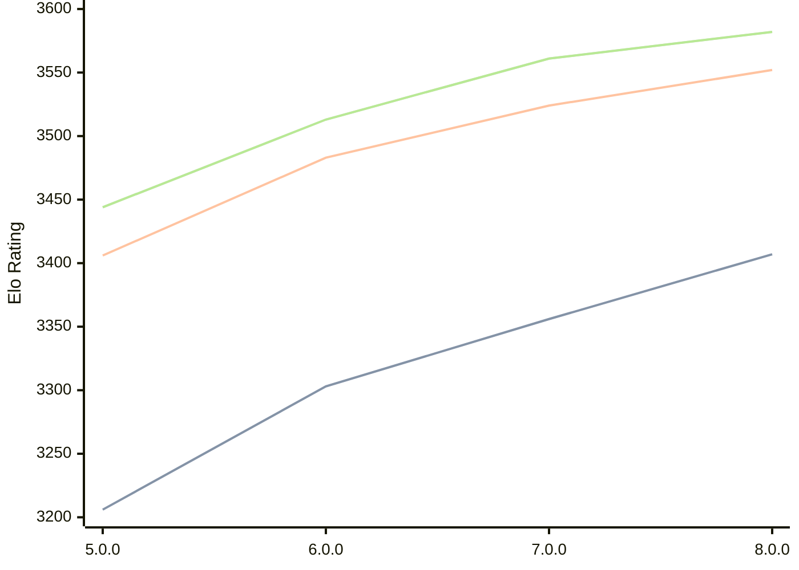

# Engine: Stormphrax

Author: Ciekce

Home: https://github.com/Ciekce/Stormphrax

## Elo Ratings

| Version | Published | STC 8.0+0.08s  | LTC 60.0+0.60s | VLTC 2m24s+1.12s | Comment |
| --- | --- | --- | --- | --- | --- |
| 8.0.0 | 2026-06-27 | 3407(+51) | 3552(+28) | 3582(+21) |  |
| 7.0.0 | 2025-06-24 | 3356(+53) | 3524(+41) | 3561(+48) |  |
| 6.0.0 | 2024-10-29 | 3303(+97) | 3483(+77) | 3513(+69) |  |
| 5.0.0 | 2024-06-26 | 3206 | 3406 | 3444 |  |
 | | | cElo (∆ prev) | cElo (∆ prev) | cElo (∆ prev) | 

<a href="https://github.com/computer-chess-index/cci/issues/new?template=submit-version.yml&title=[VERSION]+Stormphrax+<version>&body=###%20Engine%20name%0AStormphrax%0A%0A###%20Version%0A8.0.0" target="_blank">Submit new version</a>

 Test Conditions:

GUI/CLI: <a href=https://github.com/cutechess/cutechess target="_blank">Cute-Chess</a> 
Elo Calculation: <a href=https://www.remi-coulom.fr/Bayesian-Elo/ target="_blank">Bayesian-Elo</a> 
CPU: Intel(R) Core(TM) i5-7500T 2.70GHz 
Opening book: 8_moves_v3 
\* STC: 8.0+0.08s, LTC: 60.0+0.60s, VLTC: 2m24s+1.12s

 Lists:
Ratings: <a href=https://github.com/computer-chess-index/cci/blob/main/lists/CCIRatings.csv target="_blank">Complete list</a>

Generated: 2026-09-18 04:43:05

## Ratings Verlauf

## Detailed Evaluation Results

| Version | Time Control | Elo  | Range +/- | Matches | Score | Average Opponent Elo | Draws |
| --- | --- | --- | --- | --- | --- | --- | --- |
| 8.0.0 | VLTC (2m24s+1.12s) | 3582 | 27 | 322 | 51% | 3578 | 89% |
| 8.0.0 | LTC (60.0+0.60s) | 3552 | 25 | 372 | 50% | 3551 | 91% |
| 8.0.0 | STC (8.0+0.08s) | 3407 | 25 | 396 | 50% | 3407 | 71% |
| --- | --- | --- | --- | --- | --- | --- | --- |
| 7.0.0 | VLTC (2m24s+1.12s) | 3561 | 18 | 722 | 51% | 3557 | 87% |
| 7.0.0 | LTC (60.0+0.60s) | 3524 | 17 | 824 | 51% | 3519 | 87% |
| 7.0.0 | STC (8.0+0.08s) | 3356 | 17 | 930 | 51% | 3349 | 69% |
| --- | --- | --- | --- | --- | --- | --- | --- |
| 6.0.0 | VLTC (2m24s+1.12s) | 3513 | 14 | 1184 | 50% | 3511 | 82% |
| 6.0.0 | LTC (60.0+0.60s) | 3483 | 14 | 1228 | 50% | 3484 | 80% |
| 6.0.0 | STC (8.0+0.08s) | 3303 | 15 | 1188 | 50% | 3302 | 67% |
| --- | --- | --- | --- | --- | --- | --- | --- |
| 5.0.0 | VLTC (2m24s+1.12s) | 3444 | 32 | 248 | 51% | 3437 | 73% |
| 5.0.0 | LTC (60.0+0.60s) | 3406 | 27 | 340 | 54% | 3374 | 71% |
| 5.0.0 | STC (8.0+0.08s) | 3206 | 29 | 332 | 48% | 3222 | 57% |
| --- | --- | --- | --- | --- | --- | --- | --- |