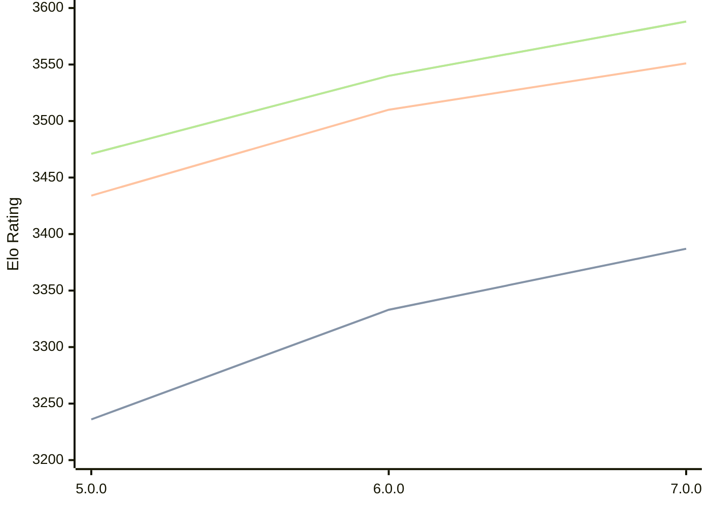

# Engine: Stormphrax

Author: Ciekce

Home: https://github.com/Ciekce/Stormphrax

## Ratings nach Version

| Version | Published | STC 8.0+0.08s  | LTC 60.0+0.60s | VLTC 2m24s+1.12s | Comment |
| --- | --- | --- | --- | --- | --- |
| 7.0.0 | 2025-06-24 | 3387(+54) | 3551(+41) | 3588(+48) |  |
| 6.0.0 | 2024-10-29 | 3333(+97) | 3510(+76) | 3540(+69) |  |
| 5.0.0 | 2024-06-26 | 3236(+new) | 3434(+new) | 3471(+new) |  |
| 4.1.0 | 2024-03-11 |  |  |  |  |
| 4.0.0 | 2023-12-17 |  |  |  |  |
| 3.0.0 | 2023-11-02 |  |  |  |  |
| 2.0.0 | 2023-09-24 |  |  |  |  |
| 1.0.0 | 2023-07-25 |  |  |  |  |
 | | | cElo (∆ prev) | cElo (∆ prev) | cElo (∆ prev) | 

 Test Conditions:

GUI/CLI: <a href=https://github.com/cutechess/cutechess target="_blank">Cute-Chess</a> 
Elo Calculation: <a href=https://www.remi-coulom.fr/Bayesian-Elo/ target="_blank">Bayesian-Elo</a> 
CPU: Intel(R) Core(TM) i5-7500T 2.70GHz 
Opening book: 8_moves_v3 
\* STC: 8.0+0.08s, LTC: 60.0+0.60s, VLTC: 2m24s+1.12s

 Lists:
Ratings: <a href=https://github.com/computer-chess-index/cci/blob/main/lists/CCIRatings.csv target="_blank">Complete list</a>

Generated: 2026-03-18 06:26:27

## Ratings Verlauf

⬛ STC (8.0+0.08s) &nbsp;&nbsp; 🟧 LTC (60.0+0.60s) &nbsp;&nbsp; 🟩 VLTC (2m24s+1.12s)

