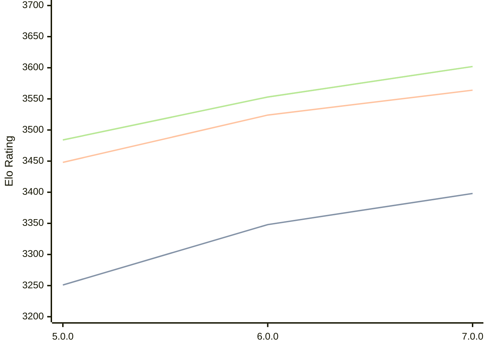

# Engine: Stormphrax

Author: Ciekce

Home: https://github.com/Ciekce/Stormphrax

## Elo Ratings

| Version | Published | STC 8.0+0.08s  | LTC 60.0+0.60s | VLTC 2m24s+1.12s | Comment |
| --- | --- | --- | --- | --- | --- |
| 7.0.0 | 2025-06-24 | 3398(+50) | 3564(+40) | 3602(+49) |  |
| 6.0.0 | 2024-10-29 | 3348(+97) | 3524(+76) | 3553(+69) |  |
| 5.0.0 | 2024-06-26 | 3251(+new) | 3448(+new) | 3484(+new) |  |
| 4.1.0 | 2024-03-11 |  |  |  |  |
| 4.0.0 | 2023-12-17 |  |  |  |  |
| 3.0.0 | 2023-11-02 |  |  |  |  |
| 2.0.0 | 2023-09-24 |  |  |  |  |
| 1.0.0 | 2023-07-25 |  |  |  |  |
 | | | cElo (∆ prev) | cElo (∆ prev) | cElo (∆ prev) | 

<a href="https://github.com/computer-chess-index/cci/issues/new?template=submit-version.yml&title=[VERSION]+Stormphrax+<version>&body=###%20Engine%20name%0AStormphrax%0A%0A###%20Version%0A7.0.0" target="_blank">Submit new version</a>

 Test Conditions:

GUI/CLI: <a href=https://github.com/cutechess/cutechess target="_blank">Cute-Chess</a> 
Elo Calculation: <a href=https://www.remi-coulom.fr/Bayesian-Elo/ target="_blank">Bayesian-Elo</a> 
CPU: Intel(R) Core(TM) i5-7500T 2.70GHz 
Opening book: 8_moves_v3 
\* STC: 8.0+0.08s, LTC: 60.0+0.60s, VLTC: 2m24s+1.12s

 Lists:
Ratings: <a href=https://github.com/computer-chess-index/cci/blob/main/lists/CCIRatings.csv target="_blank">Complete list</a>

Generated: 2026-05-15 06:28:26

## Ratings Verlauf

⬛ STC (8.0+0.08s) &nbsp;&nbsp; 🟧 LTC (60.0+0.60s) &nbsp;&nbsp; 🟩 VLTC (2m24s+1.12s)

dark mode: 🟩STC (8.0+0.08s) 🟧LTC (60.0+0.60s) ⬜VLTC (2m24s+1.12s)

## Detailed Evaluation Results

| Version | Time Control | Elo  | Range +/- | Matches | Score | Average Opponent Elo | Draws |
| --- | --- | --- | --- | --- | --- | --- | --- |
| 7.0.0 | VLTC (2m24s+1.12s) | 3602 | 18 | 714 | 51% | 3598 | 87% |
| 7.0.0 | LTC (60.0+0.60s) | 3564 | 17 | 824 | 51% | 3560 | 87% |
| 7.0.0 | STC (8.0+0.08s) | 3398 | 17 | 894 | 51% | 3393 | 69% |
| --- | --- | --- | --- | --- | --- | --- | --- |
| 6.0.0 | VLTC (2m24s+1.12s) | 3553 | 14 | 1184 | 50% | 3553 | 82% |
| 6.0.0 | LTC (60.0+0.60s) | 3524 | 14 | 1228 | 50% | 3526 | 80% |
| 6.0.0 | STC (8.0+0.08s) | 3348 | 15 | 1188 | 50% | 3345 | 67% |
| --- | --- | --- | --- | --- | --- | --- | --- |
| 5.0.0 | VLTC (2m24s+1.12s) | 3484 | 32 | 248 | 51% | 3478 | 73% |
| 5.0.0 | LTC (60.0+0.60s) | 3448 | 27 | 340 | 54% | 3416 | 71% |
| 5.0.0 | STC (8.0+0.08s) | 3251 | 29 | 332 | 48% | 3267 | 57% |
| --- | --- | --- | --- | --- | --- | --- | --- |