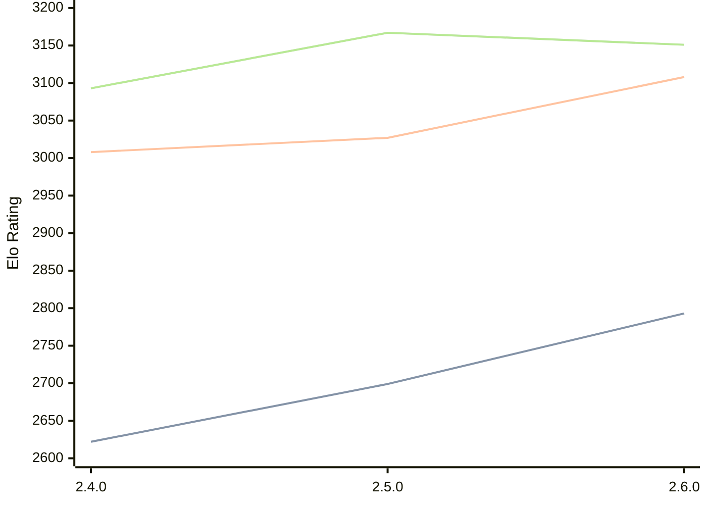

# Engine: Sturddle2

Author: Cristian Vlasceanu

Home: https://github.com/cristivlas/sturddle-2

## Elo Ratings

| Version | Published | STC 8.0+0.08s  | LTC 60.0+0.60s | VLTC 2m24s+1.12s | Comment |
| --- | --- | --- | --- | --- | --- |
| 2.6.0 | 2026-08-09 | 2793(+94) | 3108(+81) | 3151(-16) |  |
| 2.5.0 | 2026-02-04 | 2699(+77) | 3027(+19) | 3167(+74) |  |
| 2.4.0 | 2025-12-06 | 2622 | 3008 | 3093 |  |
 | | | cElo (∆ prev) | cElo (∆ prev) | cElo (∆ prev) | 

<a href="https://github.com/computer-chess-index/cci/issues/new?template=submit-version.yml&title=[VERSION]+Sturddle2+<version>&body=###%20Engine%20name%0ASturddle2%0A%0A###%20Version%0A2.6.0" target="_blank">Submit new version</a>

 Test Conditions:

GUI/CLI: <a href=https://github.com/cutechess/cutechess target="_blank">Cute-Chess</a> 
Elo Calculation: <a href=https://www.remi-coulom.fr/Bayesian-Elo/ target="_blank">Bayesian-Elo</a> 
CPU: Intel(R) Core(TM) i5-7500T 2.70GHz 
Opening book: 8_moves_v3 
\* STC: 8.0+0.08s, LTC: 60.0+0.60s, VLTC: 2m24s+1.12s

 Lists:
Ratings: <a href=https://github.com/computer-chess-index/cci/blob/main/lists/CCIRatings.csv target="_blank">Complete list</a>

Generated: 2026-09-13 04:42:27

## Ratings Verlauf

## Detailed Evaluation Results

| Version | Time Control | Elo  | Range +/- | Matches | Score | Average Opponent Elo | Draws |
| --- | --- | --- | --- | --- | --- | --- | --- |
| 2.6.0 | VLTC (2m24s+1.12s) | 3151 | 32 | 268 | 49% | 3156 | 57% |
| 2.6.0 | LTC (60.0+0.60s) | 3108 | 30 | 312 | 50% | 3105 | 53% |
| 2.6.0 | STC (8.0+0.08s) | 2793 | 34 | 280 | 51% | 2780 | 35% |
| --- | --- | --- | --- | --- | --- | --- | --- |
| 2.5.0 | VLTC (2m24s+1.12s) | 3167 | 23 | 514 | 52% | 3150 | 52% |
| 2.5.0 | LTC (60.0+0.60s) | 3027 | 25 | 478 | 49% | 3038 | 45% |
| 2.5.0 | STC (8.0+0.08s) | 2699 | 23 | 626 | 50% | 2695 | 33% |
| --- | --- | --- | --- | --- | --- | --- | --- |
| 2.4.0 | VLTC (2m24s+1.12s) | 3093 | 34 | 236 | 49% | 3100 | 53% |
| 2.4.0 | LTC (60.0+0.60s) | 3008 | 37 | 224 | 51% | 2990 | 45% |
| 2.4.0 | STC (8.0+0.08s) | 2622 | 36 | 248 | 50% | 2618 | 30% |
| --- | --- | --- | --- | --- | --- | --- | --- |