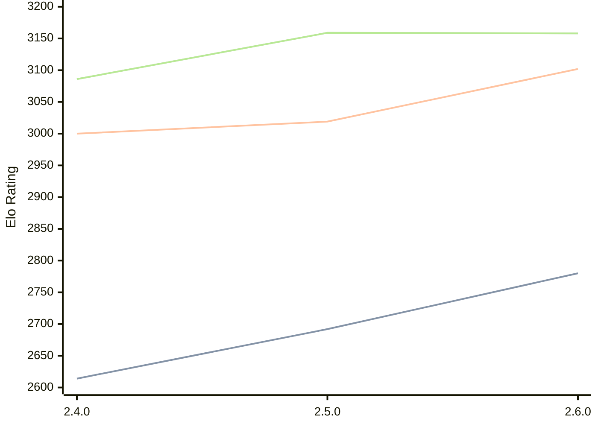

# Engine: Sturddle2

Author: Cristian Vlasceanu

Home: https://github.com/cristivlas/sturddle-2

## Elo Ratings

| Version | Published | STC 8.0+0.08s  | LTC 60.0+0.60s | VLTC 2m24s+1.12s | Comment |
| --- | --- | --- | --- | --- | --- |
| 2.6.0 | 2026-08-09 | 2780(+88) | 3102(+83) | 3158(-1) |  |
| 2.5.0 | 2026-02-04 | 2692(+78) | 3019(+19) | 3159(+73) |  |
| 2.4.0 | 2025-12-06 | 2614 | 3000 | 3086 |  |
 | | | cElo (∆ prev) | cElo (∆ prev) | cElo (∆ prev) | 

<a href="https://github.com/computer-chess-index/cci/issues/new?template=submit-version.yml&title=[VERSION]+Sturddle2+<version>&body=###%20Engine%20name%0ASturddle2%0A%0A###%20Version%0A2.6.0" target="_blank">Submit new version</a>

 Test Conditions:

GUI/CLI: <a href=https://github.com/cutechess/cutechess target="_blank">Cute-Chess</a> 
Elo Calculation: <a href=https://www.remi-coulom.fr/Bayesian-Elo/ target="_blank">Bayesian-Elo</a> 
CPU: Intel(R) Core(TM) i5-7500T 2.70GHz 
Opening book: 8_moves_v3 
\* STC: 8.0+0.08s, LTC: 60.0+0.60s, VLTC: 2m24s+1.12s

 Lists:
Ratings: <a href=https://github.com/computer-chess-index/cci/blob/main/lists/CCIRatings.csv target="_blank">Complete list</a>

Generated: 2026-08-21 06:31:36

## Ratings Verlauf

⬛ STC (8.0+0.08s) &nbsp;&nbsp; 🟧 LTC (60.0+0.60s) &nbsp;&nbsp; 🟩 VLTC (2m24s+1.12s)

dark mode: 🟩STC (8.0+0.08s) 🟧LTC (60.0+0.60s) ⬜VLTC (2m24s+1.12s)

## Detailed Evaluation Results

| Version | Time Control | Elo  | Range +/- | Matches | Score | Average Opponent Elo | Draws |
| --- | --- | --- | --- | --- | --- | --- | --- |
| 2.6.0 | VLTC (2m24s+1.12s) | 3158 | 38 | 184 | 50% | 3154 | 57% |
| 2.6.0 | LTC (60.0+0.60s) | 3102 | 35 | 232 | 51% | 3093 | 50% |
| 2.6.0 | STC (8.0+0.08s) | 2780 | 40 | 200 | 52% | 2758 | 34% |
| --- | --- | --- | --- | --- | --- | --- | --- |
| 2.5.0 | VLTC (2m24s+1.12s) | 3159 | 23 | 514 | 52% | 3141 | 52% |
| 2.5.0 | LTC (60.0+0.60s) | 3019 | 25 | 478 | 49% | 3029 | 45% |
| 2.5.0 | STC (8.0+0.08s) | 2692 | 23 | 626 | 50% | 2687 | 33% |
| --- | --- | --- | --- | --- | --- | --- | --- |
| 2.4.0 | VLTC (2m24s+1.12s) | 3086 | 34 | 236 | 49% | 3092 | 53% |
| 2.4.0 | LTC (60.0+0.60s) | 3000 | 37 | 224 | 51% | 2982 | 45% |
| 2.4.0 | STC (8.0+0.08s) | 2614 | 36 | 248 | 50% | 2610 | 30% |
| --- | --- | --- | --- | --- | --- | --- | --- |