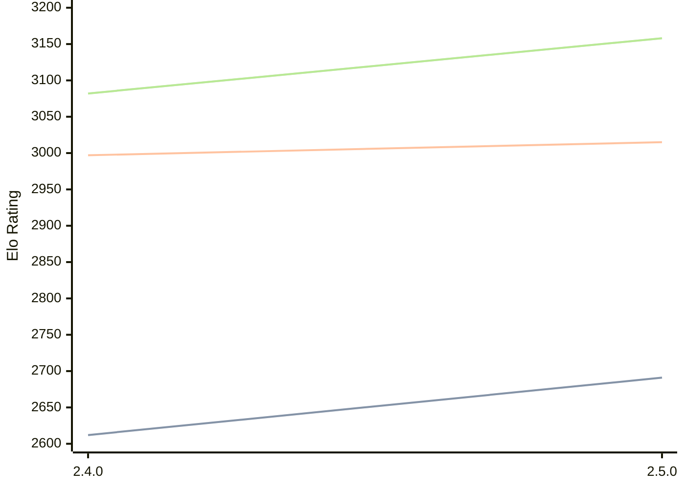

# Engine: Sturddle2

Author: Cristian Vlasceanu

Home: https://github.com/cristivlas/sturddle-2

## Elo Ratings

| Version | Published | STC 8.0+0.08s  | LTC 60.0+0.60s | VLTC 2m24s+1.12s | Comment |
| --- | --- | --- | --- | --- | --- |
| 2.5.0 | 2026-02-04 | 2691(+79) | 3015(+18) | 3158(+76) |  |
| 2.4.0 | 2025-12-06 | 2612(+new) | 2997(+new) | 3082(+new) |  |
| 2.3.1 | 2025-09-04 |  |  |  |  |
| 2.3 | 2025-09-01 |  |  |  |  |
| 2.02 | 2025-03-28 |  |  |  |  |
| 2.01 | 2024-12-09 |  |  |  |  |
| 2.00 | 2024-12-07 |  |  |  |  |
 | | | cElo (∆ prev) | cElo (∆ prev) | cElo (∆ prev) | 

<a href="https://github.com/computer-chess-index/cci/issues/new?template=submit-version.yml&title=[VERSION]+Sturddle2+<version>&body=###%20Engine%20name%0ASturddle2%0A%0A###%20Version%0A2.5.0" target="_blank">Submit new version</a>

 Test Conditions:

GUI/CLI: <a href=https://github.com/cutechess/cutechess target="_blank">Cute-Chess</a> 
Elo Calculation: <a href=https://www.remi-coulom.fr/Bayesian-Elo/ target="_blank">Bayesian-Elo</a> 
CPU: Intel(R) Core(TM) i5-7500T 2.70GHz 
Opening book: 8_moves_v3 
\* STC: 8.0+0.08s, LTC: 60.0+0.60s, VLTC: 2m24s+1.12s

 Lists:
Ratings: <a href=https://github.com/computer-chess-index/cci/blob/main/lists/CCIRatings.csv target="_blank">Complete list</a>

Generated: 2026-07-14 06:29:28

## Ratings Verlauf

## Ratings Verlauf

⬛ STC (8.0+0.08s) &nbsp;&nbsp; 🟧 LTC (60.0+0.60s) &nbsp;&nbsp; 🟩 VLTC (2m24s+1.12s)

dark mode: 🟩STC (8.0+0.08s) 🟧LTC (60.0+0.60s) ⬜VLTC (2m24s+1.12s)

## Detailed Evaluation Results

| Version | Time Control | Elo  | Range +/- | Matches | Score | Average Opponent Elo | Draws |
| --- | --- | --- | --- | --- | --- | --- | --- |
| 2.5.0 | VLTC (2m24s+1.12s) | 3158 | 24 | 490 | 53% | 3136 | 52% |
| 2.5.0 | LTC (60.0+0.60s) | 3015 | 25 | 454 | 48% | 3027 | 45% |
| 2.5.0 | STC (8.0+0.08s) | 2691 | 24 | 590 | 50% | 2685 | 33% |
| --- | --- | --- | --- | --- | --- | --- | --- |
| 2.4.0 | VLTC (2m24s+1.12s) | 3082 | 34 | 236 | 49% | 3089 | 53% |
| 2.4.0 | LTC (60.0+0.60s) | 2997 | 37 | 224 | 51% | 2979 | 45% |
| 2.4.0 | STC (8.0+0.08s) | 2612 | 36 | 248 | 50% | 2610 | 30% |
| --- | --- | --- | --- | --- | --- | --- | --- |