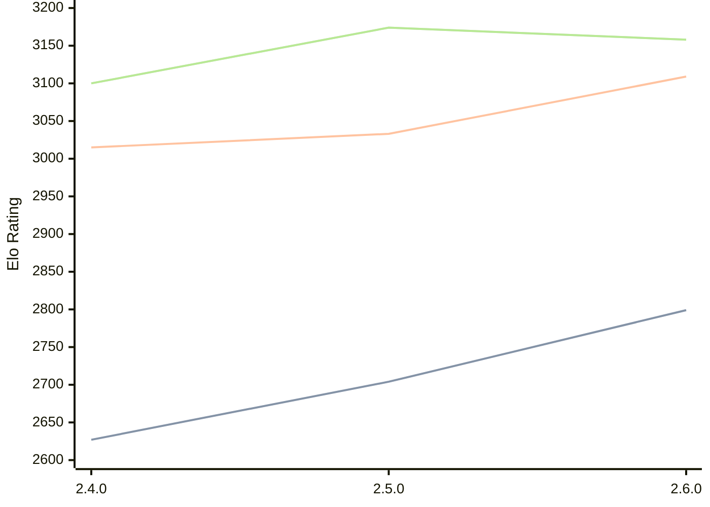

# Engine: Sturddle2

Author: Cristian Vlasceanu

Home: https://github.com/cristivlas/sturddle-2

## Elo Ratings

| Version | Published | STC 8.0+0.08s  | LTC 60.0+0.60s | VLTC 2m24s+1.12s | Comment |
| --- | --- | --- | --- | --- | --- |
| 2.7.0 | 2026-10-04 |  |  |  |  |
| 2.6.0 | 2026-08-09 | 2799(+95) | 3109(+76) | 3158(-16) |  |
| 2.5.0 | 2026-02-04 | 2704(+77) | 3033(+18) | 3174(+74) |  |
| 2.4.0 | 2025-12-06 | 2627 | 3015 | 3100 |  |
 | | | cElo (∆ prev) | cElo (∆ prev) | cElo (∆ prev) | 

<a href="https://github.com/computer-chess-index/cci/issues/new?template=submit-version.yml&title=[VERSION]+Sturddle2+<version>&body=###%20Engine%20name%0ASturddle2%0A%0A###%20Version%0A2.7.0" target="_blank">Submit new version</a>

 Test Conditions:

GUI/CLI: <a href=https://github.com/cutechess/cutechess target="_blank">Cute-Chess</a> 
Elo Calculation: <a href=https://www.remi-coulom.fr/Bayesian-Elo/ target="_blank">Bayesian-Elo</a> 
CPU: Intel(R) Core(TM) i5-7500T 2.70GHz 
Opening book: 8_moves_v3 
\* STC: 8.0+0.08s, LTC: 60.0+0.60s, VLTC: 2m24s+1.12s

 Lists:
Ratings: <a href=https://github.com/computer-chess-index/cci/blob/main/lists/CCIRatings.csv target="_blank">Complete list</a>

Generated: 2026-10-09 04:43:34

## Ratings Verlauf

```mermaid
%%{init: {"theme":"base","themeVariables":{"seriesColors:['#a3a3a3','#222221','#faa371']}}}%%
xychart-beta
  x-axis ["2.4.0", "2.5.0", "2.6.0"]
  y-axis "Elo Rating" 2600 --> 3200
  line "" [2627, 2704, 2799]
  line "STC (8.0+0.08s)" [2627, 2704, 2799]
  line "LTC (60.0+0.60s)" [3015, 3033, 3109]
  line "" [3100, 3174, 3158]
  line "VLTC (2m24s+1.12s)" [3100, 3174, 3158]
```

## Detailed Evaluation Results

| Version | Time Control | Elo  | Range +/- | Matches | Score | Average Opponent Elo | Draws |
| --- | --- | --- | --- | --- | --- | --- | --- |
| 2.6.0 | VLTC (2m24s+1.12s) | 3158 | 30 | 296 | 50% | 3160 | 56% |
| 2.6.0 | LTC (60.0+0.60s) | 3109 | 29 | 332 | 50% | 3110 | 52% |
| 2.6.0 | STC (8.0+0.08s) | 2799 | 32 | 312 | 51% | 2790 | 35% |
| --- | --- | --- | --- | --- | --- | --- | --- |
| 2.5.0 | VLTC (2m24s+1.12s) | 3174 | 23 | 514 | 52% | 3155 | 52% |
| 2.5.0 | LTC (60.0+0.60s) | 3033 | 25 | 478 | 49% | 3044 | 45% |
| 2.5.0 | STC (8.0+0.08s) | 2704 | 23 | 626 | 50% | 2700 | 33% |
| --- | --- | --- | --- | --- | --- | --- | --- |
| 2.4.0 | VLTC (2m24s+1.12s) | 3100 | 34 | 236 | 49% | 3105 | 53% |
| 2.4.0 | LTC (60.0+0.60s) | 3015 | 37 | 224 | 51% | 2996 | 45% |
| 2.4.0 | STC (8.0+0.08s) | 2627 | 36 | 248 | 50% | 2623 | 30% |
| --- | --- | --- | --- | --- | --- | --- | --- |